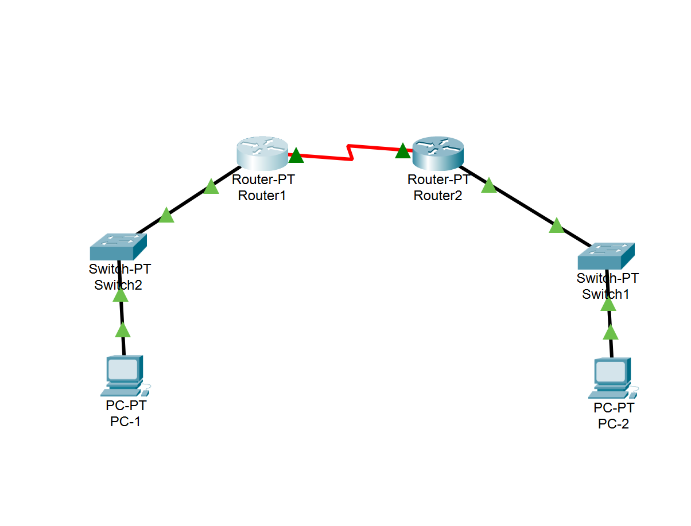
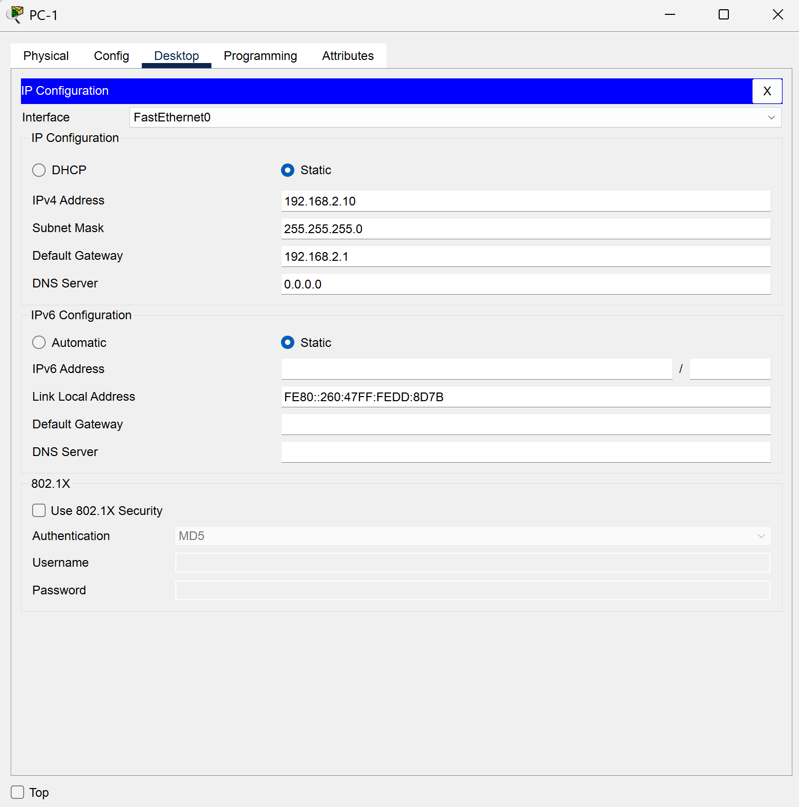
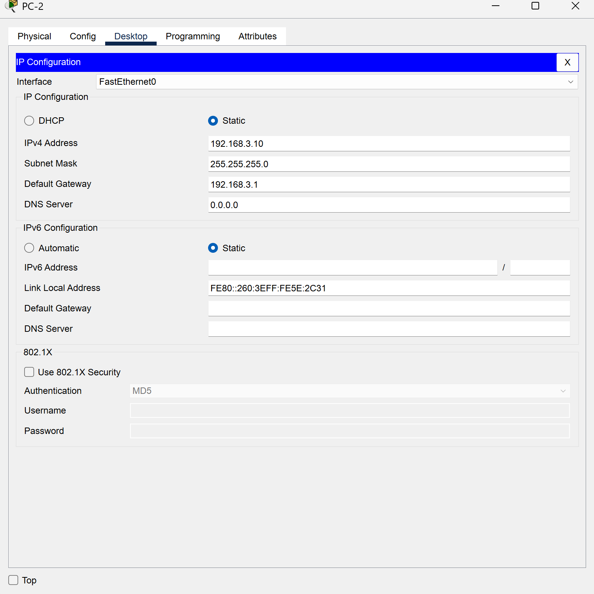
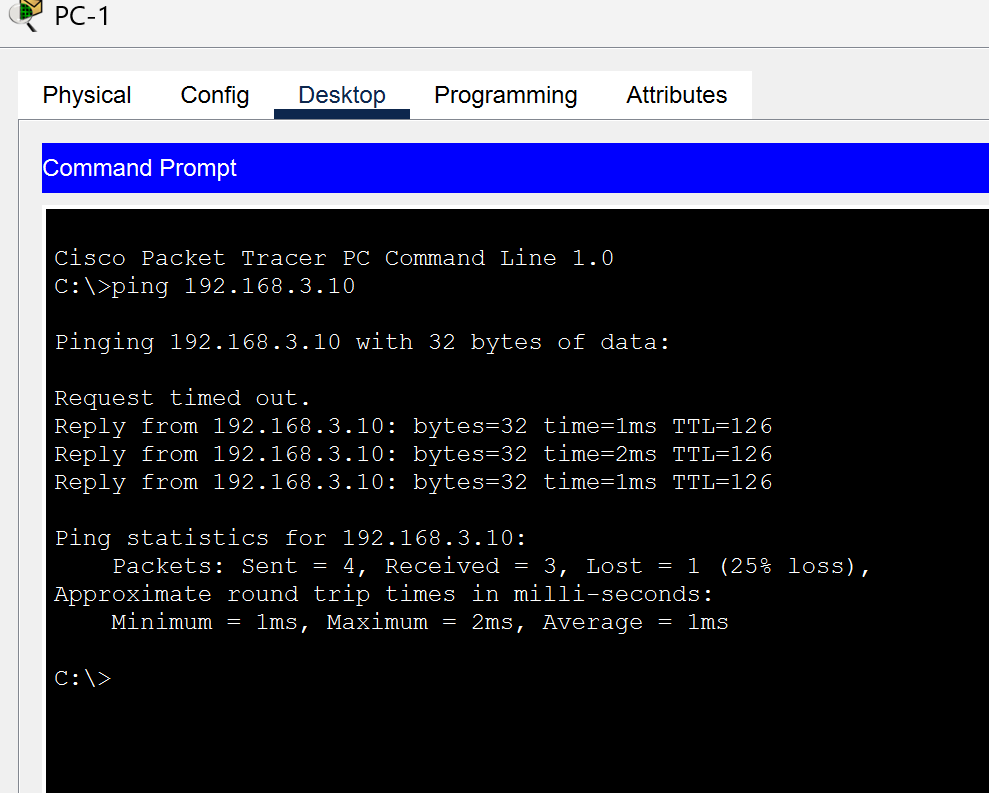

# Yêu cầu truyền dữ liệu từ PC1 đến PC2 thông qua Router 1 và Router 2
## Cấu hình bài Lab
### Bảng kế hoạch 
| Thiết bị | Cổng (Interface) | Địa chỉ IP | Subnet Mask | Default Gateway |
| :--- | :--- | :--- | :--- | :--- |
| **PC1** | NIC | `192.168.2.10` | `255.255.255.0` | `192.168.2.1` |
| **PC2** | NIC | `192.168.3.10` | `255.255.255.0` | `192.168.3.1` |
| **Router 1** | Fa0/0 (LAN) | `192.168.2.1` | `255.255.255.0` | N/A |
| | Se2/0 (WAN) | `192.168.1.1` | `255.255.255.0` | N/A |
| **Router 2** | Fa0/0 (LAN) | `192.168.3.1` | `255.255.255.0` | N/A |
| | Se2/0 (WAN) | `192.168.1.2` | `255.255.255.0` | N/A |
### 1. Cấu hình IP trên các PC

- PC1: IP: 192.168.2.10, Subnet Mask: 255.255.255.0, Default Gateway: 192.168.2.1 (IP của Router1).
  
 

- PC2: IP: 192.168.3.10, Subnet Mask: 255.255.255.0, Default Gateway: 192.168.3.1 (IP của Router2).
  
 
### 2. Cấu hình IP trên các Router
#### Router 1
```ruby
Router> enable
Router# configure terminal
Router(config)# hostname R1

! 1. Cấu hình cổng nối xuống Switch 2 (LAN 1)
R1(config)# interface fastEthernet 0/0
R1(config-if)# ip address 192.168.2.1 255.255.255.0
R1(config-if)# no shutdown
R1(config-if)# exit

! 2. Cấu hình cổng nối sang Router 2 (WAN)
R1(config)# interface serial 2/0
R1(config-if)# ip address 192.168.1.1 255.255.255.0
R1(config-if)# no shutdown
R1(config-if)# exit

! 3. ĐỊNH TUYẾN: Chỉ đường sang mạng của PC2 (Mạng 3.0)
R1(config)# ip route 192.168.3.0 255.255.255.0 192.168.1.2
```
#### Router 2
```ruby
Router> enable
Router# configure terminal
Router(config)# hostname R2

! 1. Cấu hình cổng nối xuống Switch 1 (LAN 2)
R2(config)# interface fastEthernet 0/0
R2(config-if)# ip address 192.168.3.1 255.255.255.0
R2(config-if)# no shutdown
R2(config-if)# exit

! 2. Cấu hình cổng nối sang Router 1 (WAN)
R2(config)# interface serial 2/0
R2(config-if)# ip address 192.168.1.2 255.255.255.0
R2(config-if)# no shutdown
R2(config-if)# exit

! 3. ĐỊNH TUYẾN: Chỉ đường về lại mạng của PC1 (Mạng 2.0)
R2(config)# ip route 192.168.2.0 255.255.255.0 192.168.1.1
```
Mở Command Prompt trên PC1 và gõ:
ping 192.168.3.10
 
