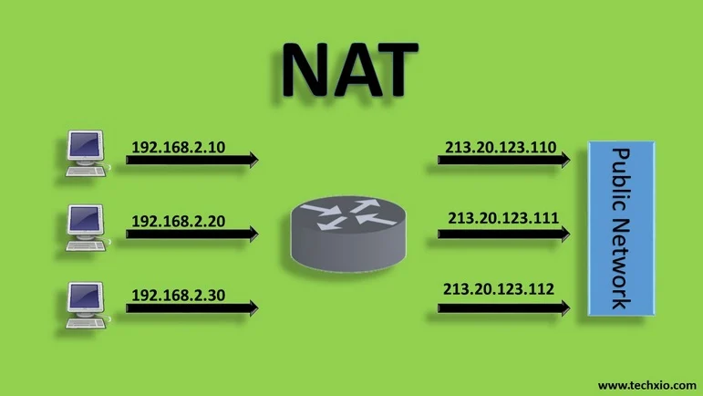
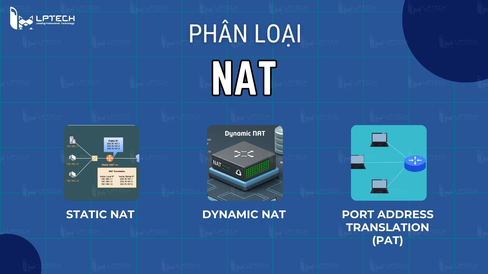

# TÌM HIỂU VỀ NAT (Network Address Translation)

## 1. Bối cảnh: Tại sao cần NAT?

Số lượng địa chỉ IPv4 Public hiện tại không đủ để cung cấp cho tất cả các thiết bị trên thế giới. Giải pháp triệt để là chuyển sang IPv6, nhưng đây là quá trình dài và phức tạp. Vì vậy, để giải quyết sự cạn kiệt IPv4 trong thời gian này, các giải pháp sau được sử dụng:

- **CIDR (Classless Inter-Domain Routing):** Phá vỡ giới hạn các lớp mạng A, B, C cứng nhắc, dùng prefix-length linh hoạt.
- **Dải địa chỉ Private IPv4 (RFC 1918):** Cho phép dùng trong nội bộ mà không cần đăng ký. Bao gồm:
  - `10.x.x.x/8`
  - `172.16.x.x - 172.31.x.x/12`
  - `192.168.x.x/16`
- **Kỹ thuật NAT:** Vì các nhà mạng (ISP) chặn lưu lượng mạng đi từ các IP Private ra ngoài, ta cần NAT để chuyển đổi IP Private thành IP Public, giúp máy tính nội bộ có thể kết nối Internet.

---

## 2. NAT là gì?

### 2.1. Khái niệm

**NAT (Network Address Translation - Biên dịch địa chỉ mạng)** là một kỹ thuật trên Router/Firewall cho phép chuyển đổi địa chỉ IP của các thiết bị trong mạng nội bộ (Private IP) sang địa chỉ IP công cộng (Public IP) và ngược lại.



### 2.2. Chức năng chính

- **Chia sẻ địa chỉ IP Public:** Cho phép hàng chục, hàng trăm thiết bị LAN dùng chung một vài IP Public để truy cập Internet.
- **Tăng cường bảo mật:** Che giấu địa chỉ IP Private khỏi Internet. Máy tính bên ngoài không thể chủ động khởi tạo kết nối vào máy có IP Private nếu không được cấu hình trước.
- **Linh hoạt mạng nội bộ:** Người quản trị có thể thay đổi, cấu trúc lại IP mạng LAN mà không làm ảnh hưởng đến IP Public ở bên ngoài.

### 2.3. Các thuật ngữ quan trọng trong NAT

- **Inside Local:** Địa chỉ IP mạng nội bộ của thiết bị (Thường là IP Private).
- **Inside Global:** Địa chỉ IP dùng để đại diện cho Inside Local khi đi ra mạng ngoài (Thường là IP Public của Router).
- **Outside Global:** Địa chỉ IP của thiết bị đích nằm trên mạng Internet.

---

## 3. Phân loại NAT và Cách cấu hình



Có 3 loại NAT chính:

### 3.1. Static NAT (NAT tĩnh)

Ánh xạ cố định **1:1** giữa 1 IP Private và 1 IP Public.

- **Ưu điểm:** Phù hợp cho các thiết bị cần cung cấp dịch vụ ra bên ngoài (Web Server, Mail Server, Camera) vì có IP Public cố định để truy cập.
- **Nhược điểm:** Không giúp tiết kiệm IP Public.
- **Cấu hình (Cisco Router):**

  ```ruby
  # Thiết lập ánh xạ tĩnh
  Router(config)# ip nat inside source static <IP_Local> <IP_Global>

  # Cổng kết nối vào mạng nội bộ
  Router(config)# interface <Cổng_LAN>
  Router(config-if)# ip nat inside

  # Cổng kết nối ra Internet
  Router(config)# interface <Cổng_WAN>
  Router(config-if)# ip nat outside
  ```

### 3.2. Dynamic NAT (NAT động)

Ánh xạ **1:1** từ 1 IP Private sang 1 IP Public ngẫu nhiên được lấy từ một nhóm (pool) các IP Public rảnh rỗi.

- **Ưu điểm:** Tiết kiệm hơn NAT tĩnh do cấp phát động cho thiết bị nào cần truy cập mạng trước.
- **Nhược điểm:** IP Public thay đổi thường xuyên. Vẫn bị giới hạn bởi số lượng IP trong pool (Rất ít dùng trong thực tế).
- **Cấu hình (Cisco Router):**

  ```ruby
  # Tạo pool IP Public
  Router(config)# ip nat pool <Tên_pool> <IP_Start> <IP_End> netmask <Subnet_mask>

  # Tạo ACL cho phép dải IP nội bộ
  Router(config)# access-list <Số_ACL> permit <Network_IP> <Wildcard_mask>

  # Ánh xạ ACL vào Pool
  Router(config)# ip nat inside source list <Số_ACL> pool <Tên_pool>

  # Thiết lập cổng inside và outside tương tự Static NAT.
  ```

### 3.3. NAT Overload (PAT - Port Address Translation)

Ánh xạ **N:1** - Cho phép nhiều IP Private dùng chung 1 IP Public thông qua việc phân biệt bằng các **Port (cổng)** khác nhau.

- **Ưu điểm:** Tiết kiệm tối đa IP Public. Là phương pháp phổ biến nhất trong mọi mạng gia đình và văn phòng.
- **Nhược điểm:** Có thể gây tắc nghẽn, quá tải Router/Firewall nếu có quá nhiều kết nối đồng thời.
- **Cấu hình (Cisco Router):**

  ```ruby
  # Tạo ACL cho phép dải IP nội bộ
  Router(config)# access-list <Số_ACL> permit <Network_IP> <Wildcard_mask>

  # Cấu hình PAT thông qua cổng kết nối bên ngoài
  Router(config)# ip nat inside source list <Số_ACL> interface <Cổng_WAN> overload

  # Thiết lập cổng inside và outside tương tự Static NAT.
  ```

---

## 4. Cơ chế hoạt động của NAT

Quá trình NAT diễn ra tại Router qua các bước (VD thiết bị nội bộ truy cập Internet):

1. **Gửi gói tin từ mạng nội bộ:** Máy tính gửi gói tin đến Router, chứa IP nguồn (Private) và IP đích (IP Public của Server đích).
2. **Thay đổi IP nguồn:** Router nhận gói tin, đổi IP nguồn từ Private sang IP Public của Router (hoặc từ pool). Với PAT, Router sẽ thay đổi luôn Port nguồn để đảm bảo không trùng lặp.
3. **Lưu vào bảng NAT:** Router lưu thông tin ánh xạ giữa IP/Port nội bộ và IP/Port bên ngoài vào **Bảng NAT (NAT Table)**. Sau đó gửi gói tin ra mạng Internet.
4. **Nhận gói tin phản hồi:** Server ngoài Internet trả dữ liệu về IP Public và Port của Router.
5. **Chuyển đổi lại địa chỉ IP:** Router tra cứu bảng NAT xem IP/Port đích này tương ứng với máy tính nào. Sau đó đổi lại IP đích thành IP Private và chuyển gói tin vào mạng nội bộ.
6. **Kết thúc phiên:** Khi ngắt kết nối hoặc hết hạn thời gian (timeout), dòng ánh xạ trong bảng NAT sẽ bị xóa.

---

## 5. Ưu điểm và Nhược điểm của NAT

### Ưu điểm

- **Tiết kiệm địa chỉ IP:** Giảm cực kì nhiều áp lực cạn kiệt IPv4 bằng cách chia sẻ một IP Public cho toàn bộ mạng.
- **Tăng cường bảo mật (Hide IP):** Mạng bên ngoài không thể xác định hay truy cập trực tiếp vào cấu trúc IP bên trong, tạo thành một lớp bảo vệ tự nhiên.
- **Tính linh hoạt:** Dễ dàng đổi IP nội bộ, quy hoạch mạng, hoặc đổi nhà mạng (ISP) mà không tốn nhiều công sức sửa đổi.

### Nhược điểm

- **Giảm hiệu suất kết nối:** Quá trình chuyển đổi IP và Port làm Router tốn nhiều tài nguyên, gây ra độ trễ (latency).
- **Vấn đề với giao thức End-to-End:** Việc che giấu IP thực khiến một số giao thức yêu cầu kết nối trực tiếp từ điểm-đến-điểm (như IPSec VPN, SIP/VoIP, Game Online) hoạt động thiếu ổn định.
- **Khó thiết lập kết nối từ ngoài vào:** Cần phải có kỹ thuật cấu hình phụ trợ như Port Forwarding (Static NAT/DNAT).
- **Khó truy vết:** Mọi thiết bị đi ra đều có chung IP Public, khi xảy ra sự cố bảo mật khó xác định máy nào gây ra.
- **Ít quan trọng hơn trong IPv6:** Mạng IPv6 có số lượng IP cực lớn nên NAT không còn là sự bắt buộc.

---

## 6. So sánh giữa SNAT và DNAT

|                         | **SNAT** (Source NAT)                                                                                                                        | **DNAT** (Destination NAT)                                                                                                                                                                                                              |
| ----------------------- | -------------------------------------------------------------------------------------------------------------------------------------------- | --------------------------------------------------------------------------------------------------------------------------------------------------------------------------------------------------------------------------------------- |
| **Thuật ngữ**           | SNAT đổi địa chỉ IP của nguồn kết nối thành công cộng. Ngoài ra có thể đổi cổng nguồn trong TCP/UDP. Thường được dùng bởi người dùng nội bộ. | DNAT đổi địa chỉ đích (destination) thành địa chỉ IP bên trong. Có thể thay đổi cổng đích trong TCP/UDP. Thường sử dụng để ánh xạ dịch vụ cho các gói đến địa chỉ/cổng công cộng (public) thành địa chỉ/cổng IP private bên trong mạng. |
| **Trường hợp sử dụng**  | SNAT cho phép các máy chủ trong mạng riêng truy cập các dịch vụ công cộng trên Internet. internet.                                           | DNAT cho phép các máy chủ bên ngoài mạng riêng truy cập các dịch vụ công cộng trong mạng riêng.                                                                                                                                         |
| **Thay đổi về địa chỉ** | SNAT thay đổi địa chỉ nguồn của gói dữ liệu khi bị NAT.                                                                                      | DNAT thay đổi địa chỉ đích của gói dữ liệu qua Router.                                                                                                                                                                                  |
| **Thứ tự hoạt động**    | Sau khi quyết định định tuyến được thực hiện.                                                                                                | Trước khi xác định quyết định định tuyến.                                                                                                                                                                                               |
| **Luồng giao tiếp**     | Xảy ra khi bên trong mạng được bảo mật bắt đầu giao tiếp với bên ngoài.                                                                      | Xảy ra khi mạng không an toàn bên ngoài (public network) muốn giao tiếp với bên trong (private network).                                                                                                                                |
| **Đơn/đa máy chủ**      | SNAT cho phép nhiều máy chủ bên trong mạng truy cập vào bất kỳ máy chủ nào bên ngoài.                                                        | DNAT cho phép một máy chủ bên ngoài truy cập vào một hoặc một nhóm máy chủ bên trong.                                                                                                                                                   |
