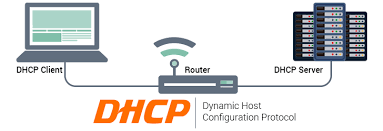
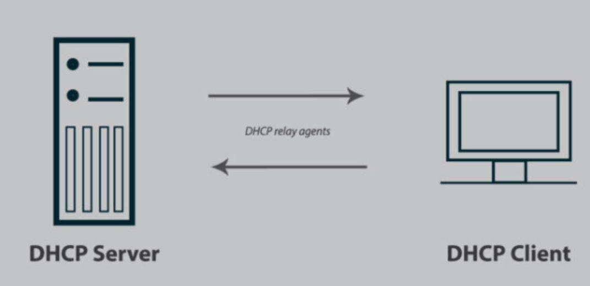
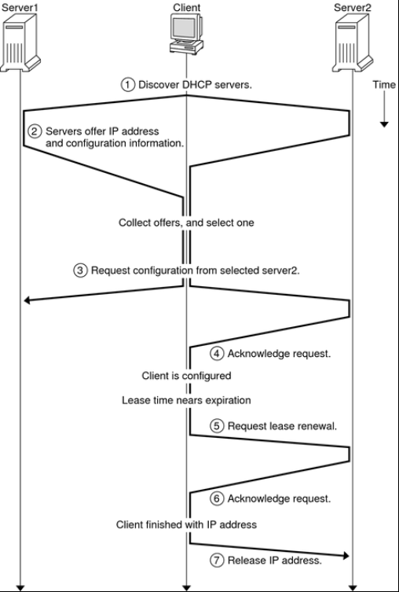
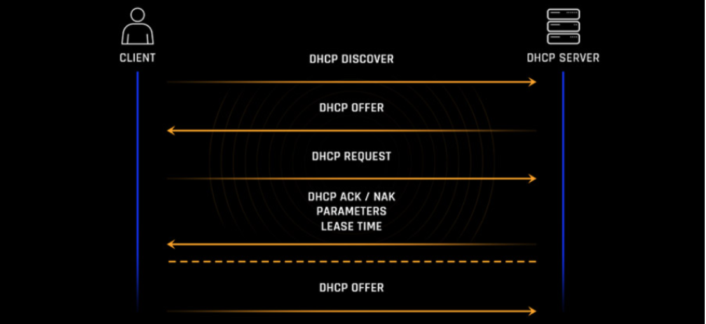
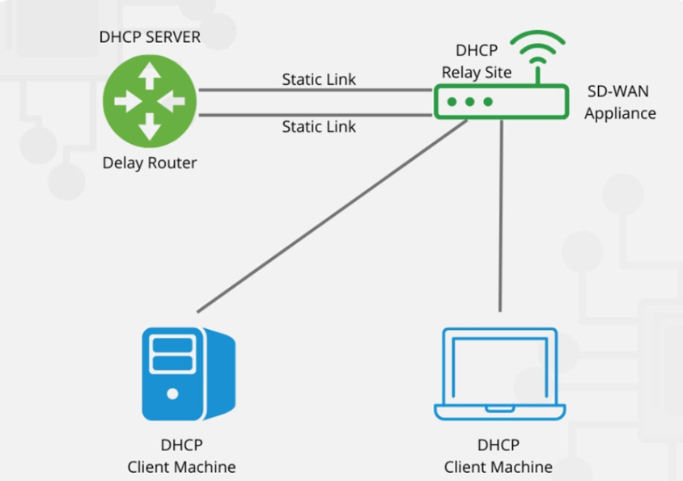

# TÌM HIỂU VỀ DHCP

## I. DHCP là gì?

### 1. Khái niệm



**DHCP (Dynamic Host Configuration Protocol)** là giao thức dùng để **tự động cấp phát địa chỉ IP** và các thông số mạng cho thiết bị.

Thay vì phải cấu hình IP thủ công cho từng máy, DHCP Server sẽ tự động cấp:

- Địa chỉ IP
- Subnet Mask
- Default Gateway
- DNS Server
- Thời gian thuê IP (Lease Time)

Ví dụ: Khi laptop kết nối vào Wi-Fi, laptop sẽ tự động nhận IP như `192.168.1.10` từ router. Quá trình này thường do DHCP thực hiện.

### 2. DHCP dùng để làm gì?

DHCP giúp việc quản lý địa chỉ IP đơn giản hơn:

- **Tự động gán IP** cho thiết bị khi kết nối vào mạng.
- **Tránh trùng IP**, vì DHCP Server quản lý IP nào đã cấp, IP nào còn trống.
- **Quản lý tập trung**, quản trị viên chỉ cần cấu hình trên DHCP Server.
- **Dễ thay đổi cấu hình mạng**, vì khi đổi gateway, DNS hoặc dải IP thì chỉ cần sửa trên DHCP Server.
- **Thuận tiện khi di chuyển**, thiết bị sang mạng khác sẽ tự động nhận IP mới.

## II. Các thành phần của DHCP

### 1. DHCP Server

**DHCP Server** là máy chủ hoặc thiết bị chịu trách nhiệm cấp IP cho client.

DHCP Server sẽ lưu:

- Dải IP có thể cấp phát
- IP nào đã cấp
- IP đó cấp cho MAC address nào
- Thời gian thuê IP của từng thiết bị

Trong mạng gia đình, router Wi-Fi thường đóng vai trò DHCP Server.

### 2. DHCP Client

**DHCP Client** là thiết bị cần xin IP từ DHCP Server.

Ví dụ:

- Máy tính
- Laptop
- Điện thoại
- Máy in
- Camera IP

Khi kết nối vào mạng, client gửi yêu cầu xin IP. Sau khi được cấp IP, client mới có thể giao tiếp trong mạng.

### 3. DHCP Relay Agent

**DHCP Relay Agent** là thiết bị trung gian chuyển tiếp gói DHCP giữa client và server khi hai bên **không cùng subnet**.

Bình thường, gói DHCP Discover là broadcast nên router không chuyển qua subnet khác. Vì vậy cần DHCP Relay Agent để chuyển gói tin đó đến DHCP Server.

Hoạt động đơn giản:

1. Client gửi DHCP Discover trong subnet của nó.
2. Relay Agent nhận gói tin này.
3. Relay Agent chuyển tiếp đến DHCP Server bằng unicast.
4. DHCP Server phản hồi lại Relay Agent.
5. Relay Agent gửi cấu hình IP về cho client.

Trên router Cisco, DHCP Relay thường cấu hình bằng lệnh:

```text
ip helper-address <địa-chỉ-DHCP-Server>
```

### 4. DHCP Lease

**DHCP Lease** là thời gian mà client được phép sử dụng địa chỉ IP đã cấp.

Ví dụ: DHCP Server cấp IP `192.168.1.20` cho laptop trong 24 giờ. Sau 24 giờ, nếu laptop không gia hạn, IP đó có thể được cấp cho thiết bị khác.

Lease giúp DHCP Server thu hồi và tái sử dụng IP hiệu quả.

### 5. DHCP Binding

**DHCP Binding** là bảng ghi nhớ việc cấp phát IP.

Một binding thường gồm:

- Địa chỉ IP đã cấp
- Địa chỉ MAC của client
- Thời gian lease

Ví dụ:

| IP đã cấp | MAC Address | Trạng thái |
| --- | --- | --- |
| 192.168.1.10 | AA:BB:CC:11:22:33 | Đang sử dụng |

Binding giúp DHCP Server biết IP nào đang được thiết bị nào sử dụng.

## III. Cách DHCP hoạt động


**`Bước 1` - Trạng thái khởi tạo**:

- Client ở INIT (hoặc INIT-REBOOT nếu vừa khởi động lại và nhớ lease cũ).
- Client dùng UDP `68`; Server dùng UDP `67`
- Gói ban đầu đi **Broadcast** vì client chưa có IP.
- Trường địa chỉ MAC/IP đặc biệt:

  - Src IP: `0.0.0.0` (client) -> Dst IP: `255.255.255.255` (broadcast) ở bước đầu.
  - Dựa trên MAC client (chaddr) để định danh.

**`Bước 2` - Discovery (Tìm kiếm máy chủ DHCP)**:

Khi một thiết bị (Client) kết nối vào mạng lần đầu, nó không có địa chỉ IP. Client sẽ gửi một gói tin DHCPDISCOVER dưới dạng broadcast (phát tán toàn mạng) để tìm kiếm DHCP Server. Gói tin này chứa:

- **Địa chỉ nguồn (Source Address)** là `0.0.0.0`.
- **Địa chỉ đích (Destination Address)** là `255.255.255.255`.

Mục đích là để thông báo cho tất cả các thiết bị trong mạng rằng nó cần một địa chỉ IP.

**`Bước 3` - Offer (Đề nghị cấp phát địa chỉ IP)**:

Khi DHCP Server nhận được gói DHCPDISCOVER, nó sẽ phản hồi bằng một gói tin DHCPOFFER. Gói tin DHCPOFFER được gửi đến địa chỉ MAC của Client. Gói tin này bao gồm:

- Địa chỉ IP tạm thời được đề nghị cho Client.
- Thông tin mạng như Subnet Mask, Default Gateway, DNS Server, và thời gian thuê địa chỉ IP (Lease Time).

**`Bước 4` - Request (Yêu cầu sử dụng địa chỉ IP)**:

Sau khi nhận được gói tin DHCPOFFER, Client sẽ gửi một gói tin DHCPREQUEST để chấp nhận địa chỉ IP mà DHCP Server đề nghị. Gói tin này xác nhận rằng Client muốn sử dụng địa chỉ IP được cấp. Đồng thời, Client cũng gửi yêu cầu xác nhận các thông tin khác như Subnet Mask, Gateway, DNS.

**`Bước 5` - Acknowledgement (Xác nhận)**:

DHCP Server gửi gói tin DHCPACK để xác nhận rằng địa chỉ IP đã được cấp phát thành công cho Client. Gói tin này cũng bao gồm thời gian thuê địa chỉ IP (Lease Time) và các thông tin cấu hình mạng. Sau khi nhận được DHCPACK, Client cấu hình địa chỉ IP trên giao diện mạng của nó và bắt đầu sử dụng.

**`Bước 6` - DHCP Negative Acknowledge (DHCP NAK)**:

- **Mục đích**: Thông điệp này được gửi bởi `DHCP Server` để thông báo cho Client rằng yêu cầu của nó không được chấp nhận. Điều này có thể xảy ra nếu địa chỉ IP mà Client yêu cầu không còn hợp lệ (ví dụ: đã được cấp phát cho máy khác) hoặc nếu có lỗi trong quá trình gia hạn. Client sẽ yêu cầu lại IP mới.
- **Nguồn**: `DHCP Server` (địa chỉ của server)
- **Đích**: Địa chỉ Unicast đến `DHCP Client`

**`Bước 7` - DHCP Release - Giải phóng IP**

- Thông điệp này được gửi bởi `DHCP Client` để thông báo cho Server biết rằng nó không còn sử dụng địa chỉ IP đã được cấp phát nữa. Điều này thường xảy ra khi Client tắt máy hoặc ngắt kết nối mạng.

- **Nguồn**: DHCP Client(địa chỉ IP đã được cấp phát).

- **Đích**: Địa chỉ Unicast đến DHCP Server.

**`Ngoài ra`: DHCP INFORM / LEASE RENEWALL (Gia hạn thuê IP)**:

- Với `DHCP INFORM`:

  - Các thiết bị không sử dụng DHCP để lấy địa chỉ IP vẫn có thể sử dụng khả năng cấu hình khác của nó. Một Client có thể gửi một bản tin DHCP INFORM để yêu cầu bất kì máy chủ có sẵn nào gửi cho nó các thông số để mạng hoạt động. DHCP server đáp ứng với các thông số yêu cầu – được điền trong phần tùy chọn của DHCP trong bản tin DHCP ACK.

    - Nguồn: DHCP Client (địa chỉ IP đã được cấu hình).
    - Đích: Địa chỉ Unicast đến DHCP Server.

- Với `LEASE RENEWALL`:

  - Mỗi lease có 2 mốc:

    - T1(50%): Client gửi DHCP REQUEST (unicast) trực tiếp đến server đã cấp(Option 54).
    - T2(87.5%): Nếu T1 thất bại, client broadcast REQUEST để bất kỳ server nào cùng scope có thể gia hạn.
Nếu hết hạn mà không gia hạn được, client mất IP và quay về INIT (Discover lại).

## IV. Các thông điệp DHCP thường gặp


**DHCP Discover**:

- **Mục đích:** Đây là thông điệp đầu tiên được gửi bởi một DHCP client khi nó khởi động hoặc kết nối vào mạng và chưa có địa chỉ IP. Mục đích là để tìm kiếm các máy chủ DHCP có sẵn trên mạng.
- **Nguồn:** DHCP client (địa chỉ IP nguồn là 0.0.0.0).
- **Đích:** Địa chỉ broadcast (255.255.255.255) hoặc địa chỉ broadcast của subnet.

**DHCP Offer**:

- **Mục đích:** Thông điệp này được gửi bởi DHCP server để phản hồi lại gói tin DHCP Discover từ client. Nó chứa một địa chỉ IP mà server sẵn sàng cấp phát, cùng với các thông số cấu hình mạng khác (subnet mask, default gateway, DNS server) và thời gian thuê (lease time).
- **Nguồn:** DHCP server (địa chỉ IP của server).
- **Đích:** Địa chỉ broadcast (255.255.255.255) hoặc địa chỉ broadcast của subnet.

**DHCP Request**:

- **Mục đích:** Thông điệp này được gửi bởi DHCP client trong hai trường hợp chính:
  - **Chấp nhận Offer:** Sau khi nhận được một hoặc nhiều gói tin DHCP Offer, client sẽ chọn một (thường là gói đầu tiên) và gửi DHCP Request để thông báo cho server đã chọn biết rằng nó chấp nhận địa chỉ IP và các thông số cấu hình đã được đề nghị.
  - **Gia hạn Lease:** Khi còn một nửa thời gian thuê, client sẽ gửi DHCP Request trực tiếp đến server đã cấp phát địa chỉ IP để yêu cầu gia hạn.
- **Nguồn:** DHCP client (địa chỉ IP nguồn có thể là 0.0.0.0 nếu là yêu cầu sau Discover, hoặc địa chỉ IP đã được cấp phát nếu là yêu cầu gia hạn).
- **Đích:** Địa chỉ broadcast (255.255.255.255) hoặc địa chỉ unicast đến DHCP server (nếu là yêu cầu gia hạn).

**DHCP Acknowledge (DHCP ACK)**:

- **Mục đích:** Thông điệp này được gửi bởi DHCP server để xác nhận rằng địa chỉ IP và các thông số cấu hình đã được cấp phát (hoặc gia hạn) thành công cho client.
- **Nguồn:** DHCP server (địa chỉ IP của server).
- **Đích:** Địa chỉ unicast đến DHCP client.

**DHCP Negative Acknowledge (DHCP NAK)**:

- **Mục đích:** Thông điệp này được gửi bởi DHCP server để thông báo cho client rằng yêu cầu của nó không được chấp nhận. Điều này có thể xảy ra nếu địa chỉ IP mà client yêu cầu không còn hợp lệ (ví dụ: đã được cấp phát cho máy khác) hoặc nếu có lỗi trong quá trình gia hạn. Client sẽ yêu cầu lại IP mới.
- **Nguồn:** DHCP server (địa chỉ IP của server).
- **Đích:** Địa chỉ unicast đến DHCP client.

**DHCP Release – Giải phóng IP**:

- **Mục đích:** Thông điệp này được gửi bởi DHCP client để thông báo cho server biết rằng nó không còn sử dụng địa chỉ IP đã được cấp phát nữa. Điều này thường xảy ra khi client tắt máy hoặc ngắt kết nối mạng.
- **Nguồn:** DHCP client (địa chỉ IP đã được cấp phát).
- **Đích:** Địa chỉ unicast đến DHCP server.

**DHCP Inform**:

- **Mục đích:** Thông điệp này được gửi bởi DHCP client để yêu cầu thêm các thông số cấu hình mạng từ server mà không cần cấp phát địa chỉ IP mới. Client có thể đã được cấu hình địa chỉ IP tĩnh hoặc nhận địa chỉ IP theo cách khác.
- **Nguồn:** DHCP client (địa chỉ IP đã được cấu hình).
- **Đích:** Địa chỉ unicast đến DHCP server.

**DHCP LEASE RENEWALL (Gia hạn thuê IP)**:

- Với `DHCP INFORM`:

  - `T1(50%)`: Client gửi `DHCP REQUEST` (Unicast) trực tiếp đến Server đã cấp(Option 54).
  - `T2(87.5%)`: Nếu `T1` thất bại, Client Broadcast REQUEST để bất kỳ server nào cùng scope có thể gia hạn.

-> Nếu hết hạn mà không gia hạn được, Client mất IP và quay về INIT (Discover lại).

## V. Ưu điểm và nhược điểm của DHCP


### 1. Ưu điểm

- **Dễ quản lý:** Không cần cấu hình IP thủ công trên từng máy.
- **Giảm lỗi cấu hình:** Hạn chế nhập sai IP, subnet mask, gateway hoặc DNS.
- **Tránh trùng IP:** DHCP Server quản lý danh sách IP đã cấp.
- **Linh hoạt:** Thiết bị di chuyển sang mạng khác sẽ tự động nhận IP mới.
- **Phù hợp mạng lớn:** Quản trị viên có thể quản lý IP tập trung.

### 2. Nhược điểm

- **Phụ thuộc vào DHCP Server:** Nếu DHCP Server lỗi, client có thể không nhận được IP.
- **Không phù hợp cho một số thiết bị cần IP cố định:** Máy chủ, máy in, camera nên dùng IP tĩnh hoặc DHCP Reservation.
- **Có rủi ro bảo mật:** DHCP không xác thực client mặc định, nên có thể xuất hiện DHCP Server giả mạo.
- **Cần DHCP Relay nếu khác subnet:** Client và server khác mạng thì phải cấu hình relay.

## VI. Lỗi DHCP thường gặp

### 1. Client nhận IP 169.254.x.x

Đây là địa chỉ APIPA. Lỗi này thường xảy ra khi client không liên lạc được DHCP Server.

Nguyên nhân có thể là:

- DHCP Server bị tắt
- Dây mạng hoặc Wi-Fi lỗi
- VLAN sai
- Chưa cấu hình DHCP Relay
- Hết IP trong pool

### 2. Trùng địa chỉ IP

Xảy ra khi có thiết bị cấu hình IP tĩnh trùng với IP trong DHCP Pool.

Cách khắc phục:

- Không đặt IP tĩnh trong dải DHCP cấp phát
- Loại trừ các IP quan trọng khỏi DHCP Pool
- Dùng DHCP Reservation nếu cần IP cố định

### 3. Lease Time quá dài

Nếu Lease Time quá dài, IP bị giữ lâu và không được giải phóng nhanh.

Điều này dễ gây thiếu IP trong các mạng có nhiều thiết bị ra vào liên tục, ví dụ Wi-Fi công ty, quán cafe, trường học.

### 4. Sai Gateway hoặc DNS

Client có IP nhưng không vào Internet hoặc không truy cập được tên miền.

Nguyên nhân có thể là:

- Sai Default Gateway
- Sai DNS Server
- DHCP Server cấp sai option

