# Tổng quan về Linux

## I. Linux là gì?

### 1. Khái niệm
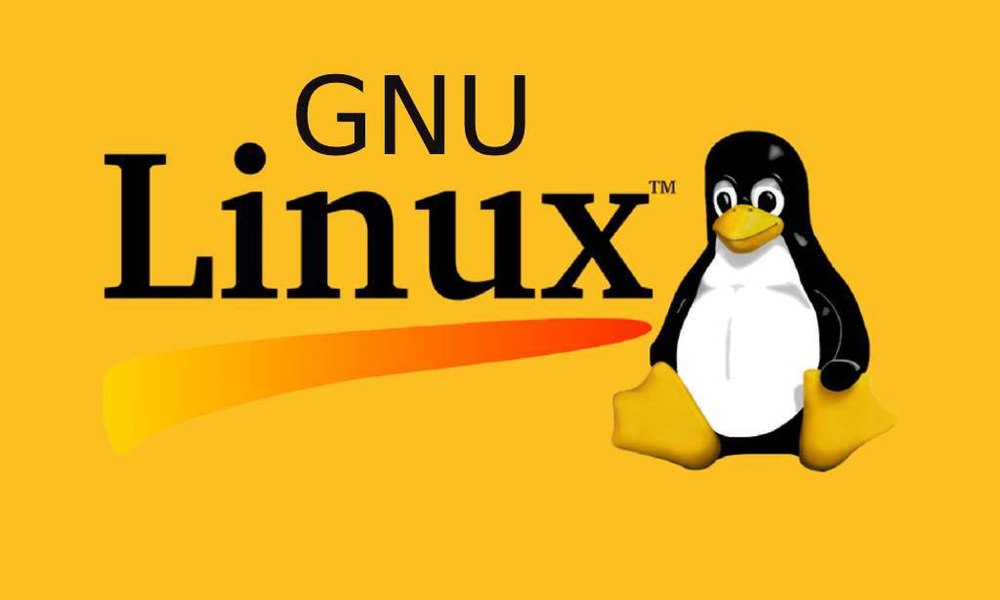

Linux là một hệ điều hành (Operating System - OS) mã nguồn mở (open-source), được phát triển dựa trên nhân(kernel) Linux do Linus Torvalds tạo ra năm 1991. Linux có nguồn gốc từ hệ điều hành Unix. Nó cung cấp môi trường hoạt động cho phần mềm và phần cứng, tương tự như Windows hoặc macOS, nhưng có tính linh hoạt và bảo mật cao hơn.

### 2. Kiến trúc thành phần Linux

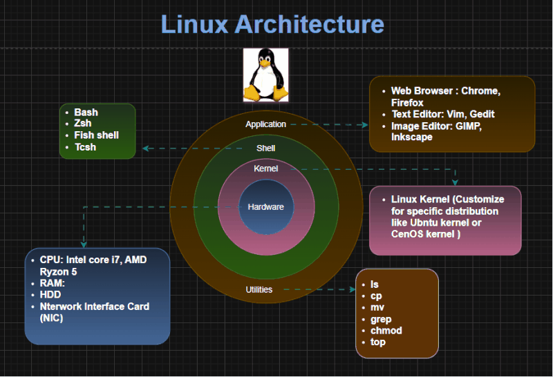

Hệ điều hành Linux được tổ chức theo một kiến trúc phân lớp, trong đó mỗi thành phần có nhiệm vụ và vai trò riêng biệt. Cấu trúc này giúp Linux hoạt động ổn định và hiệu quả trên nhiều loại phần cứng khác nhau.

**Hardware (Phần cứng) – Nền tảng vật lý:**

- **Không phải là một thành phần của hệ điều hành Linux**, nhưng là nền tảng để hệ điều hành hoạt động.
- Gồm CPU, RAM, ổ cứng, card mạng, bo mạch chủ và các thiết bị ngoại vi khác.
- Kernel của Linux sẽ giao tiếp với phần cứng thông qua trình điều khiển thiết bị (drivers).

**Kernel (Nhân hệ điều hành) – Cốt lõi của Linux:**

- Thành phần quan trọng nhất của Linux, chịu trách nhiệm quản lý tài nguyên phần cứng và phân phối chúng cho các tiến trình và ứng dụng.
- Quản lý bộ nhớ, CPU, thiết bị ngoại vi và thực thi các tiến trình.
- Kernel hoạt động như một cầu nối giữa phần cứng và phần mềm.

**Shell:**

- Là chương trình cho phép người dùng giao tiếp với Kernel thông qua dòng lệnh (CLI) như một liên kết giữa Application và Kernel, diễn giải các lệnh được gửi từ Application đến kernel để thực thi.
- Nó là thành phần thực thi các command (lệnh) do người dùng đưa ra hoặc các ứng dụng yêu cầu và được chuyển đến Kernel để xử lý.
 - Các loại Shell phổ biến nhất:
   -  Sh (the Bourne shell)
   - csh (C shell)
   - bash (Bourne-again shell): On most Linux distributions.
   - tsh (TENEX C shell)
   - ash (Almquist shell)
   - zsh (Z shell)
  
**Ứng dụng (Application)**

- Là thành phần trên cùng của kiến trúc Linux, đây chính là các chương trình, ứng dụng (Program, Application) hay câu lệnh mà người dùng chạy trong quá trình sử dụng Linux.

**Các thành phần quan trọng khác:**

- **Bootloader (bộ nạp khởi động):** Khi bật máy tính, nó sẽ trải qua quá trình tự khởi động gọi là booting. Bootloader (bộ nạp khởi động) sẽ có chức năng chính là tải kernel vào bộ nhớ và bắt đầu quá trình khởi động này.
- **Daemon:** là các quy trình chạy ngầm (background process) bắt đầu trong quá trình khởi động. Daemon đảm bảo các chương trình chạy trơn tru trên hệ thống:
  - **systemd:** Daemon trung tâm chịu trách nhiệm quản lý các tiến trình daemon khác.
  - **sshd:** Daemon cho phép kết nối an toàn với máy chủ từ xa và cho phép truyền tệp.
  - **Httpd:** Daemon máy chủ web nhận các yêu cầu HTTP và phục vụ các trang web.
  - **cron:** Daemon thực thi các tác vụ hoặc tập lệnh đã lên lịch từ crontab vào những thời điểm được yêu cầu.
- **Init system (Hệ thống khởi tạo):** là một quy trình daemon được bắt đầu bởi kernel. Init system có vai trò khởi tạo không gian người dùng trong khi khởi động và quản lý các quy trình hệ thống trong thời gian chạy.
- **Graphic server (Máy chủ đồ họa):** là một framework cơ bản trên Linux hiển thị đồ họa trên màn hình. Thành phần này triển khai Hệ thống X Window (X11 hoặc X) và cho phép quản lý cửa sổ, nhập liệu bằng bàn phím/chuột và hỗ trợ nhiều màn hình.
- **Môi trường desktop:** là một thành phần không bắt buộc có trên tất cả các hệ thống Linux. Mỗi môi trường desktop cung cấp:
  - Các ứng dụng cài sẵn (ví dụ: trình quản lý tệp và thư mục, công cụ chỉnh sửa văn bản, trình duyệt web, trò chơi, và các tác vụ phổ biến khác).
  - Giao diện người dùng đồ họa (GUI) cho phép người dùng tương tác với hệ điều hành bằng chuột và bàn phím (Ví dụ: cửa sổ, menu thả xuống, cách hiển thị tệp và thư mục…)

## II. Cấu trúc file, thư mục trong Linux

Đối với Linux, tất cả đều là file. Từ file thông thường, thư mục, đĩa cho đến thiết bị ngoại vi, mọi thứ đều được hệ điều hành Linux coi là các file trong hệ thống. Tất cả các "file" này được tổ chức theo cấu trúc dạng cây phân cấp (FHS – File Hierarchy Structure) trong đó cao nhất là thư mục gốc "/" (gọi là root)

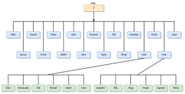

### 1. Root - thư mục gốc (`/`).
- Root filesystem (`/`) là thư mục gốc của toàn bộ hệ thống tập tin Linux. Tất cả các thư mục và tập tin khác đều nằm dưới `/` theo cấu trúc phân cấp.

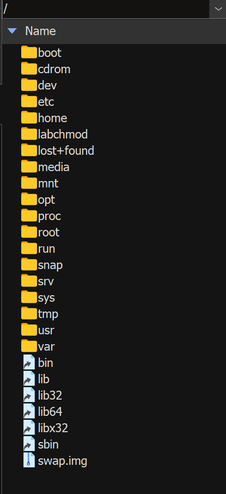

- Các đặc điểm chính của root filesystem:
+ **Cấu trúc phân cấp duy nhất**: tất cả các phân vùng, thiết bị đều được gắn (mount) dưới thư mục `/`.
+ **Tiêu chuẩn FHS (Filesystem Hierarchy Standard)**: Linux tuân theo tiêu chuẩn FHS để đảm bảo tính nhất quán giữa các bản phân phối.
+ **Phân tách quyền hạn**: Root filesystem thường chứa các thư mục hệ thống cốt lõi như `/bin`, `/etc`, `/lib`.
+ **Bảo vệ**: các tập tin và thư mục có quyền truy cập hạn chế để bảo vệ tính toàn vẹn hệ thống.

Ý nghĩa của việc dùng cấu trúc thư mục duy nhất:
+ Quản lý tài nguyên thống nhất.
+ Dễ dàng mở rộng bằng cách gắn các phân vùng mới.
+ Giúp người quản trị định vị tệp và dịch vụ dễ dàng hơn.

### 2. Các thư mục quan trọng trong hệ thống Linux.
- **/bin**: chứa các lệnh/tiện ích cơ bản, có sẵn ngay khi cài hệ điều hành, cần thiết để khởi động và sửa chữa hệ thống, như `ls`, `cp`, `mv`, `cat`, `grep`, `sed`, `awk`.
  - Những tiện ích ở đây được sử dụng bởi tất cả người dùng.
  - `/bin` thường là link tới `/usr/bin` trong các bản phân phối hiện đại.

- **/sbin**: chứa các lệnh hệ thống (system binaries) mặc định dành cho quản trị viên, như `ip`, `iptables`, `mount`, `fsck`, `shutdown`, `reboot`.
  - Thường chỉ root mới có quyền thực thi các lệnh này.
  - `/sbin` thường link tới `/usr/sbin`.

- **/etc**: chứa các tập tin cấu hình mặc định của hệ thống.
  - `/etc/passwd`: thông tin người dùng.
  - `/etc/shadow`: mật khẩu được mã hóa.
  - `/etc/group`: thông tin nhóm người dùng.
  - `/etc/sudoers`: cấu hình cho lệnh sudo.
  - `/etc/fstab`: cấu hình tự động gắn phân vùng khi khởi động.
  - `/etc/hostname`, `/etc/hosts`: cấu hình mạng.
  - `/etc/systemd/system/`: cấu hình dịch vụ systemd.

- **/home**: chứa thư mục người dùng cá nhân.
  - Mỗi người dùng có một thư mục con, ví dụ `/home/username`.
  - Người dùng có toàn quyền đối với thư mục của mình.
  - Thông thường `/home` nằm trên phân vùng riêng để bảo vệ dữ liệu người dùng.

- **/lib** và **/lib64**: chứa các thư viện hệ thống mặc định cần thiết cho các tiện ích ở `/bin` và `/sbin`.
  - Gồm `libc.so.6` (GNU C Library), `libm.so.6` (math library), v.v.
  - `/lib64` chứa thư viện 64-bit trên hệ thống 64-bit.

- **/media**: điểm gắn kết cho các thiết bị di động như USB, CD, DVD.
  - Người dùng thông thường có quyền truy cập các thiết bị ở đây.
  - Thư mục này có sẵn nhưng thường trống cho đến khi có thiết bị được cắm vào.

- **/mnt**: điểm gắn kết tạm thời cho các phân vùng hoặc thiết bị khác.
  - Người quản trị sử dụng để gắn phân vùng hoặc chia sẻ mạng.
  - Thư mục này có sẵn nhưng mặc định trống, chỉ có nội dung khi admin chủ động mount vào.

- **/boot**: chứa kernel, initrd (initial ramdisk) và các tập tin cấu hình bootloader, đều là những file có sẵn ngay sau khi cài đặt.
  - Ví dụ: `vmlinuz-<version>` (kernel), `initrd.img-<version>`, `grub/grub.cfg`.
  - Khi máy khởi động, bootloader đọc các tập tin ở đây để nạp kernel.
  - Thường là một phân vùng riêng để tránh lỗi khi cập nhật kernel.

- **/opt**: dành cho các phần mềm cài thêm sau này, không phải từ package manager.
  - Thư mục này **có sẵn nhưng mặc định trống** ngay sau khi cài hệ điều hành; chỉ có nội dung khi người dùng tự cài thêm phần mềm bên thứ ba vào đây.

- **/root**: thư mục home của người dùng root (quản trị viên).
  - Khác với `/home` dùng cho người dùng thông thường.

- **/tmp**: chứa tập tin tạm thời được tạo bởi các ứng dụng và người dùng.
  - Tập tin ở đây thường bị xóa khi khởi động lại hệ thống.
  - Mỗi người dùng có quyền ghi vào `/tmp`.

- **/usr**: chứa các chương trình người dùng, thư viện, tài liệu (sẽ chi tiết ở phần 3).

- **/var**: chứa dữ liệu biến đổi như log, cache, spool (sẽ chi tiết ở phần 4).

### 3. Các thư mục quan trọng trong `/usr`.
`/usr` chứa các chương trình, thư viện, tài liệu và dữ liệu dành cho người dùng, không bao gồm các tập tin cấu hình hệ thống cốt lõi.

- **/usr/bin**: chứa hầu hết các lệnh và tiện ích có sẵn mặc định khi cài hệ điều hành.
  - Ví dụ: `bash`, `python3`, `perl`, `ssh`, `scp`, `sudo`, `apt`, `dpkg`, `systemctl`, `journalctl`, `less`.
  - Là nơi chính chứa các ứng dụng được cài đặt qua package manager (các gói cài thêm sau này như `git`, `gcc`, `node`, `java`... cũng sẽ nằm ở đây, nhưng không có sẵn mặc định mà phải cài đặt riêng).

- **/usr/sbin**: chứa các lệnh quản trị hệ thống mặc định, không cần thiết để khởi động.
  - Ví dụ: `useradd`, `userdel`, `groupadd`, `usermod`, `visudo`, `mkfs`, `fdisk`, `blkid`.

- **/usr/lib** và **/usr/lib64**: chứa thư viện chia sẻ mặc định cho các chương trình ở `/usr/bin` và `/usr/sbin`.
  - Ví dụ: `libc.so`, `libssl.so`, `libcrypto.so`.

- **/usr/local**: chứa các chương trình được cài đặt thủ công (không qua package manager).
  - Cấu trúc tương tự `/usr`: `/usr/local/bin`, `/usr/local/lib`, `/usr/local/include`.
  - Thư mục này có sẵn nhưng mặc định trống, chỉ có nội dung khi admin tự build/cài phần mềm vào đây để tránh xung đột với gói được quản lý bởi hệ thống.

- **/usr/share**: chứa dữ liệu độc lập với kiến trúc phần cứng, có sẵn mặc định.
  - `/usr/share/doc`: tài liệu của các gói đã cài.
  - `/usr/share/man`: trang manual cho các lệnh.
  - `/usr/share/locale`: dữ liệu bản địa hóa (ngôn ngữ, mã hóa).
  - `/usr/share/zoneinfo`: dữ liệu múi giờ hệ thống.

### 4. Các thư mục quan trọng trong `/var`.
`/var` chứa các tập tin dữ liệu biến đổi như log, cache, mail queue, những tập tin thay đổi thường xuyên trong quá trình hoạt động của hệ thống.

- **/var/log**: chứa các tập tin log mặc định của hệ thống.
  - `/var/log/syslog` (Debian/Ubuntu) hoặc `/var/log/messages` (RHEL/CentOS): log chung của hệ thống.
  - `/var/log/auth.log`: log xác thực người dùng.
  - `/var/log/kern.log`: log của kernel.
  - `/var/log/dpkg.log` (Debian/Ubuntu) hoặc `/var/log/dnf.log` (RHEL/Fedora): log cài đặt/gỡ gói phần mềm.
  - `/var/log/boot.log`: log quá trình khởi động.
  - Việc kiểm tra log rất quan trọng trong việc tìm ra sự cố hệ thống.
  - **Lưu ý**: các log riêng của dịch vụ (VD: `/var/log/apache2/`, `/var/log/nginx/`, `/var/log/mysql/`) chỉ xuất hiện sau khi cài đặt các dịch vụ tương ứng, không có sẵn mặc định.

- **/var/spool**: chứa dữ liệu chờ xử lý mặc định cho các dịch vụ nền tảng của hệ thống.
  - `/var/spool/mail`: thư được gửi tới người dùng cục bộ.
  - `/var/spool/cron`: tập tin cron job của từng người dùng.
  - Các thư mục spool khác (VD: `/var/spool/cups` cho in ấn) chỉ được tạo khi cài đặt dịch vụ tương ứng.

- **/var/cache**: chứa dữ liệu cache mặc định của trình quản lý gói.
  - `/var/cache/apt`: cache các gói apt đã tải về (Debian/Ubuntu).
  - `/var/cache/dnf` hoặc `/var/cache/yum`: cache các gói dnf/yum (RHEL/Fedora/CentOS).
  - Dữ liệu ở đây có thể an toàn xóa khi cần lấy lại dung lượng.

- **/var/run** hoặc **/run**: chứa các tập tin PID (Process ID) và socket mặc định của các dịch vụ nền hệ thống.
  - `/run/systemd/`: socket và trạng thái của systemd.
  - `/run/lock/`: các file lock của hệ thống.
  - `/run/utmp`: thông tin phiên đăng nhập hiện tại.
  - Các tập tin ở đây thường được xóa khi khởi động lại hệ thống.

- **/var/tmp**: chứa tập tin tạm thời lâu dài, không bị xóa khi khởi động lại (khác `/tmp`).
  - Thư mục có sẵn mặc định nhưng thường trống, một số ứng dụng dùng để lưu trữ tập tin tạm thời lớn.

### 5. Một số thư mục đặc biệt khác.
- **/proc**: hệ thống tập tin ảo cung cấp thông tin về các tiến trình và thông tin hệ thống.
  - `/proc/cpuinfo`: thông tin CPU.
  - `/proc/meminfo`: thông tin bộ nhớ.
  - `/proc/[PID]`: thông tin về tiến trình có ID là `[PID]`.
  - `/proc/[PID]/status`: trạng thái chi tiết của tiến trình.
  - Tất cả tập tin ở đây không thực sự tồn tại trên đĩa cứng, chúng được sinh ra động bởi kernel.

- **/sys**: hệ thống tập tin ảo cung cấp thông tin và kiểm soát thiết bị và module kernel.
  - `/sys/class/`: thông tin về các lớp thiết bị (usb, net, block, etc).
  - `/sys/devices/`: cây phân cấp các thiết bị hệ thống.
  - `/sys/module/`: thông tin về các module kernel được nạp.

- **/dev**: chứa các tập tin thiết bị (device files) do kernel tự sinh ra, luôn có sẵn mặc định.
  - `/dev/sda`, `/dev/sda1`: ổ đĩa cứng và phân vùng (tên có thể khác tùy loại ổ, VD `/dev/vda`, `/dev/nvme0n1`).
  - `/dev/null`: thiết bị null (loại bỏ dữ liệu ghi vào).
  - `/dev/zero`: thiết bị cung cấp byte 0 vô hạn.
  - `/dev/tty`: terminal hiện tại.
  - `/dev/pts/`: pseudo-terminal cho SSH, terminal ảo.
  - Linux sử dụng udev để quản lý các tập tin thiết bị động.

- **/lost+found**: thư mục có sẵn mặc định trên các phân vùng ext, được tạo bởi `fsck` (file system check) để lưu trữ các tập tin bị hỏng hoặc bắt gặp khi kiểm tra hệ thống tập tin.
  - Thường trống nếu hệ thống hoạt động ổn định.

## III. Ưu điểm, hạn chế của Linux

### 1. Ưu điểm

- **Mã nguồn mở & miễn phí:** Người dùng không tốn chi phí bản quyền và có thể tự do sửa đổi, tùy biến mọi thành phần của hệ thống.

- **Bảo mật cao:** Nhờ cấu trúc phân quyền chặt chẽ và cộng đồng lớn liên tục rà soát lỗi, Linux ít bị tấn công bởi virus hay phần mềm độc hại.

- **Hiệu suất cao và ổn định:** Tiết kiệm tài nguyên phần cứng, chạy mượt mà trên cả các thiết bị cấu hình thấp và hiếm khi cần khởi động lại.

- **Môi trường lý tưởng cho lập trình:**  Hỗ trợ tuyệt vời cho các công việc quản trị hệ thống và phát triển phần mềm.

### 2. Hạn chế

- **Phần mềm hạn chế:**  Không có nhiều phần mềm phổ biến (ví dụ: Adobe Photoshop, Microsoft Office gốc) hoặc các tựa game nổi tiếng như trên Windows

- **Không tương thích với một số phần cứng:**  Một số thiết bị ngoại vi đặc thù có thể không có driver hỗ trợ chính thức từ nhà sản xuất cho Linux.

- **Đòi hỏi kiến thức kỹ thuật:**  Việc cài đặt, cấu hình phần cứng hoặc khắc phục lỗi đôi khi phải dùng đến dòng lệnh (Terminal), gây khó khăn cho người mới bắt đầu.

## IV. Distro Linux là gì? Phân loại distro linux

### 1. Khái niệm Distro Linux

**Distro (Linux Distribution) - bản phân phối của Linux:**

- là một phiên bản của hệ điều hành Linux, được đóng gói kèm theo Kernel (nhân Linux), công cụ hệ thống, phần mềm mặc định, trình quản lý gói (package manager) và giao diện người dùng.
- Mỗi Distro có cách quản lý, tối ưu và mục đích sử dụng khác nhau, phù hợp với nhiều đối tượng từ người mới dùng đến lập trình viên và quản trị hệ thống.

### 2. Thành phần chính của một bản phân phối Linux

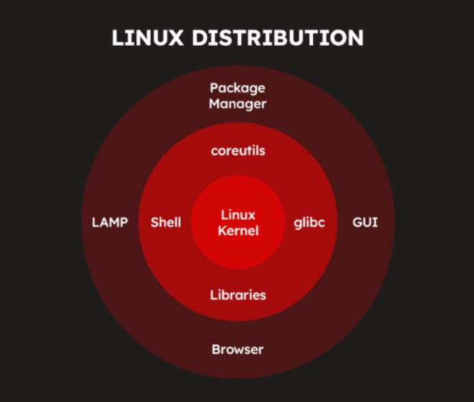

# Kiến trúc cơ bản của Linux

## Lớp lõi (Core) – Trung tâm của hệ thống

- **Kernel:** Nhân hệ điều hành, chịu trách nhiệm quản lý CPU, RAM, tiến trình, thiết bị và giao tiếp với phần cứng.

**Kiểm tra phiên bản Kernel:**

```bash
uname -a
```

Kết quả:

```bash
Linux chien2003 5.15.0-185-generic #195-Ubuntu SMP Fri Jun 19 17:11:50 UTC 2026 x86_64 x86_64 x86_64 GNU/Linux
```

---

## Lớp hệ thống (System Layer) – Cung cấp công cụ cơ bản

### Shell

Là giao diện dòng lệnh (CLI), giúp người dùng giao tiếp với hệ điều hành thông qua các lệnh.

**Kiểm tra Shell đang sử dụng:**

```bash
echo $SHELL
```

Kết quả:

```text
/bin/bash
```

---

### glibc (GNU C Library)

Là thư viện C tiêu chuẩn mà hầu hết các chương trình trên Linux sử dụng để gọi các hàm hệ thống.

**Kiểm tra phiên bản glibc:**

```bash
ldd --version
```
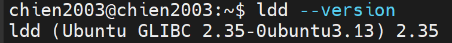
---

### Libraries

Là các thư viện mà chương trình cần để hoạt động.

**Xem các thư viện mà lệnh `ls` đang sử dụng:**

```bash
ldd /bin/ls
```

Kết quả:

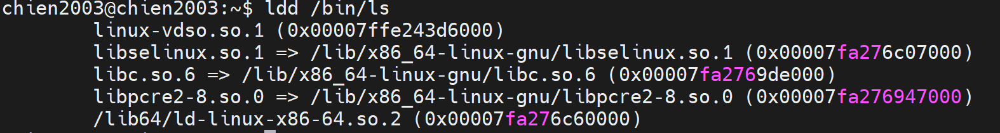

---

### coreutils

Là bộ công cụ dòng lệnh cơ bản của Linux như:

- ls
- cat
- cp
- mv
- rm
- mkdir
- chmod
- chown

**Kiểm tra phiên bản GNU Coreutils:**

```bash
ls --version
```

Kết quả:

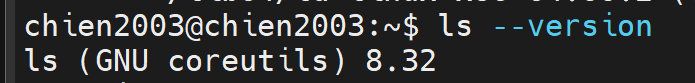

---

## Lớp ứng dụng và quản lý phần mềm

### Package Manager

Là hệ thống quản lý gói phần mềm, giúp tìm kiếm, cài đặt, cập nhật và gỡ bỏ ứng dụng.

Ví dụ:

- Ubuntu/Debian: `apt`

**Kiểm tra phiên bản Package Manager:**

Ubuntu:

```bash
apt --version
```
Kết quả:

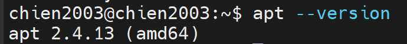
---

### LAMP (Linux, Node, Python,...)

Là bộ công cụ thường dùng để xây dựng máy chủ Web.

- Linux: Hệ điều hành
- Node: Ngôn ngữ lập trình phía Server

**Kiểm tra từng thành phần:**

Node:

```bash
node -v
```
Python:

```bash
python3 --version
```

---

### GUI (Graphical User Interface)

Là giao diện đồ họa giúp người dùng thao tác bằng chuột và cửa sổ.

Các môi trường Desktop phổ biến:

- GNOME
- KDE Plasma
- XFCE
- Cinnamon

**Kiểm tra Desktop Environment hiện tại:**

```bash
echo $XDG_CURRENT_DESKTOP
```
---

### Browser

Là trình duyệt web được cài trên hệ điều hành.

Ví dụ:

- Firefox
- Google Chrome

**Kiểm tra trình duyệt đã cài:**

Firefox:

```bash
firefox --version
```

Google Chrome:

```bash
google-chrome --version
```
### 3. Phân loại distro linux

Có rất nhiều distro Linux tồn tại, nhưng chúng ta không cần phải nhớ hết — chỉ cần hiểu chúng được phân loại theo **3 cách** chính dưới đây.

---

#### 3.1. Phân loại theo nguồn gốc (Dựa trên Distro gốc)

Hãy hình dung Linux giống như một cái cây lớn. Từ một số ít "gốc cây" ban đầu, người ta đã tạo ra hàng trăm distro khác nhau bằng cách thêm bớt, tùy chỉnh cho phù hợp với nhu cầu riêng. Nhờ vậy, các distro cùng nhánh thường có cách dùng và cấu trúc tương tự nhau.

> **Quản lý gói** là cách hệ thống cài đặt/gỡ phần mềm.

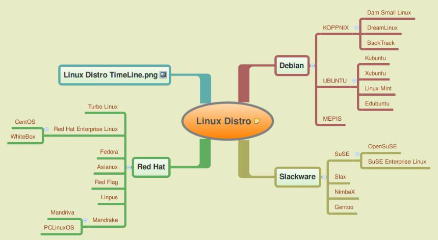

| Nhánh gốc | Distro phổ biến | Đặc điểm nổi bật | Công cụ cài phần mềm |
| :--- | :--- | :--- | :--- |
| **Debian** | Ubuntu, Kali Linux, Linux Mint | Ổn định, cộng đồng hỗ trợ lớn, dễ dùng — **phù hợp người mới bắt đầu** | File `.deb`, dùng lệnh `apt` |
| **Red Hat** | RHEL, Rocky Linux, Fedora | Được dùng nhiều trong doanh nghiệp vì độ ổn định và bảo mật cao | File `.rpm`, dùng lệnh `dnf` hoặc `yum` |
| **Slackware** | Slackware, Puppy Linux | Một trong những distro lâu đời nhất, ít tự động hóa — **phù hợp người muốn tự kiểm soát mọi thứ** | File `.txz`, cài thủ công |
| **Arch** | Arch Linux, Manjaro | Tối giản, tự cấu hình từ đầu, luôn có phần mềm mới nhất — **phù hợp người dùng nâng cao** | Dùng lệnh `pacman` |

---

#### 3.2. Phân loại theo mục đích sử dụng

Khác với Windows chỉ có một phiên bản chung cho mọi người, Linux có các distro được thiết kế riêng cho từng mục đích cụ thể. Điều này giúp hệ thống chạy tối ưu hơn cho công việc bạn cần làm.

| Mục đích | Distro tiêu biểu | Đặc điểm |
|:---|:---|:---|
| **Máy tính cá nhân (Desktop)** | Ubuntu Desktop, Linux Mint | Có giao diện đồ họa đẹp, tự nhận diện phần cứng — dùng như Windows bình thường |
| **Máy chủ (Server)** | Rocky Linux, Ubuntu Server | Không có giao diện đồ họa (để tiết kiệm tài nguyên), tập trung vào bảo mật và hiệu suất cao |
| **Bảo mật / Kiểm thử xâm nhập** | Kali Linux, Parrot OS | Cài sẵn hàng trăm công cụ chuyên dụng cho việc kiểm tra và phân tích bảo mật |
| **Máy cấu hình yếu** | Puppy Linux, Lubuntu | Rất nhẹ, chỉ cần vài trăm MB RAM vẫn chạy mượt — hồi sinh được máy tính cũ |

---

#### 3.3. Phân loại theo mô hình phát hành (Release Model)

Đây là cách các distro tung ra bản cập nhật cho người dùng. Có hai kiểu chính:

- **Fixed Release (Phiên bản cố định):** Nhà phát triển tung ra một phiên bản hoàn chỉnh, đã được kiểm tra kỹ lưỡng theo chu kỳ nhất định (ví dụ: Ubuntu LTS ra mỗi 2 năm). Phù hợp khi bạn cần sự **ổn định**, không muốn thay đổi liên tục — thường dùng cho máy chủ hoặc môi trường làm việc.

- **Rolling Release (Cập nhật liên tục):** Không có phiên bản lớn, phần mềm được cập nhật liên tục ngay khi có bản mới. Bạn luôn có công cụ mới nhất nhưng đổi lại đôi khi có thể gặp lỗi từ bản cập nhật chưa ổn định.

| Mô hình | Distro tiêu biểu | Đặc điểm |
|:---|:---|:---|
| **Fixed Release** | Ubuntu, Debian, Fedora | Ra phiên bản theo chu kỳ cố định, ổn định và dễ dự đoán — **phù hợp môi trường production** |
| **Rolling Release** | Arch Linux, Manjaro | Không có phiên bản lớn, luôn cập nhật lên mới nhất — **phù hợp người thích trải nghiệm công nghệ mới** |

---
## V. User và Group trong Linux

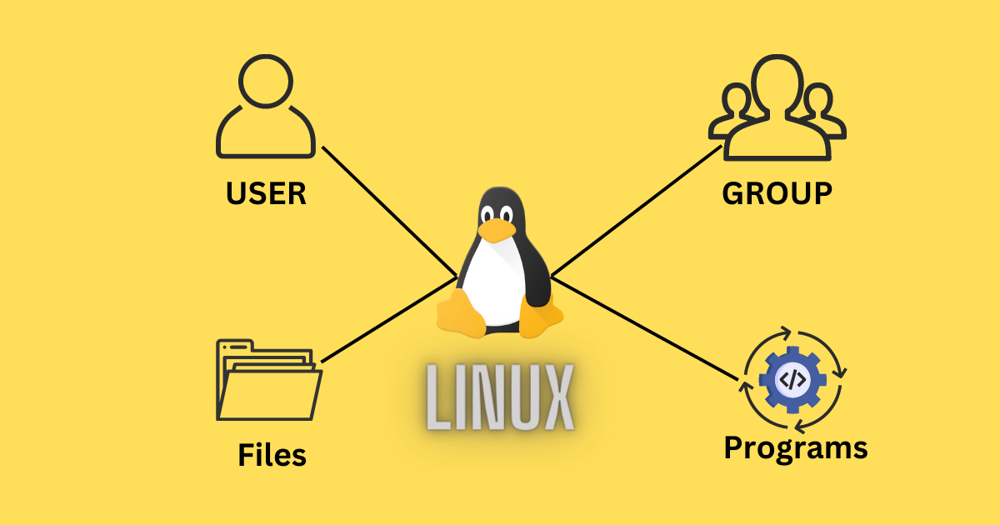

### 1. Thế nào là User trong Linux?

- **Định nghĩa:** User đại diện cho một thực thể (thường là một người) hoặc một tiến trình có thể tương tác với hệ thống. Mỗi user có một danh tính riêng và được hệ thống xác thực khi đăng nhập hoặc thực hiện các tác vụ.
- **User ID (UID):** Mỗi user được gán một số định danh duy nhất gọi là User ID (UID). UID được sử dụng bởi kernel để xác định user khi thực hiện các hoạt động liên quan đến quyền truy cập.
  - **UID 0:** Thường dành cho root user (superuser).
  - **UID 1-999 (hoặc một khoảng tương tự):** Thường dành cho các system user và service account, được hệ thống hoặc các ứng dụng tạo ra để chạy các dịch vụ.
  - **UID 1000 trở lên (hoặc một khoảng tương tự):** Thường dành cho các regular user (người dùng thông thường).
- **Username:** Đây là tên mà người dùng sử dụng để đăng nhập vào hệ thống. Username thường dễ nhớ và có ý nghĩa hơn so với UID.
- **Home Directory:** Mỗi regular user thường có một thư mục riêng gọi là home directory. Đây là nơi người dùng lưu trữ các tệp và thư mục cá nhân của họ. Đường dẫn thường là `/home/<username>`.
- **Thông tin User** được lưu trữ chủ yếu trong 2 tệp:
  - `/etc/passwd`: Chứa thông tin cơ bản về user như username, UID, GID (Group ID mặc định), home directory, và shell mặc định. Thông tin này có thể đọc được bởi tất cả mọi người.

  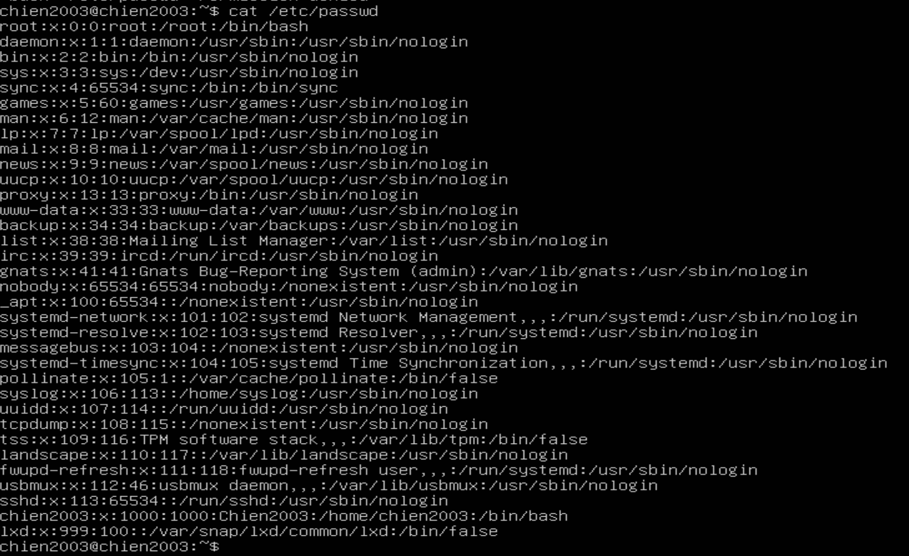

- `/etc/shadow`: Chứa thông tin nhạy cảm về user như mật khẩu đã được mã hóa và các thông tin liên quan đến quản lý mật khẩu. Tệp này thường chỉ có quyền đọc cho root user.

### 2. Các loại user trong Linux

Trong Linux, cách phân loại phổ biến và cơ bản gồm có **Root User** và **Regular User**. Bên cạnh đó, có các loại user khác thường được nhắc đến là "**System User**, **Service Account**, **Guest User**."

- **Root** có quyền cao nhất.
- **Regular User** là tài khoản dùng hằng ngày.
- **System user** và **service account** là các tài khoản **regular user** được tạo ra và quản lý bởi hệ thống hoặc ứng dụng, không dành cho người dùng tương tác trực tiếp.
- **Guest user** cũng là một dạng regular user nhưng mang tính tạm thời và có nhiều hạn chế hơn.

#### a. **Root User (Người dùng quản trị - Siêu người dùng):**

- **Root** là người dùng có quyền cao nhất trong hệ thống.
- Có thể làm mọi thứ: cài đặt/xóa phần mềm, thay đổi file hệ thống, tạo và xóa user, thay đổi quyền hạn file, v.v.
- UID (User ID) = 0.
- Chuyển sang root:

    ```bash
    sudo -i # hoặc sudo su
    ```

*Lưu ý:* Không nên đăng nhập trực tiếp bằng **root**, thay vào đó hãy dùng `sudo` để chạy lệnh với quyền root.

#### b. **Regular User (Người dùng thông thường):**

- Tạo bởi root hoặc trong quá trình cài đặt hệ thống.
- Có UID từ 1000 trở lên trên hầu hết các hệ thống Linux hiện đại.
- Là các tài khoản người dùng có quyền sử dụng hệ thống, tạo file/thư mục trong thư mục home của mình (/home/username).
- Không thể cài đặt phần mềm hoặc sửa đổi file hệ thống mà không có quyền sudo.

#### c. **System User (Người dùng hệ thống):**

- Là các tài khoản được tạo tự động khi cài đặt hệ điều hành để chạy các dịch vụ hệ thống (daemon).
- Thường có UID từ 1-999.
- Không đăng nhập trực tiếp vào hệ thống.
- **Kiểm tra danh sách System User:**

    ```plaintext
    cat /etc/passwd | grep nologin
    ```

- Kết quả:

  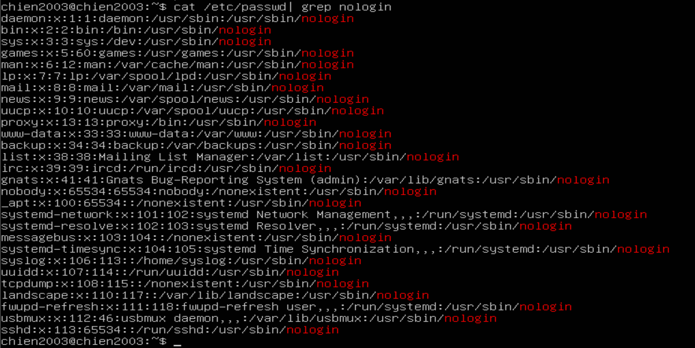

#### d. **Service Account (Tài khoản dịch vụ - chuyên biệt):**

- Là dạng user được sử dụng để chạy các ứng dụng hoặc dịch vụ cụ thể.
- Ví dụ:
  - **www-data** (Nginx/Apache)
  - **mysql** (MySQL, MariaDB)
  - **docker** (Docker daemon)

#### e. **Guest User (Người dùng khách - Tạm thời):**

- Có quyền hạn thấp nhất, thường được dùng trên hệ thống chia sẻ công khai.
- Không thể cài đặt phần mềm hoặc thay đổi cài đặt hệ thống.
- Thư mục /home/guest có thể bị xóa sau khi đăng xuất.
- Tạo một Guest User:

  ```plaintext
  sudo adduser guest --disabled-password
  ```

### 3. Group là gì?

- **Định nghĩa:** Group là một tập hợp các user. Mục đích chính của việc sử dụng group là để đơn giản hóa việc quản lý quyền truy cập cho nhiều user cùng một lúc. Thay vì phải cấp quyền cho từng user riêng lẻ,chỉ cần cấp quyền cho một group và tất cả các user trong group đó sẽ được hưởng quyền này.
- **Group ID (GID):** Tương tự như user, mỗi group cũng được gán một số định danh duy nhất gọi là Group ID (GID).
- **Group Name:** Đây là tên được sử dụng để tham chiếu đến group.
- **Primary Group:** Khi một user được tạo, họ sẽ được gán một group chính (primary group). Thông thường, primary group có cùng tên với username. Khi user tạo một tệp mới, group sở hữu tệp đó sẽ là primary group của user.
- **Secondary Groups:** Một user có thể thuộc nhiều group khác nhau ngoài primary group. Các group này được gọi là secondary groups.
- **Thông tin Group:** Thông tin về group được lưu trữ trong tệp `/etc/group`. Tệp này chứa thông tin về group name, GID, và danh sách các user là thành viên của group đó.

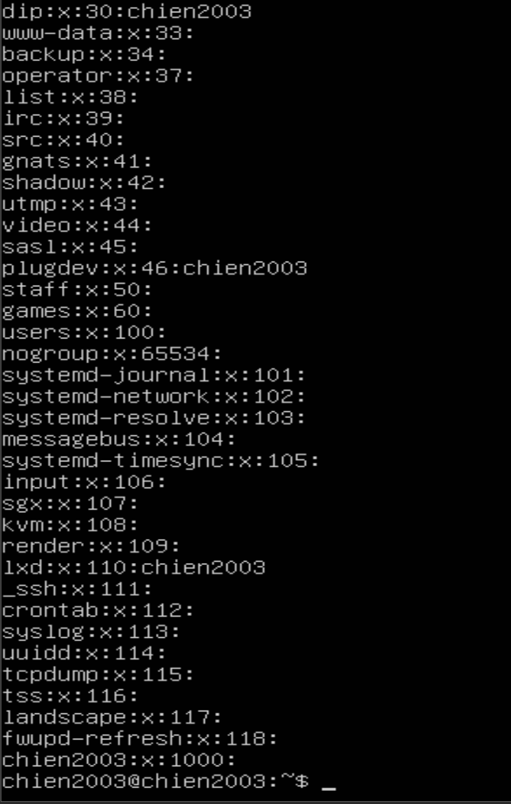

### 4. Mối quan hệ giữa User và Group trong quản lý quyền

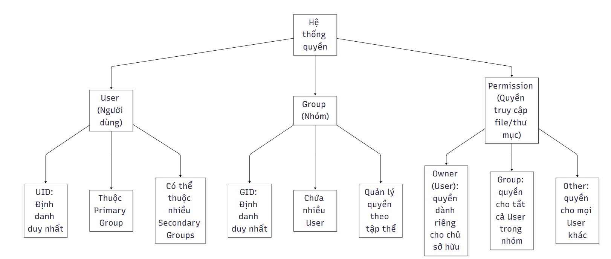

- **Quyền sở hữu tệp và thư mục:** Mỗi tệp và thư mục trong Linux đều có thông tin về **owner (chủ sở hữu)** (là một user) và **group owner (nhóm sở hữu)** (là một group).
- **Quyền truy cập:** Hệ thống Linux sử dụng ba loại quyền truy cập cơ bản cho mỗi tệp và thư mục, áp dụng cho ba đối tượng:
  - **Owner:** User sở hữu tệp/thư mục.
  - **Group:** Group sở hữu tệp/thư mục.
  - **Others:** Tất cả các user khác không phải là owner và không thuộc group sở hữu.
- **Các loại quyền:**
  - **Read (r):** cho phép xem nội dung của tệp hoặc nội dung của thư mục.
  - **Write (w):** Cho phép sửa đổi nội dung của tệp hoặc tạo, xóa, đổi tên tệp trong thư mục.
  - **Execute (x):** Cho phép chạy tệp (nếu là một chương trình) hoặc truy cập vào thư mục (để truy cập các tệp bên trong).

- Lệnh `chmod`: Được sử dụng để thay đổi quyền truy cập của tệp và thư mục.
- Lệnh `chown`: Được sử dụng để thay đổi owner của tệp và thư mục.
- Lệnh `chgrp`: Được sử dụng để thay đổi group owner của tệp và thư mục.

### 5. Quản lý User và Group

**Quản lý User:**

| Chức năng | Câu lệnh |
|-----------|-------------|
| Tạo mới user | `sudo adduser username` |
| Xóa user | `sudo deluser username` |
| Đổi mật khẩu user | `sudo passwd username` |
| Liệt kê User | `cat /etc/passwd` |
| Kiểm tra user hiện tại | `whoami` |

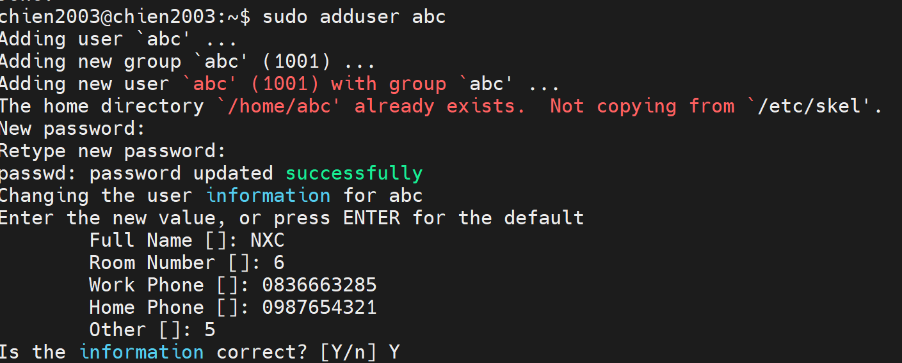

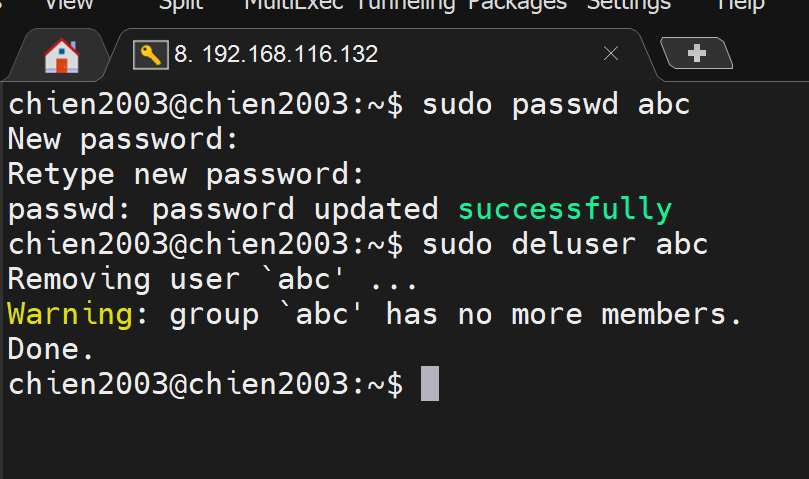

**Quản lý Group:**

| Chức năng | Câu lệnh |
|-----------|-------------|
| Tạo group mới | `sudo groupadd groupname` |
| Xóa group | `sudo groupdel groupname` |
| Thêm user vào group | `sudo usermod -aG groupname username` |
| Liệt kê nhóm của user | `groups username` |
| Xem danh sách group | `cat /etc/group` |

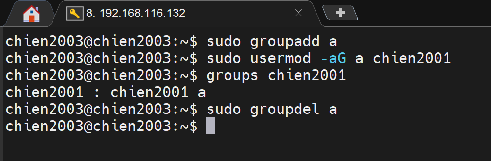

### 6. Xem phân quyền của một file/thư mục

- Xem phân quyền của một file/thư mục:
  - Để xem thông tin phân quyền của một file hay thư mục gõ lệnh **ls** **-l** **/file_name/**. Kết quả thu được sẽ hiện dưới dạng format như sau:
  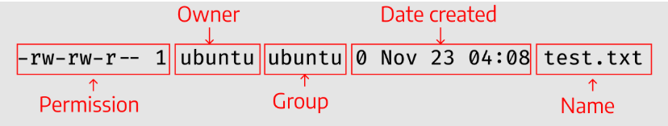
    - **Permission:** các quyền của file.
    - **Owner:** chủ sở hữu của file.
    - **Group:** nhóm mà owner thuộc vào.
    - **Date Created:** ngày tạo file.
  - Trong Permission, có chi tiết các quyền cho các loại user khác nhau:
  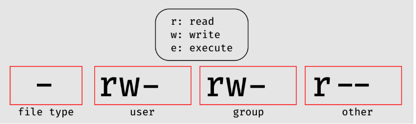
    - **file type:** có ba loại là Tệp thông thường (-)/ Thư mục (d)/ Liên kết (i).
    - **user:** quyền đối với người dùng (chủ sở hữu).
    - **group:** quyền đối với nhóm của chủ sở hữu.
    - **other:** quyền đối với những người dùng khác.
- Các chế độ chỉnh sửa phân quyền:

```bash
    Syntax: $ chmod [permission] [file_name]
```

  - Symbolic Mode: sử dụng ký tự để phân quyền
    - Quy ước ký tự:
      - User (u)
      - Group (g)
      - Other (o)
      - All (a)
      - Read (r)
      - Write (w)
      - Excute (x)
      - +: thêm quyền lên đầu các quyền hiện có
      - -: xóa quyền khỏi các quyền hiện có
      - =: ghi đè lên các quyền hiện có
    - `Syntax: $ chmod [user_type][signs][permission] [file_name]`
  - Numeric Mode: sử dụng mã bát phân để phân quyền

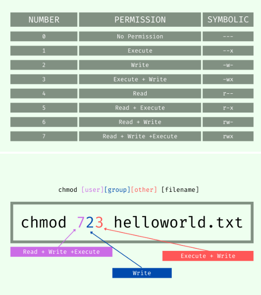

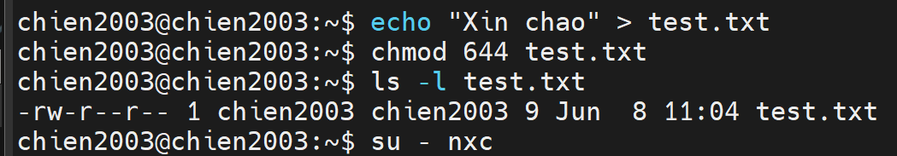

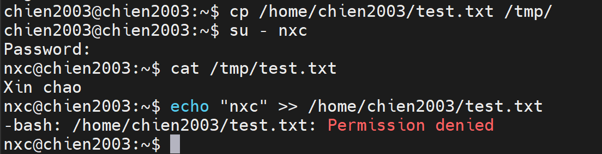

## VI. Giấy phép nguồn mở trong Linux

Giấy phép mã nguồn mở xác định quyền sử dụng, sửa đổi và phân phối lại phần mềm. Có 2 nhóm chính:

- **Bản quyền cho dùng (Copyleft):** là luật hạn chế quyền sử dụng, sửa đổi và chia sẻ các sản phẩm sáng tạo nếu không được sự cho phép của chủ bản quyền. Khi một tác giả phát hành một chương trình theo giấy phép copyleft, họ đưa ra các yêu cầu về bản quyền của chương trình và đưa ra tuyên bố rằng người khác có quyền sử dụng, sửa đổi và chia sẻ tác phẩm miễn là các nghĩa vụ vẫn được duy trì.

- **Cấp phép (Permissive):** là giấy phép nguồn mở non-copyleft, đảm bảo quyền tự do sử dụng, sửa đổi và phân phối lại, đồng thời cho phép độc quyền các sản phẩm phát sinh. Nó đặt ra những hạn chế tối thiểu về cách người khác sử dụng các thành phần nguồn mở, có nghĩa là loại giấy phép này cho phép các mức độ tự do khác nhau để sử dụng, sửa đổi và phân phối lại mã nguồn mở, cho phép sử dụng nó trong các tác phẩm phát sinh độc quyền và gần như không yêu cầu gì liên quan đến các nghĩa vụ trong tương lai.

Hiện nay, có rất nhiều giấy phép mã nguồn mở trên mạng, bất kỳ ai cũng có thể tạo ra loại giấy phép này tùy theo sở thích của họ. Để giúp thu hẹp các quyết định và đơn giản hóa sự lựa chọn, OSI (Open Source Initiative) đã tổng hợp một danh sách các giấy phép đã được phê duyệt, bao gồm hơn 80 giấy phép nguồn mở được sử dụng phổ biến nhất, trong đó có một số giấy phép có giá trị cao đã và đang được sử dụng bởi một số dự án nguồn mở phổ biến nhất hiện nay.

- GNU General Public License (GPL):

  - GNU General Public License (GPL) là giấy phép nguồn mở phổ biến nhất hiện nay. Richard Stallman đã tạo ra GPL để bảo vệ phần mềm GNU khỏi việc bị trở thành độc quyền và nó là một sự triển khai định rõ khái niệm “copyleft” của ông.
  
  - GPL là một giấy phép copyleft. Điều này có nghĩa là bất kỳ phần mềm nào được viết dựa trên bất kỳ thành phần nào của GPL đều phải được phát hành dưới dạng mã nguồn mở. Kết quả là những phần mềm nào sử dụng thành phần mã nguồn mở của GPL (không quan trọng tỷ lệ phần trăm của nó trong toàn bộ mã là bao nhiêu) đều phải phát hành mã nguồn đầy đủ và cho phép tất cả các quyền sửa đổi và phân phối lại toàn bộ mã.

- The Apache License: Giấy phép Apache là một giấy phép phần mềm nguồn mở được phát hành bởi Apache Software Foundation (ASF). Đây là một loại giấy phép phổ biến, được triển khai rộng rãi và được hỗ trợ bởi một cộng đồng lớn mạnh. Giấy phép Apache cho phép tự do sử dụng, sửa đổi và phân phối bất kỳ sản phẩm nào được cấp phép Apache. Tuy nhiên vẫn bắt buộc phải tuân theo các điều khoản của loại giấy phép này.

- MIT License: MIT là một trong những giấy phép phần mềm miễn phí dễ sử dụng nhất. Về cơ bản, có thể làm bất kì điều gì bạn muốn với phần mềm được cấp phép bởi Giấy phép MIT – chi cần thêm một bản sao của Giấy phép MIT gốc và thông báo bản quyền vào đó. Sự đơn giản của nó chính là lý do nó có tỷ lệ chấp nhận cao với các developer.

- Microsoft Public Licenses (Ms-PL): Là một giấy phép phần mềm mã nguồn mở miễn phí do Microsoft phát hành, hãng sản xuất phần mềm này đã tạo ra giấy phép này cho những dự án của mình và được phát hành dưới dạng mã nguồn mở. Giấy phép Ms-PL bảo vệ các tác giả bằng cách không đưa ra bất kì giấy bảo hành được quy định rõ ràng hay sự bảo đảm nào cho việc sử dụng mã của bạn, vì vậy tác giả sẽ không chịu trách nhiệm pháp lý trong các trường hợp mã không hoạt động tốt.