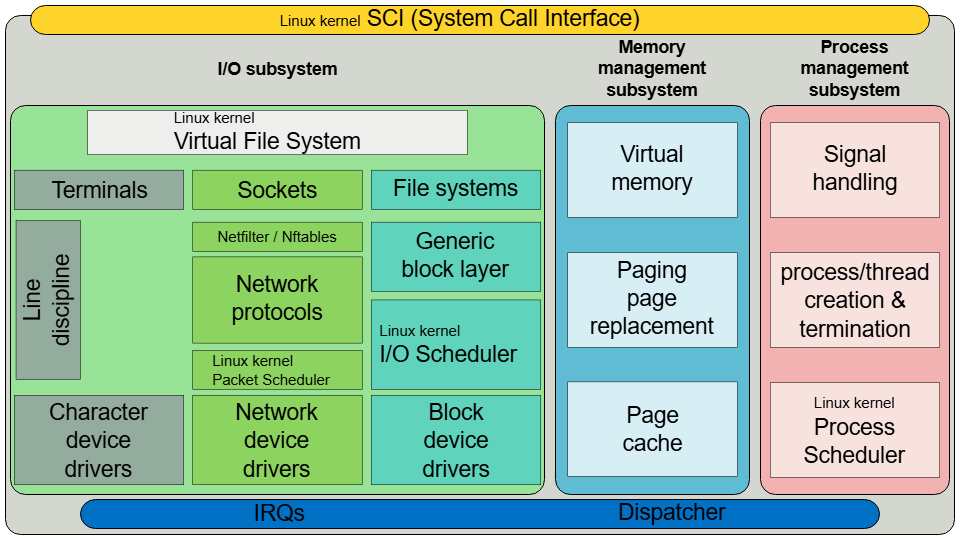
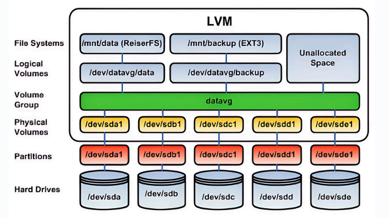
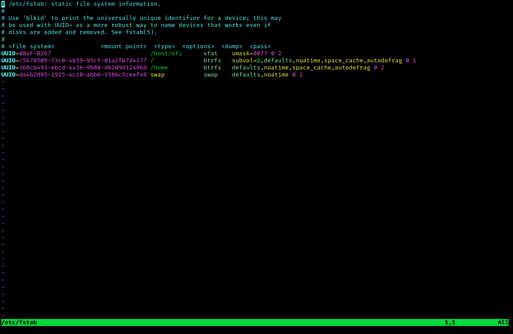
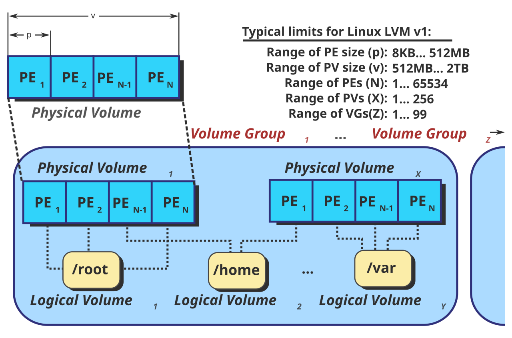
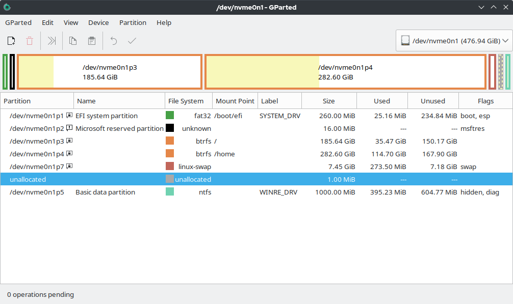

# Advanced Linux Installation & Storage Management
## I. Cài đặt Linux Nâng cao (Advanced Linux Installation Concepts)

### 1. Các Chế Độ Cài Đặt (Installation Modes)
- **Minimal Install**: Chỉ cài đặt các gói lõi cơ bản nhất để hệ thống khởi động. Giúp giảm bề mặt tấn công (attack surface), nhẹ và tối ưu hóa tài nguyên.
- **Full Install**: Cài đặt đầy đủ giao diện đồ họa (GUI), các ứng dụng và tiện ích văn phòng (Complete desktop environment).
- **Server Install**: Tối ưu hóa cho *headless server* (không giao diện người dùng), tập trung triển khai các dịch vụ nền tảng mạng như Apache, Nginx, MySQL, SSH, DNS...

### 2. Các Bước Cài Đặt Khuyến Nghị (Installation Roadmap)
- **Pre-flight Check**: Kiểm tra phần cứng (CPU, RAM, Disk) và chuẩn bị USB boot hoặc file ảo hóa `.iso`.
- **The Installer**: Lựa chọn ngôn ngữ, cấu hình mạng, tạo User và Hostname. Đặc biệt chú ý bước **Disk Partitioning (Phân vùng ổ cứng)**.
- **Post-Installation**: Cập nhật các gói phần mềm hệ thống (`sudo apt update && sudo apt upgrade`), kích hoạt các dịch vụ mạng.

### 3. Chuẩn Phân Vùng: MBR vs GPT
| Tiêu chí | MBR (Master Boot Record) | GPT (GUID Partition Table) |
|---|---|---|
| Năm ra đời | 1983 | 2000s (chuẩn UEFI) |
| Dung lượng tối đa | 2 TB | ~9.4 ZB (gần như vô hạn thực tế) |
| Số phân vùng | Tối đa 4 primary | 128 (Windows), có thể nhiều hơn trên Linux |
| Cơ chế boot | BIOS | UEFI |
| Độ an toàn | Thấp (chỉ 1 bảng MBR duy nhất) | Cao (có lưu trữ backup, CRC check) |
| Ứng dụng | Máy cũ, ổ đĩa < 2TB | Máy đời mới, ổ đĩa > 2TB (chuẩn khuyến nghị) |

### 4. Quản lý Device Driver (Kernel Modules)
Trong Linux, các device driver thường được xây dựng dưới dạng module hạt nhân (kernel modules) và có thể nạp/gỡ mà không cần khởi động lại.
- **Lệnh thường dùng**:
  - `lsmod`: Hiển thị danh sách các module đang chạy và lượt sử dụng.
  - `modprobe` / `rmmod`: Load / Unload các module.
  - `lspci -v` / `lsusb -v`: Xem thông tin chi tiết thiết bị PCI/USB.
  - `dmesg | tail -20`: Kiểm tra các thông điệp liên quan đến phần cứng từ kernel.



## II. Tổng Quan Hệ Thống Lưu Trữ Linux (Linux Storage Systems)

### 1. Swap & Storage Layout
- **Swap**: Vùng nhớ ảo trên ổ cứng, được hệ điều hành dùng làm bộ đệm thay thế khi RAM vật lý bị đầy.
- Phân tách phân vùng `/` (root), `/home`, và `/var` để đảm bảo hệ thống tối ưu và tránh quá tải không gian do dữ liệu cá nhân hay log sinh ra.

### 2. Công Cụ Quản Lý Ổ Đĩa (Disk Management Tools)
- `lsblk` (List Block Devices): Hiển thị danh sách các thiết bị dạng sơ đồ cây, cho bạn cái nhìn tổng quan về cấu trúc vật lý các ổ đĩa và phân vùng.
- `df -h`: Kiểm tra không gian còn trống và đã dùng trên các phân vùng **đã được mount** (cho biết phòng đã chứa bao nhiêu đồ đạc).
- `fdisk` / `parted`: Trình phân vùng dòng lệnh. Sử dụng `fdisk` để tạo (`n`), xóa (`d`), xem bảng (`p`) và lưu (`w`) các phân vùng. VD: `sudo fdisk /dev/sdb`.


### 3. Định Dạng File System
- `ext4`: Kiểu chuẩn mực, phổ biến mặc định trên nhiều distros.
- `XFS`: Tốc độ cao, tối ưu khi làm việc với các file dung lượng lớn.
- `Btrfs`: Hệ thống tập tin hiện đại, mạnh mẽ trong hỗ trợ tính năng snapshot.

### 4. Các Thao Tác Mount (Gắn phân vùng)
Sau khi tạo phân vùng và định dạng (Ví dụ: `sudo mkfs.ext4 /dev/sdb1`), bạn cần mount phân vùng đó để đọc/ghi dữ liệu.
- **Tạm thời**: `sudo mount /dev/sdb1 /mnt/data` (Sẽ mất hiệu lực khi khởi động lại).
- **Vĩnh viễn (Persistent Mount)**: Cần khai báo trong tệp `/etc/fstab`. Khuyến cáo dùng **UUID** (kiểm tra bằng lệnh `blkid`) thay vì tên thiết bị, nhằm tránh sai lệch nếu thứ tự ổ đĩa bị thay đổi.
  - *Ví dụ cấu trúc fstab:* `UUID=1234-abcd-5678  /mnt/data  ext4  defaults  0  2`
  - *Lưu ý quan trọng:* Sau khi chỉnh sửa `/etc/fstab`, bắt buộc chạy lệnh `sudo mount -a` để test lỗi cấu hình, tránh bị crash khi khởi động (boot loop).
- **Unmount (Tháo gắn kết)**: `sudo umount /mnt/data`. Nếu báo `target is busy`, đảm bảo không có user/process nào đang đứng bên trong thư mục đó.


## III. Logical Volume Manager (LVM) - Quản Lý Ổ Đĩa Linh Hoạt

**LVM** là lớp quản lý trừu tượng nằm giữa phần cứng lưu trữ và hệ điều hành. Thay vì phân vùng cố định cứng nhắc, LVM gộp các ổ đĩa thành một "hồ chứa" (pool), cho phép tạo, mở rộng hay thu nhỏ phân vùng nhanh chóng theo nhu cầu trong thời gian chạy (runtime).

### 1. Kiến Trúc LVM (3 Tầng Chính)
1. **Physical Volume (PV)**: Cấp độ thấp nhất. Là các ổ đĩa thô hoặc phân vùng (VD: `/dev/sdb`, `/dev/sdc`) được "đăng ký" định dạng phục vụ cho LVM.
2. **Volume Group (VG)**: Được tạo ra từ việc gộp một hoặc nhiều PV lại. Hành động như một dung lượng tổng mà từ đó có thể cắt ra.
3. **Logical Volume (LV)**: Các "phân vùng ảo" do LVM tạo ra từ không gian chứa của VG. HĐH sẽ định dạng (format) và sử dụng chính các LV này.



### 2. Triển Khai LVM Cơ Bản

**B1. Khởi tạo PV (Physical Volume)**
Đánh dấu ổ cứng để LVM nhận diện:
```bash
sudo pvcreate /dev/sdb /dev/sdc
sudo pvs  # Kiểm tra danh sách Physical Volume
```

**B2. Tạo VG (Volume Group)**
Gom các ổ đã khởi tạo PV thành một bể chứa chung tên là `vg_data`:
```bash
sudo vgcreate vg_data /dev/sdb /dev/sdc
sudo vgs  # Xem trạng thái dung lượng tổng
```

**B3. Tạo LV (Logical Volume)**
Cắt ra một phân vùng ảo tên `lv_storage` có dung lượng `15GB`:
```bash
sudo lvcreate -n lv_storage -L 15G vg_data
sudo lvs  # Xác minh trạng thái của Logical Volume
```

**B4. Định dạng File System và Mount**
Logical volume tạo ra sẽ nằm ở địa chỉ `/dev/Tên_VG/Tên_LV`. Ta cần định dạng và gắn nó:
```bash
sudo mkfs.ext4 /dev/vg_data/lv_storage
sudo mkdir -p /mnt/storage
sudo mount /dev/vg_data/lv_storage /mnt/storage
```
*Bạn có thể cấu hình UUID hoặc đường dẫn LV vào `/etc/fstab` để tự động Mount.*



### 3. Mở Rộng Dung Lượng LVM (Extend LVM)
Một trong những khả năng mạnh mẽ nhất của LVM là phóng to phân vùng trực tiếp.

- **Trường hợp VG vẫn còn trống**:
```bash
# Tăng Logical Volume lên thêm 5GB
sudo lvextend -L +5G /dev/vg_data/lv_storage

# "Kéo giãn" cấu trúc File System (bắt buộc để HDH nhận phần dung lượng mới)
sudo resize2fs /dev/vg_data/lv_storage
```

- **Trường hợp VG đã hết sạch dung lượng**: Bạn có thể cắm thêm ổ cứng vật lý (VD: `/dev/sdd`) và bơm vào VG hiện tại:
```bash
sudo pvcreate /dev/sdd
sudo vgextend vg_data /dev/sdd
# Sau đó thực hiện lvextend và resize2fs bình thường.
```


### 4. Thu Nhỏ & Xóa Bỏ LVM

- **Thu nhỏ LVM (Reduce)**: Phải rất cẩn thận, chỉ nên dùng với ext4 và rủi ro mất dữ liệu cao.
  - Các bước thực hiện: `umount` -> chạy kiểm tra lỗi `e2fsck -f` -> thu nhỏ File System `resize2fs` -> thu nhỏ Logical Volume `lvreduce` -> Mount lại hệ thống.

- **Xóa Bỏ LVM (Remove)**: Tiến hành ngược quy trình tạo từ trên xuống dưới.
  1. `sudo umount /mnt/storage`
  2. Xóa LV: `sudo lvremove /dev/vg_data/lv_storage`
  3. Xóa VG: `sudo vgremove vg_data`
  4. Trả định dạng gốc (Xóa PV): `sudo pvremove /dev/sdb /dev/sdc`
  5. **Bắt buộc**: Phải sửa file `/etc/fstab` xóa dòng mount LV đó để không bị kẹt ở chế độ `Emergency Mode` khi khởi động.

### 5. Cheat Sheet Các Lệnh LVM Thường Dùng
- **Nhóm lệnh hiển thị (Display)**: `pvs`, `vgs`, `lvs` (xem tóm tắt); hoặc `pvdisplay`, `vgdisplay`, `lvdisplay` (xem chi tiết kỹ thuật).
- **Nhóm lệnh Physical Volume**: `pvcreate` (Tạo mới), `pvremove` (Xóa bỏ), `pvmove` (Di chuyển data nóng).
- **Nhóm lệnh Volume Group**: `vgcreate` (Tạo), `vgextend` (Bơm thêm PV), `vgreduce` (Rút bớt PV), `vgremove` (Xóa bỏ).
- **Nhóm lệnh Logical Volume**: `lvcreate` (Tạo), `lvextend` (Tăng dung lượng), `lvreduce` (Giảm dung lượng), `lvremove` (Xóa).

---
*Lưu ý khi mở rộng trực tiếp đĩa cứng ảo trong VM (Ví dụ VMware)*:
Nếu bạn "Expand" dung lượng ổ đĩa từ máy ảo (từ 20G lên 40G), cấu trúc partition trong HĐH vẫn đang giới hạn ở mức cũ. Bạn phải dùng lệnh sau để phân vùng mới nhận diện:
```bash
sudo growpart /dev/sda 3     # Mở rộng partition số 3 của sda
sudo pvresize /dev/sda3      # Cập nhật size cho Physical Volume
sudo lvextend -r -l +100%FREE /dev/ubuntu-vg/ubuntu-lv  # Bơm dung lượng LVM & Auto-resize File System
```

