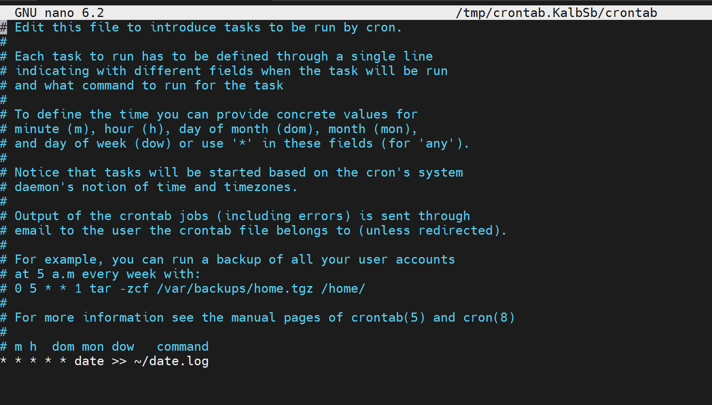
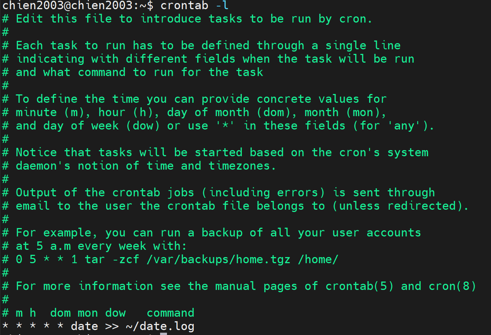
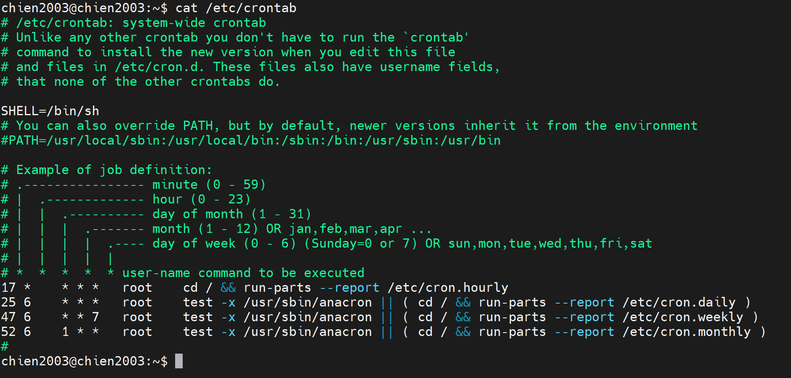
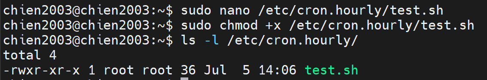

# TÌM HIỂU VỀ CRONTAB
## 1. KHÁI NIỆM
- Crontab (CRON TABLE) là công cụ quản lý lịch trình tự động trên hệ điều hành Linux, cho phép người dùng lên lịch các tác vụ định kỳ và thực hiện chúng tự động mà không cần sự can thiệp thủ công. Crontab giúp bạn tạo và quản lý các tác vụ, như chạy các script, backup dữ liệu hay thực hiện các nhiệm vụ hệ thống vào những thời điểm xác định trước, như hàng ngày, hàng tuần hoặc vào một thời gian cụ thể trong ngày, giúp giảm bớt công việc thủ công và tăng hiệu suất làm việc.

## 2. CẤU TRÚC CỦA CRONTAB
- Crontab bao gồm 5 trường thời gian và 1 trường lệnh cần thực thi. Các trường này được phân cách bằng khoảng trắng hoặc tab, tạo nên cấu trúc để xác định lịch trình thực hiện tác vụ định kỳ.


- Bên cạnh đó, một số lưu ý đặc biệt khi sử dụng:
+ Bạn có thể sử dụng dấu “,” để đặt lịch cho nhiều thời điểm khác nhau
+ Dấu “/” dùng để đặt lịch chạy sau mỗi khoảng thời gian chỉ định.
+ Dấu “–” được sử dụng để đặt lịch chạy trong một khoảng thời gian nhất định.
+ @yearly: Chạy mỗi năm (ví dụ: @yearly /script/script.sh)
+ @monthly: Chạy mỗi tháng (ví dụ: @monthly /script/script.sh)
+ @weekly: Chạy mỗi tuần (ví dụ: @weekly /script/script.sh)
+ @daily: Chạy mỗi ngày (ví dụ: @daily /script/script.sh)
+ @hourly: Chạy mỗi giờ (ví dụ: @hourly /script/script.sh)
+ @reboot: Chạy sau khi khởi động lại hệ thống (ví dụ: @reboot /script/script.sh)

## 3. CRONTAB HOẠT ĐỘNG NHƯ THẾ NÀO
- Crontab hoạt động thông qua các file cấu hình (cron schedule) để quản lý các tác vụ tự động trên hệ thống Linux. Mỗi người dùng có một file Crontab riêng, được lưu trữ trong thư mục /var/spool/cron. Người dùng không thể chỉnh sửa file này trực tiếp mà phải sử dụng lệnh crontab -e để mở tệp trong trình soạn thảo, thêm hoặc sửa các lệnh cần thực thi theo lịch trình và lưu lại.
+ `crontab -e`: Tùy chọn cho phép tạo hoặc chỉnh sửa file Crontab
+ `crontab -l`: Giúp hiển thị file crontab
+ `crontab -r`: Cho phép xóa file crontab

## 4. MỘT SỐ ỨNG DỤNG CỦA CRONTAB
- _Lên task công việc:_ Crontab giúp người dùng lên lịch tự động các tác vụ như sao lưu dữ liệu, quét virus hay thực hiện quy trình định kỳ vào thời gian cụ thể trong ngày, tuần, tháng hoặc năm.
- _Sao lưu dữ liệu:_ Cron thường tự động tạo bản sao lưu cơ sở dữ liệu, các file cấu hình quan trọng hoặc toàn bộ hệ thống hàng ngày, hàng tuần, hoặc hàng tháng, giúp đảm bảo an toàn cho dữ liệu.
- _Quản lý Logs:_ Các tác vụ cron được thiết lập để tự động xóa các file log cũ, giúp tiết kiệm không gian lưu trữ và duy trì hiệu suất hệ thống.
- _Cập nhật hệ thống:_ Cron tự động hóa cập nhật phần mềm, hệ điều hành và các bản vá bảo mật, giúp hệ thống luôn được bảo mật và tối ưu hóa.
- _Gửi Email thông báo tự động:_ Cron được sử dụng để gửi báo cáo, thông báo hoặc email nhắc nhở vào những thời điểm cụ thể, như gửi báo cáo hiệu suất hàng tuần cho quản lý.
- _Tự động hóa công việc lập trình:_ Cron sẽ thực hiện các tác vụ liên quan đến lập trình, chẳng hạn như xây dựng mã nguồn, chạy các bài kiểm thử tự động và triển khai ứng dụng.
- _Quản lý dữ liệu:_ Cron thực hiện các tác vụ như tối ưu hóa cơ sở dữ liệu, tái lập chỉ mục, hoặc chạy các truy vấn SQL định kỳ.


## 5. PHÂN LOẠI CRONTAB TRONG HỆ THỐNG LINUX
Crontab được chia làm hai cấp độ quản lý khác nhau:
### 5.1. Crontab của người dùng (User Crontab)

- Vị trí lưu trữ:
  ```
  /var/spool/cron/crontabs/
  ```
- Mỗi user (bao gồm cả `root`) có một file crontab riêng.
- Các lệnh trong file này sẽ được thực thi với quyền của chính user sở hữu file.

### Bước 1: Kiểm tra user hiện tại

```bash
whoami
```

Ví dụ:

```text
chien2003
```

---

### Bước 2: Tạo hoặc chỉnh sửa Crontab của user

```bash
crontab -e
```



---

### Bước 3: Thêm tác vụ Cron

Di chuyển xuống cuối file và thêm dòng:

```cron
* * * * * date >> ~/date.log
```

Ý nghĩa:

- `* * * * *` : Thực hiện mỗi phút.
- `date` : Hiển thị ngày giờ hiện tại.
- `>>` : Ghi thêm vào cuối file.
- `~/date.log` : File lưu kết quả trong thư mục Home của user.

---

### Bước 4: Lưu và thoát

Trong Nano:

- Nhấn `Ctrl + O`
- Nhấn `Enter`
- Nhấn `Ctrl + X`

Nếu thành công sẽ xuất hiện thông báo:

```text
crontab: installing new crontab
```

---

### Bước 5: Kiểm tra Crontab

```bash
crontab -l
```

Kết quả:



### Bước 6: Kiểm tra file Crontab của user

Hiển thị danh sách file:

```bash
sudo ls -l /var/spool/cron/crontabs
```

Ví dụ:

```text
-rw------- 1 chien2003 crontab 1119 Jul 5 13:47 chien2003
```

Xem nội dung file:

```bash
sudo cat /var/spool/cron/crontabs/chien2003
```

Kết quả:

```cron
# DO NOT EDIT THIS FILE - edit the master and reinstall.
# (/tmp/crontab.xxxxx/crontab installed on ...)
...
* * * * * date >> ~/date.log
```

---

### Bước 7: Kiểm tra Cron hoạt động
```bash
cat ~/date.log
```

Nếu Cron hoạt động, kết quả sẽ giống:

```text
Sun Jul  5 13:48:01 +07 2026
Sun Jul  5 13:49:01 +07 2026
Sun Jul  5 13:50:01 +07 2026
```

### 5.2. Crontab của hệ thống (System Crontab)

System Crontab được sử dụng để cấu hình các tác vụ của toàn hệ thống. Khác với User Crontab, System Crontab cho phép chỉ định **user** sẽ thực thi lệnh.

### Vị trí các file cấu hình

File cấu hình chính:

```text
/etc/crontab
```

Các thư mục thực thi theo chu kỳ:

```text
/etc/cron.hourly/    # Chạy mỗi giờ
/etc/cron.daily/     # Chạy mỗi ngày
/etc/cron.weekly/    # Chạy mỗi tuần
/etc/cron.monthly/   # Chạy mỗi tháng
```

---

### Bước 1: Xem nội dung file System Crontab

```bash
cat /etc/crontab
```

Hoặc chỉnh sửa:

```bash
sudo nano /etc/crontab
```


### Bước 2: Tạo script thực thi

Tạo file script:

```bash
sudo nano /etc/cron.hourly/test.sh
```

Thêm nội dung:

```bash
#!/bin/bash
date >> /tmp/hourly.log
```

Lưu file.

---

### Bước 3: Cấp quyền thực thi

```bash
sudo chmod +x /etc/cron.hourly/test.sh
```

Kiểm tra:

```bash
ls -l /etc/cron.hourly/
```


### Bước 4: Kiểm tra các thư mục Cron

Hiển thị các script chạy theo giờ:

```bash
ls /etc/cron.hourly/
```

Theo ngày:

```bash
ls /etc/cron.daily/
```

Theo tuần:

```bash
ls /etc/cron.weekly/
```

Theo tháng:

```bash
ls /etc/cron.monthly/
```

---

### Bước 5: Kiểm tra dịch vụ Cron

```bash
systemctl status cron
```

Nếu chưa chạy:

```bash
sudo systemctl start cron
sudo systemctl enable cron
```

---

### Bước 6: Kiểm tra kết quả

Sau khi Cron thực thi, xem kết quả:

```bash
cat /tmp/hourly.log
```

Nếu xuất hiện thời gian hệ thống, chứng tỏ script đã được Cron thực thi thành công.

## 6. NHỮNG CÚ PHÁP ĐẶC BIỆT TRONG CRONTAB
| Lệnh viết tắt | Viết tắt của lệnh |                        Mô tả                       |
|:-------------:|:-----------------:|:--------------------------------------------------:|
| @hourly       | 0****             | Chạy công việc tự động mỗi giờ.                    |
| @daily        | 00***             | Chạy tự động vào lúc 00:00 mỗi ngày.               |
| @weekly       | 00**0             | Chạy tự động vào lúc 00:00 mỗi Chủ Nhật hàng tuần. |
| @monthly      | 001**             | Chạy tự động vào lúc 00:00 ngày đầu tháng.         |
| @yearly       | 0011*             | Chạy tự động vào lúc 00:00 ngày đầu năm.           |
| @reboot       | –                 | Chạy tự động mỗi khi hệ thống khởi động lại.       |

## 7. CÁC LỖI THƯỜNG GẶP VÀ CÁCH XỬ LÝ
### Thiếu biến môi trường (Environment Path)
- Khi Cron hoạt động, nó chạy trong một môi trường tối giản và không có đầy đủ danh sách đường dẫn PATH như khi bạn đăng nhập trực tiếp.
- Giải pháp: Luôn sử dụng đường dẫn tuyệt đối cho cả câu lệnh hệ thống lẫn file script.
+ Sai: `0 2 * * * python3 test.py`
+ Đúng: `0 2 * * * /usr/bin/python3 /home/chien2003/test.py`

### Lỗi bị nuốt mất (Không biết tại sao script hỏng)
- Mặc định, Cron sẽ gửi kết quả đầu ra (output) hoặc báo lỗi của lệnh vào hòm thư nội bộ của user. Nếu bạn không cấu hình nhận mail, bạn sẽ không biết script chạy lỗi gì.
- Giải pháp: Xuất toàn bộ dữ liệu log ra một file văn bản bên ngoài để tiện kiểm tra:
`0 2 * * * /usr/bin/python3 /home/chien2003/test.py >> /home/chien2003/cron_output.log 2>&1`

### Thời gian trên Server bị sai
- Cron hoạt động dựa trên đồng hồ của hệ thống. Nếu Server của bạn không được đồng bộ NTP và bị lệch múi giờ (ví dụ: hệ thống dùng giờ UTC nhưng bạn lại tính theo giờ Việt Nam GMT+7), các cron job sẽ chạy sai giờ hoàn toàn.
- Kiểm tra: Hãy gõ lệnh date trên server để xem giờ hệ thống trước khi lên lịch cron.