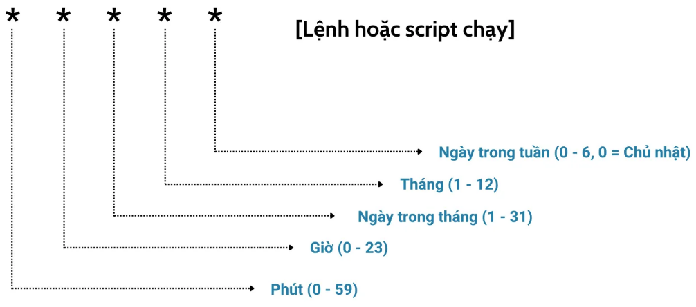

# Crontab
## 1. Khái niệm
Crontab (Cron Table) là một tiện ích tích hợp sẵn trên các hệ điều hành Linux/Unix dùng để lên lịch và tự động hóa các tác vụ (cron jobs) chạy ngầm định kỳ theo thời gian cài đặt trước. Nó hoạt động giống như một bộ hẹn giờ tự động cho máy chủ, giúp bạn xử lý các việc lặp đi lặp lại như sao lưu dữ liệu, xóa tệp log, hoặc chạy script hệ thống.

Việc sử dụng Crontab giúp tiết kiệm thời gian, giảm sai sót và tối ưu hiệu suất vận hành hệ thống.



Một số lưu ý đặc biệt khi sử dụng:

- `*` có nghĩa là mọi giá trị
- Sử dụng dấu “,” để đặt lịch cho nhiều thời điểm khác nhau
- Dấu “/” dùng để đặt lịch chạy sau mỗi khoảng thời gian chỉ định.
- Dấu “–” được sử dụng để đặt lịch chạy trong một khoảng thời gian nhất định.
- `@yearly`: Chạy mỗi năm (ví dụ: @yearly /script/script.sh)
- `@monthly`: Chạy mỗi tháng (ví dụ: @monthly /script/script.sh)
- `@weekly`: Chạy mỗi tuần (ví dụ: @weekly /script/script.sh)
- `@daily`: Chạy mỗi ngày (ví dụ: @daily /script/script.sh)
- `@hourly`: Chạy mỗi giờ (ví dụ: @hourly /script/script.sh)
- `@reboot`: Chạy sau khi khởi động lại hệ thống (ví dụ: @reboot /script/script.sh)


- Ví dụ:

| Dòng | Nghĩa |
|------|--------|
| `30 2 * * *` | 02:30 mỗi ngày |
| `*/15 * * * *`| mỗi 15 phút |
| `0 9 * * 1-5`| 9 giờ từ thứ 2 đến thứ 6 |
| `0 0 1 * *`| 00:00 ngày 1 hàng tháng |
| `0 3 * * 0`| 03:00 mỗi chủ nhật hàng tuần |

> Lưu ý: nếu cả ngày tháng (trường 3) lẫn thứ trong tuần (trường 5) đều khác *, cron dùng OR chứ không AND. 0 0 13 * 5 = chạy ngày 13 HOẶC mỗi thứ 6, không phải "thứ 6 ngày 13".


## 2. Cách hoạt động của Crontab 
Crontab hoạt động thông qua các file cấu hình (cron schedule) để quản lý các tác vụ tự động trên hệ thống Linux. Mỗi người dùng có một file Crontab riêng, được lưu trữ trong thư mục `/var/spool/cron`. Người dùng không thể chỉnh sửa file này trực tiếp mà phải sử dụng lệnh crontab -e để mở tệp trong trình soạn thảo, thêm hoặc sửa các lệnh cần thực thi theo lịch trình và lưu lại.

```bash
crontab -e      # mở editor sửa crontab của user hiện tại
crontab -l      # liệt kê
crontab -r      # XÓA SẠCH (cẩn thận, không hỏi lại)
crontab -i -r   # xóa nhưng có confirm
sudo crontab -e -u www-data   # sửa crontab của user khác
sudo crontab -e               # sửa crontab của ROOT
```

## 3. Ứng dụng phổ biến của Crontab
- Lên task công việc: Crontab giúp người dùng lên lịch tự động các tác vụ như sao lưu dữ liệu, quét virus hay thực hiện quy trình định kỳ vào thời gian cụ thể trong ngày, tuần, tháng hoặc năm.
- Sao lưu dữ liệu: Cron thường tự động tạo bản sao lưu cơ sở dữ liệu, các file cấu hình quan trọng hoặc toàn bộ hệ thống hàng ngày, hàng tuần, hoặc hàng tháng, giúp đảm bảo an toàn cho dữ liệu.
- Quản lý Logs: Các tác vụ cron được thiết lập để tự động xóa các file log cũ, giúp tiết kiệm không gian lưu trữ và duy trì hiệu suất hệ thống.
- Cập nhật hệ thống: Cron tự động hóa cập nhật phần mềm, hệ điều hành và các bản vá bảo mật, giúp hệ thống luôn được bảo mật và tối ưu hóa.
- Gửi Email thông báo tự động: Cron được sử dụng để gửi báo cáo, thông báo hoặc email nhắc nhở vào những thời điểm cụ thể, như gửi báo cáo hiệu suất hàng tuần cho quản lý.
- Tự động hóa công việc lập trình: Cron sẽ thực hiện các tác vụ liên quan đến lập trình, chẳng hạn như xây dựng mã nguồn, chạy các bài kiểm thử tự động và triển khai ứng dụng.
- Quản lý dữ liệu: Cron thực hiện các tác vụ như tối ưu hóa cơ sở dữ liệu, tái lập chỉ mục, hoặc chạy các truy vấn SQL định kỳ.

## 4. Crontab Cli

Cron hoạt động dựa trên các lệnh trong cron table. Mỗi người dùng, bao gồm cả root, có thể có một file cron, nhưng sẽ không tồn tại mặc định. Bạn có thể tạo hoặc chỉnh sửa file này bằng lệnh `crontab -e` trong thư mục `/var/spool/cron`. 

Lệnh này không chỉ giúp chỉnh sửa lệnh mà còn tự động khởi động lại crond daemon khi lưu và thoát trình soạn thảo.


### 4.1 Check Crontab install
```bash
crontab -l
```
- Nếu chưa cài đặt
```bash
sudo apt install cron
```
```bash
sudo systemctl start cron
sudo systemctl enable cron
```

### 4.2 Làm việc với Crontab
Thông thường, các file cron sẽ trống, nên các lệnh phải được thêm từ đầu. Dưới đây là một ví dụ về định nghĩa các công việc trong file cron:
```bash
# crontab -e
SHELL=/bin/bash
MAILTO=root@example.com
PATH=/bin:/sbin:/usr/bin:/usr/sbin:/usr/local/bin:/usr/local/sbin

# For details see man 4 crontabs

# Example of job definition:
# .---------------- minute (0 - 59)
# |  .------------- hour (0 - 23)
# |  |  .---------- day of month (1 - 31)
# |  |  |  .------- month (1 - 12) OR jan,feb,mar,apr ...
# |  |  |  |  .---- day of week (0 - 6) (Sunday=0 or 7) OR sun,mon,tue,wed,thu,fri,sat
# |  |  |  |  |
# *  *  *  *  * user-name  command to be executed

# backup using the rsbu program to the internal 4TB HDD and then 4TB external
01 01 * * * /usr/local/bin/rsbu -vbd1 ; /usr/local/bin/rsbu -vbd2

# Set the hardware clock to keep it in sync with the more accurate system clock
03 05 * * * /sbin/hwclock --systohc

# Perform monthly updates on the first of the month
# 25 04 1 * * /usr/bin/dnf -y update
```
- **SHELL**: Chỉ định shell sử dụng để thực thi lệnh, thường là shell Bash.
- **MAILTO**: Địa chỉ email nhận thông báo hoặc kết quả từ cron job, giúp theo dõi trạng thái backup, cập nhật, hoặc output lệnh.
- **PATH**: Đặt đường dẫn cho môi trường để đảm bảo các lệnh được thực thi chính xác.
- Lệnh `01 01 ***/usr/local/bin/rsbu -vbd1` ; `/usr/local/bin/rsbu -vbd2` trong file `/etc/crontab` sẽ thực hiện backup hệ thống vào mỗi ngày vào lúc 1:01 sáng. Dòng lệnh này backup 2 lần: lần đầu vào ổ cứng chuyên dụng và lần 2 vào USB ngoài:
  - Dấu *: Đại diện cho mọi giá trị (ngày, tháng, tuần).
  - Script rsbu: Chạy trên shell Bash để sao lưu dữ liệu tự động.
- Lệnh `03 05 * * * /sbin/hwclock --systohc` dùng để đặt thời gian phần cứng trên máy tính dựa trên thời gian hệ thống và chạy lúc 5:03 sáng mỗi ngày.
- Lệnh `# 25 04 1 * * /usr/bin/dnf -y update` được thiết kế để cập nhật dnf hoặc yum lúc 4:25 sáng ngày đầu tiên mỗi tháng. Tuy nhiên, do được chuyển thành comment (#), lệnh này sẽ không được thực thi.

- Khi muốn xây thêm lịch thêm dòng vào trong file theo cú pháp:
```bash
┌───────── phút        (0-59)
│ ┌─────── giờ         (0-23)
│ │ ┌───── Ngày trong tháng (1-31).
│ │ │ ┌─── tháng       (1-12)
│ │ │ │ ┌─ thứ trong tuần (0-7, cả 0 lẫn 7 = Chủ Nhật)
│ │ │ │ │
* * * * *  <lệnh cần chạy>
```

- Ví dụ bạn muốn xóa file log nginx hàng tuần để log không bị đầy:
```bash
0 3 * * 1 truncate -s 0 /var/log/nginx/access.log /var/log/nginx/error.log
```
- Xóa dữ liệu access.log và error.log 03:00 mỗi chủ nhật

- Tuy nhiên, cách đúng chuẩn production (logrotate) — và đây là điều bạn nên dùng: Ubuntu/Debian đã cài sẵn logrotate cho nginx rồi, file config nằm ở:
```bash
cat /etc/logrotate.d/nginx
```
Nó đã handle trọn bộ: rotate theo tuần, nén .gz, giữ lại N bản cũ, và quan trọng là gửi tín hiệu USR1 cho nginx để mở lại file sau khi rotate (postrotate ... nginx -s reopen). Bạn gần như không cần tự viết cron cho việc này.

Nếu muốn ép chu kỳ tuần, sửa trong config đó:
```bash
/var/log/nginx/*.log {
    weekly
    rotate 4
    compress
    delaycompress
    missingok
    notifempty
    postrotate
        [ -s /run/nginx.pid ] && kill -USR1 $(cat /run/nginx.pid)
    endscript
}
```
Test thử không cần chờ tới tuần sau:
```bash
sudo logrotate -d /etc/logrotate.d/nginx   # -d = dry-run, chỉ in ra xem nó định làm gì
sudo logrotate -f /etc/logrotate.d/nginx   # -f = ép chạy ngay
```

- Debug khi job không chạy
```bash
# Xem cron có thực sự kích hoạt job không
grep CRON /var/log/syslog        # Ubuntu/Debian
journalctl -u cron --since today

# Test thử lệnh trong môi trường nghèo của cron
env -i /bin/bash --noprofile --norc -c '/usr/bin/apt-get update'
```

## 5. Giới hạn truy cập Cron trong Crontab Linux
### 5.1 Giới hạn quyền truy cập Cron
- Việc sử dụng Cron quá mức có thể làm hao tổn tài nguyên hệ thống (bộ nhớ, CPU,...)
- Để tránh tình trạng này, sysadmin có thể giới hạn quyền truy cập của người dùng bằng cách tạo file `/etc/cron.allow`, trong đó chỉ định danh sách người dùng được phép tạo cron job.
- Cơ chế này dùng 2 file:
```bash
/etc/cron.allow
/etc/cron.deny
```
Luật ưu tiên:

- Nếu `cron.allow` tồn tại → chỉ user có tên trong đó được dùng crontab, tất cả còn lại bị chặn. cron.deny bị bỏ qua hoàn toàn.
- Nếu `cron.allow` không tồn tại → ai có tên trong cron.deny thì bị chặn, còn lại được phép.
- Nếu cả hai đều không tồn tại → tùy distro (Debian/Ubuntu mặc định cho mọi user dùng).
- root luôn dùng được, bất kể hai file này.

Ví dụ: chỉ cho deploy và backup được tạo cron job:
```bash
echo -e "deploy\nbackup" | sudo tee /etc/cron.allow
```
Lúc này nếu www-data chạy `crontab -e` sẽ bị đá ra: "You (www-data) are not allowed to use this program (crontab)".

### 5.2  Cơ chế 2 — Vẫn lên lịch job thay cho user bị chặn
user crontab (cái mở bằng crontab -e) có 5 trường:
```bash
phút giờ ngày tháng thứ  <lệnh>
```
còn `system crontab` (`/etc/crontab` và `/etc/cron.d/*`) có 6 trường, thêm username vào giữa:
```bash
phút giờ ngày tháng thứ  <USERNAME>  <lệnh>
```
Nên root tạo file:
```bash
sudo nano /etc/cron.d/nginx-cleanup
cron0 3 * * 1  www-data  /usr/local/bin/clean-cache.sh
```
> job này chạy mỗi thứ Hai 03:00 dưới quyền www-data, dù www-data không hề có crontab riêng và còn đang bị cron.allow chặn.
> Bạn vẫn cần thêm các trường như SHELL, 

Cách 2:

**Bước 1 — Tạo file script**

`/usr/local/bin/` là chỗ chuẩn để bỏ script tự viết. Tạo file:

```bash
sudo nano /usr/local/bin/clean-cache.sh
```

```bash
#!/usr/bin/env bash
set -euo pipefail
export PATH=/usr/local/sbin:/usr/local/bin:/usr/sbin:/usr/bin:/sbin:/bin

# --- logic dọn dẹp thật sự nằm ở đây ---
truncate -s 0 /var/log/nginx/access.log
truncate -s 0 /var/log/nginx/error.log

# ví dụ thêm: xoá file cache cũ hơn 7 ngày
find /var/cache/nginx -type f -mtime +7 -delete
```

Giải thích từng dòng đầu:
- `#!/usr/bin/env bash` — **shebang**. Dòng này báo cho kernel: "chạy file này bằng bash". Nhờ nó mà dù cron có `SHELL=/bin/sh` thì script vẫn chạy đúng bằng bash.
- `set -euo pipefail` — chế độ chặt: `-e` dừng ngay khi có lệnh lỗi, `-u` báo lỗi nếu xài biến chưa khai báo, `pipefail` bắt lỗi giữa pipe. Để job không "âm thầm fail nửa chừng".
- `export PATH=...` — tự set PATH rộng bên trong script, không phụ thuộc PATH nghèo của cron.

**Bước 2 — Cấp quyền thực thi**

File mới tạo chưa chạy được, phải bật bit execute:

```bash
sudo chmod +x /usr/local/bin/clean-cache.sh
```

Kiểm tra:
```bash
ls -l /usr/local/bin/clean-cache.sh
# -rwxr-xr-x ... <-- thấy mấy chữ x là ok
```

**Bước 3 — Test tay trước khi giao cho cron**

Luôn chạy thử bằng tay để chắc script đúng, **đừng** set cron rồi ngồi chờ tới thứ Hai mới biết sai:

```bash
sudo /usr/local/bin/clean-cache.sh
echo $?   # in 0 là thành công
```

**Bước 4 — Tạo file cron chỉ để gọi script**

Giờ file cron.d **không chứa logic gì cả**, nó chỉ có một việc: gọi script trên theo lịch.

```bash
sudo nano /etc/cron.d/nginx-cleanup
```
```cron
0 3 * * 1  root  /usr/local/bin/clean-cache.sh >> /var/log/nginx-cleanup.log 2>&1
```

(Đổi `www-data` → `root` vì truncate log trong `/var/log/nginx/` cần quyền ghi mà thường chỉ root có. Nếu script của bạn chỉ đụng file mà `www-data` sở hữu thì để `www-data`.)

Hai cái này hay bị nhầm vì cùng nằm trong họ cron, nhưng giải quyết **hai bài toán khác hẳn nhau**. Tôi tách rõ.

## `/etc/cron.d/`

### Khái niệm

`cron.d` là một **thư mục drop-in**. Ý tưởng: thay vì mọi job hệ thống nhồi hết vào một file `/etc/crontab` to đùng, mỗi package/dịch vụ tự quăng một file riêng vào `/etc/cron.d/`. Cron quét cả thư mục, đọc từng file như thể chúng là một phần nối dài của `/etc/crontab`.

Lý do tồn tại nó thuần là **đóng gói**: khi bạn `apt install` một package cần chạy job định kỳ (ví dụ `certbot`, `sysstat`, `php`), nó chỉ cần đặt file của mình vào `/etc/cron.d/tên-package`. Lúc `apt remove` thì xoá đúng file đó, không phải đi sửa tay một file dùng chung — sạch sẽ, không giẫm chân nhau.

### Format — giống `/etc/crontab`, 6 trường

Như đã nói ở câu trước: file trong `cron.d` dùng **format system crontab**, có **trường username**:

```cron
SHELL=/bin/bash
PATH=/usr/local/sbin:/usr/local/bin:/usr/sbin:/usr/bin:/sbin:/bin

# m h dom mon dow  user     command
  0 3 *   *   1    www-data /usr/local/bin/clean-cache.sh
```

### Lưu ý

- **Không được có đuôi/ký tự lạ trong tên file.** Cron dùng `run-parts`-style filtering: tên file chỉ được chứa chữ, số, `_`, `-`. File tên `nginx-cleanup` thì chạy, nhưng `nginx-cleanup.sh` hay `nginx.bak` thường **bị bỏ qua** (dấu `.` làm nó ngó lơ). Đây là bẫy kinh điển — bạn copy file thành `.bak` để backup rồi tưởng nó vẫn chạy, hoá ra cả hai đều... không, hoặc chỉ file gốc chạy.
- Mỗi file có thể chứa nhiều dòng job + dòng khai báo biến môi trường ở đầu.
- Sửa file trong `cron.d` **không cần reload** gì cả — cron tự phát hiện thay đổi ở lần quét kế tiếp (mỗi phút).

### So sánh nhanh ba kiểu

| | User crontab | `/etc/crontab` | `/etc/cron.d/*` |
|---|---|---|---|
| Sửa bằng | `crontab -e` | sửa file trực tiếp | sửa file trực tiếp |
| Có cột user? | Không (5 trường) | Có (6 trường) | Có (6 trường) |
| Dùng cho | job cá nhân | job hệ thống tổng | job theo từng package/dịch vụ |

`/etc/crontab` và `/etc/cron.d/*` về cơ chế là giống hệt; khác biệt chỉ là `cron.d` cho phép **mỗi đơn vị một file riêng**. Thực tế bây giờ người ta khuyến khích bỏ vào `cron.d` hơn là sửa thẳng `/etc/crontab`.

---

## Anacron

### Bài toán nó giải

cron có một **giả định chết người**: máy phải **bật 24/7**. Nếu job đặt `0 3 * * *` (03:00 mỗi ngày) mà đúng 03:00 máy đang tắt/ngủ → **cron bỏ lỡ luôn, không chạy bù**. Khi máy bật lại lúc 09:00, cron không quan tâm "job 03:00 hôm nay đã lỡ", nó chỉ chạy job nào khớp đúng phút hiện tại.

Trên server bật liên tục thì không sao. Nhưng **laptop, desktop, máy ảo bật-tắt thất thường** thì các job bảo trì (rotate log, update db locate, dọn temp...) sẽ liên tục bị bỏ lỡ. Đó là lý do **anacron** ra đời.

### Cơ chế — chạy theo "đã bao lâu rồi", không theo "đúng mấy giờ"

anacron không quan tâm giờ giấc chính xác. Nó hỏi: *"Job này lần cuối chạy cách đây bao nhiêu **ngày**? Nếu đã quá chu kỳ thì chạy ngay bây giờ."*

Nó làm được vậy nhờ **ghi timestamp** mỗi lần chạy vào:

```
/var/spool/anacron/<tên-job>
```

File đó chỉ chứa **ngày chạy gần nhất**. Mỗi khi anacron khởi động (lúc boot, hoặc được kích định kỳ), nó so ngày hôm nay với ngày trong file đó — quá hạn thì chạy, rồi cập nhật lại ngày.

### File cấu hình `/etc/anacrontab`

Format **4 trường**, khác hẳn cron:

```
period  delay  job-identifier      command
  1      5      cron.daily          run-parts --report /etc/cron.daily
  7      10     cron.weekly         run-parts --report /etc/cron.weekly
  @monthly 15   cron.monthly        run-parts --report /etc/cron.monthly
```

Đọc từng trường:
- **period** — chu kỳ tính bằng **ngày**. `1` = mỗi ngày, `7` = mỗi 7 ngày. (`@monthly` là từ khoá đặc biệt cho "mỗi tháng" vì tháng không cố định 30 ngày.)
- **delay** — chờ **bao nhiêu phút** sau khi anacron khởi động rồi mới chạy job. Mục đích: rải job ra, tránh boot xong cả đống job đập vào một lúc làm máy giật.
- **job-identifier** — tên định danh, cũng là tên file timestamp trong `/var/spool/anacron/`.
- **command** — lệnh chạy.

Khác biệt cốt lõi so với cron:
- anacron **đơn vị nhỏ nhất là NGÀY** — không có khái niệm "chạy lúc 03:00" hay "mỗi 5 phút". Không hợp cho job cần độ chính xác giờ phút.
- anacron **chỉ chạy as root**.
- anacron **không phải daemon chạy nền liên tục** — nó chạy một phát rồi thoát. Phải có cái gì đó *gọi* nó.

**Hai cái khớp với nhau thế nào (quan trọng nhất)**

Đây là chỗ làm sáng tỏ toàn bộ. Để ý mấy thư mục này:

```
/etc/cron.hourly/
/etc/cron.daily/
/etc/cron.weekly/
/etc/cron.monthly/
```

Bạn quăng một script (không phải dòng cron, mà là **script thực thi**) vào `/etc/cron.daily/` thì nó tự chạy mỗi ngày. Nhưng **ai chạy nó?** Câu trả lời tuỳ máy có anacron hay không:

**Trên máy KHÔNG có anacron (server thuần):**
`/etc/crontab` có sẵn mấy dòng gọi `run-parts` để quét các thư mục đó theo giờ cố định:
```cron
25 6    * * *   root  test -x /usr/sbin/anacron || run-parts --report /etc/cron.daily
47 6    * * 7   root  test -x /usr/sbin/anacron || run-parts --report /etc/cron.weekly
```
Để ý đoạn `test -x /usr/sbin/anacron ||` — nghĩa là *"nếu KHÔNG có anacron thì cron tự làm việc này"*. Chạy lúc 06:25 cố định, máy tắt giờ đó là lỡ.

**Trên máy CÓ anacron (desktop/laptop):**
Điều kiện `test -x /usr/sbin/anacron` đúng → cron **không** chạy mấy dòng trên nữa, nhường việc cho anacron. Anacron (qua `/etc/anacrontab` ở phần 2) sẽ chạy `run-parts /etc/cron.daily` **bất cứ khi nào máy bật và phát hiện đã quá hạn**, kèm delay vài phút. Job lỡ được chạy bù.

Tức là `cron.daily/weekly/monthly` là **giao điểm** của hai hệ thống: cron lo khi máy luôn bật, anacron lo khi máy bật-tắt — và chúng dàn xếp để **không chạy trùng** bằng cái `test -x` đó.

(`cron.hourly` thì luôn do cron lo, vì anacron đơn vị nhỏ nhất là ngày, không làm theo giờ được.)