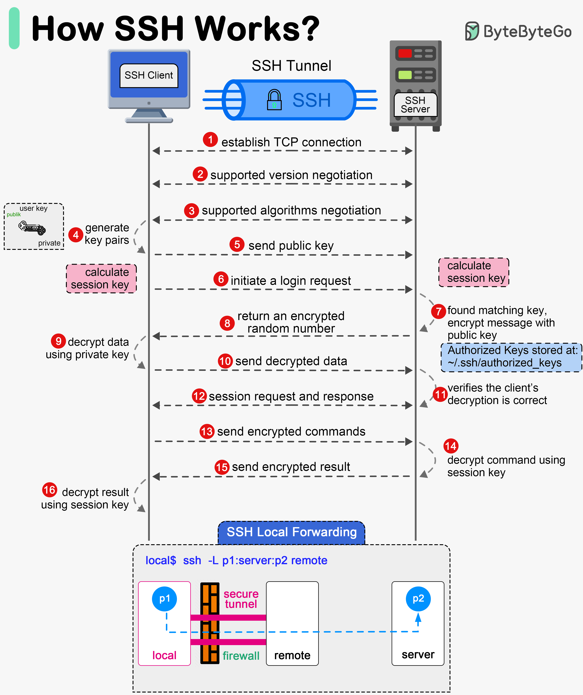

# TỔNG QUAN VỀ SSH
## 1. KHÁI NIỆM.
- SSH, hay Secure Shell, là một giao thức mạng cho phép một máy tính kết nối an toàn với một máy tính khác qua mạng không bảo mật như internet, bằng việc có một thỏa thuận chung về cách thức liên lạc. SSH là một giao thức application layer, là layer thứ 7 của mô hình OSI.

## 2. KHI NÀO NÊN SỬ DỤNG SSH.
Nên sử dụng SSH trong tất cả các trường hợp cần tương tác với máy tính/máy chủ từ xa thông qua mạng Internet hoặc mạng nội bộ:
+ Quản trị Máy chủ từ xa: Khi bạn thuê VPS trên Cloud (AWS, Azure, DigitalOcean) hoặc dựng máy ảo VMware, bạn không thể ngồi trước màn hình vật lý của chúng. SSH là cách duy nhất để bạn bốc terminal của chúng về máy mình để gõ lệnh.
+ Thay thế các giao thức kém an toàn: Bắt buộc phải dùng SSH thay thế cho Telnet, Rsh, rlogin khi quản lý các thiết bị mạng như Switch, Router Cisco.
+ Quản lý mã nguồn với Git: Khi bạn đẩy code (git push) lên GitHub hoặc GitLab, giao thức SSH Key thường được dùng để định danh tài khoản của bạn một cách tự động và bảo mật mà không cần nhập đi nhập lại mật khẩu.

## 3. CÁC CHỨC NĂNG CHÍNH CỦA SSH.
|                   Chức năng chính                   |                                                            Mô tả chi tiết                                                           |                                          Ứng dụng thực tế                                          |
|:---------------------------------------------------:|:-----------------------------------------------------------------------------------------------------------------------------------:|:--------------------------------------------------------------------------------------------------:|
| Quản lý từ xa (Remote Command Execution)            | Cho phép đăng nhập và thực thi mọi câu lệnh trên máy chủ từ xa giống như đang ngồi trực tiếp trước máy đó.                          | Chạy lệnh cấu hình NTP, cài phần mềm, khởi động lại dịch vụ qua Terminal.                          |
| Truyền file an toàn (Secure File Transfer)          | Sử dụng các giao thức con chạy trên nền SSH là SFTP hoặc SCP để gửi/nhận file được mã hóa giữa các máy.                             | Kéo thả file mã nguồn, file script .sh từ Windows lên Ubuntu bằng MobaXterm/FileZilla.             |
| Xác thực an toàn (Authentication)                   | Hỗ trợ nhiều cơ chế xác thực từ cơ bản (mật khẩu) cho đến nâng cao (SSH Key Pair, xác thực 2 lớp - 2FA).                            | Sử dụng cặp khóa id_rsa và id_rsa.pub để đăng nhập không cần mật khẩu.                             |
| Đường hầm bảo mật (SSH Tunneling / Port Forwarding) | Tạo ra một đường hầm mã hóa để bọc các giao thức không an toàn khác bên trong nó, giúp dữ liệu của ứng dụng đó đi qua mạng an toàn. | Truy cập vào một Database (MySQL/PostgreSQL) đang bị chặn cổng trong mạng nội bộ của công ty.      |
| Chạy ứng dụng đồ họa (X11 Forwarding)               | Cho phép truyền giao diện đồ họa (GUI) của một ứng dụng chạy từ máy Linux từ xa hiển thị lên màn hình máy Windows của bạn.          | Mở một trình duyệt hoặc một công cụ cài đặt có giao diện trên Ubuntu Server hiển thị trên Windows. |

## 4. THÔNG SỐ CẤU HÌNH SSH
### 4.1 Cấu hình cơ bản
| Thông số (Directive) | Giá trị mặc định |                                              Mô tả chi tiết chức năng                                             |
|:--------------------:|:----------------:|:-----------------------------------------------------------------------------------------------------------------:|
| Port                 | 22               | Định nghĩa cổng mạng mà SSH Server sẽ lắng nghe. Thay đổi cổng này giúp giảm các cuộc tấn công quét cổng tự động. |
| ListenAddress        | 0.0.0.0          | Chỉ định địa chỉ IP cụ thể trên máy chủ được phép nhận kết nối SSH. 0.0.0.0 nghĩa là chấp nhận mọi IP của máy.    |
| Protocol             | 2                | Phiên bản giao thức SSH được sử dụng (luôn chọn Protocol 2 vì Protocol 1 đã bị lỗi thời và bảo mật kém).          |

### 4.2 Cấu hình bảo mật và xác thực
| Thông số               | Giá trị khuyến nghị  | Mô tả chi tiết chức năng                                                                                   |
|------------------------|----------------------|------------------------------------------------------------------------------------------------------------|
| PermitRootLogin        | no                   | Cho phép hoặc cấm tài khoản tối cao (root) đăng nhập trực tiếp qua SSH. Nên để no để tăng tính bảo mật.    |
| PasswordAuthentication | no (khi dùng Key)    | Cho phép đăng nhập bằng mật khẩu truyền thống hay không. Đặt bằng no nếu bạn chỉ muốn dùng SSH Key.        |
| PubkeyAuthentication   | yes                  | Cho phép xác thực bằng cặp khóa công khai/bí mật (SSH Public/Private Key). Đây là phương thức rất an toàn. |
| AuthorizedKeysFile     | .ssh/authorized_keys | Đường dẫn lưu trữ danh sách các khóa Public Key được phép đăng nhập vào tài khoản của người dùng.          |

### 4.3 Kiểm soát truy cập và giới hạn
|    Thông số    |     Ví dụ cấu hình     |                                                 Mô tả chi tiết chức năng                                                 |
|:--------------:|:----------------------:|:------------------------------------------------------------------------------------------------------------------------:|
| AllowUsers     | AllowUsers user1 user2 | Chỉ định danh sách cụ thể các user được phép đăng nhập qua SSH. Các user khác sẽ bị từ chối.                             |
| AllowGroups    | AllowGroups sshusers   | Chỉ cho phép các thành viên thuộc nhóm (Group) được chỉ định kết nối SSH.                                                |
| MaxAuthTries   | 3 hoặc 5               | Số lần tối đa một tài khoản được phép nhập sai thông tin xác thực trước khi kết nối bị ngắt tự động (chống Brute Force). |
| LoginGraceTime | 2 phút                 | Thời gian tối đa cho phép người dùng giữ kết nối chờ để hoàn tất đăng nhập. Nếu quá thời gian, SSH sẽ tự ngắt.           |

## 5. CÁCH SỬ DỤNG SSH
### 5.1 Kết nối bằng mật khẩu
- Sử dụng câu lệnh trên Terminal `ssh username@dia_chi_ip`
- Trong trường hợp sử dụng một cổng khác (không phải Port 22 mặc định) thì dùng thêm tham số `-p`
Câu lệnh lúc này là `ssh username@dia_chi_ip -p port_number`
- Sau đó bạn sẽ được hỏi mật khẩu đăng nhập của User mà bạn kết nối đến, nhập đúng mật khẩu rồi nhấn Enter

### 5.2 Kết nối bằng khóa bảo mật (SSH Key)
- Việc kết nối bằng khóa bảo mật cũng sử dụng câu lệnh `ssh username@dia_chi_ip` tương tự như trên, nhưng phải qua một số bước cấu hình cả ở trên máy client cũng như server
- Chi tiết tại [Lab SSH](../5.Lab/labSsh.md)

## 6. SSH HOẠT ĐỘNG NHƯ THẾ NÀO 

**Giai đoạn 1: Thiết lập kết nối và Thỏa thuận**
Trước khi mã hóa bất kỳ dữ liệu nào, SSH Client và SSH Server cần tìm được "tiếng nói chung":
- Bước 1 (Thiết lập kết nối TCP): SSH Client bắt đầu bằng việc thiết lập một kết nối TCP tin cậy tới cổng SSH của Server (mặc định là cổng 22) thông qua quy trình bắt tay 3 bước mà bạn đã biết.
- Bước 2 (Supported version negotiation): Hai bên trao đổi thông tin để thống nhất phiên bản giao thức SSH mà cả hai cùng hỗ trợ (ví dụ: SSHv2).
- Bước 3 (Supported algorithms negotiation): Client và Server thương lượng để lựa chọn các thuật toán mã hóa, thuật toán trao đổi khóa và thuật toán kiểm tra tính toàn vẹn dữ liệu tối ưu nhất mà cả hai cùng sở hữu.

**Giai đoạn 2: Tạo Khóa và Thiết lập Kênh mã hóa**
Mục tiêu của giai đoạn này là tạo ra một Session Key (Khóa phiên) dùng chung để mã hóa toàn bộ dữ liệu luân chuyển sau đó:
- Bước 4 (Generate key pairs): Hệ thống tạo/sử dụng cặp khóa (Public Key và Private Key) của người dùng để chuẩn bị cho quá trình xác thực.
- Bước 5 (Send public key): Client gửi Khóa công khai (Public Key) của mình sang phía Server.
- Bước 6 (Initiate a login request) & Tính toán Session Key: Client gửi yêu cầu đăng nhập. Đồng thời, dựa trên các thuật toán đã thỏa thuận ở bước 3, cả Client và Server độc lập tự tính toán để đưa ra một Session Key giống hệt nhau mà không cần phải truyền trực tiếp khóa này qua mạng (để tránh bị bắt lén).

**Giai đoạn 3: Xác thực Thực thể - Kiểm tra Khóa bí mật**
- Đây là giai đoạn cốt lõi để Server kiểm tra xem Client có thực sự sở hữu Khóa bí mật khớp với Khóa công khai đã lưu hay không:
- Bước 7 (Found matching key...): Server tìm kiếm trong file cấu hình Authorized Keys (đường dẫn lưu trữ thường là ~/.ssh/authorized_keys) xem có Khóa công khai nào khớp với khóa nhận được từ Client hay không. Nếu tìm thấy, Server sẽ tạo một chuỗi số ngẫu nhiên rồi dùng Khóa công khai đó để mã hóa chuỗi này.
- Bước 8 (Return an encrypted random number): Server gửi chuỗi số đã mã hóa ngược lại cho Client.
- Bước 9 (Decrypt data using private key): SSH Client nhận được gói tin, sử dụng Khóa bí mật (Private Key) duy nhất của mình để giải mã nhằm lấy lại chuỗi số ngẫu nhiên gốc.
- Bước 10 (Send decrypted data): Client gửi chuỗi số đã giải mã thành công về lại cho Server.
- Bước 11 (Verifies the client's decryption is correct): Server đối chiếu chuỗi số nhận được từ Client với chuỗi gốc của mình. Nếu trùng khớp, Server xác nhận Client hợp lệ và cho phép thiết lập phiên làm việc chính thức.

**Giai đoạn 4: Trao đổi dữ liệu trong Đường hầm bảo mật**
Khi việc xác thực hoàn tất, một SSH Tunnel (Đường hầm SSH) bảo mật đã được dựng lên:
- Bước 12 (Session request and response): Hai bên gửi yêu cầu và xác nhận thiết lập phiên làm việc (Session).
- Bước 13 (Send encrypted commands): Kể từ lúc này, mọi câu lệnh bạn gõ từ Client sẽ được mã hóa bằng Session Key đã tính toán trước đó rồi mới truyền đi.
- Bước 14 (Decrypt command using session key): Server nhận gói tin, dùng chính Session Key đó để giải mã và thực thi câu lệnh trên hệ thống.
- Bước 15 & 16 (Send & Decrypt encrypted result): Kết quả của câu lệnh sau khi thực thi xong cũng sẽ được Server mã hóa bằng Session Key gửi trả lại cho Client giải mã hiển thị lên màn hình của bạn.