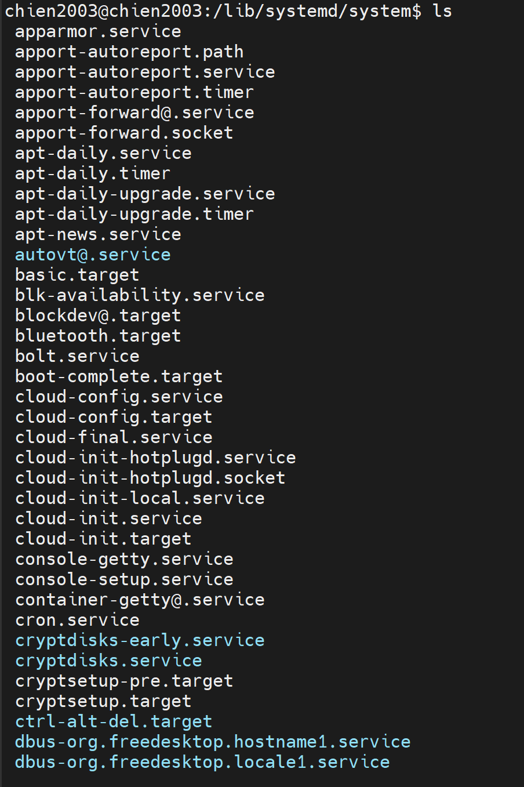
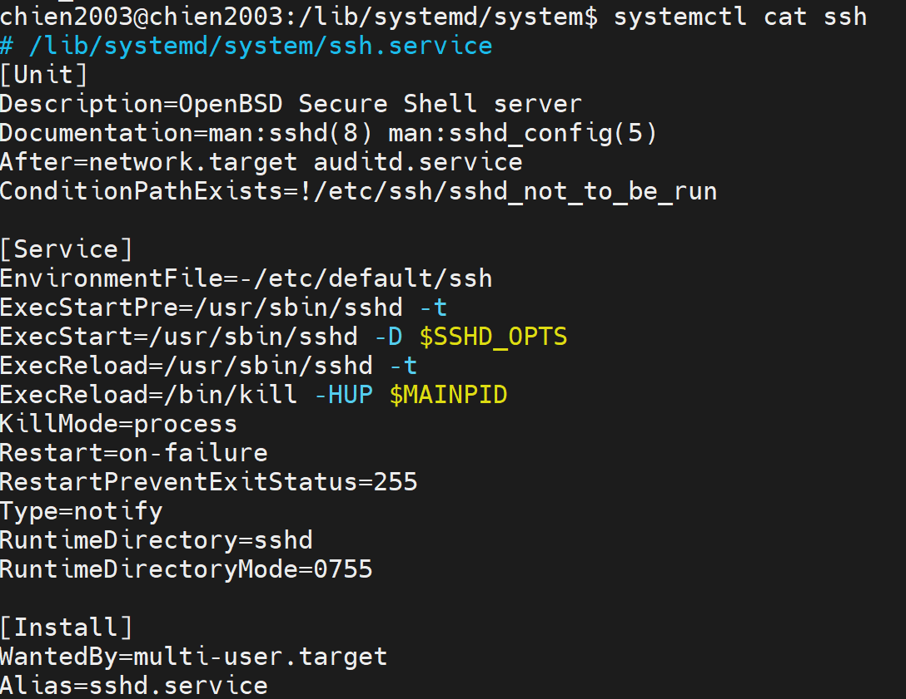

# TÌM HIỂU VỀ SYSTEMD VÀ CÁCH CHẠY MỘT SCRIPT ĐƯỢC QUẢN LÝ BỞI SYSTEMD
## 1. KHÁI NIỆM VỀ SYSTEMD
- systemd (viết tắt của System Daemon) là một nền tảng quản trị hệ thống và là hệ thống khởi tạo (Init System) mặc định trên hầu hết các bản phân phối Linux hiện đại ngày nay (Ubuntu, Debian, CentOS, RedHat, Fedora, SUSE...).
- Được giới thiệu lần đầu vào năm 2010 bởi Lennart Poettering (kỹ sư của Red Hat) để thay thế hệ thống SysV init cũ kỹ, systemd đã nhanh chóng trở thành "trái tim" điều hành mọi dịch vụ, tiến trình và phần cứng trên Linux.

## 2. KIẾN TRÚC VÀ VỊ TRÍ CỦA SYSTEMD TRONG HỆ THỐNG
- Khi bật một máy tính, quy trình khởi động sẽ diễn ra như sau
BIOS/UEFI -> BootLoader (GRUB) -> Kernel (Linux) -> systemd (pid = 1)
- Khi nhân Linux khởi động xong, nó sẽ gọi tiến trình đầu tiên là `systemd`. Tiến trình này mang PID = 1 (Process ID bằng 1) - tức là "tiến trình mẹ" của tất cả các tiến trình khác trên hệ điều hành. Nếu systemd bị sập hoặc bị tắt, hệ thống Linux sẽ lập tức rơi vào trạng thái Kernel Panic (~ BSOD của Windows)

## 3. CÁC THÀNH PHẦN CỦA SYSTEMD
- systemd không quản lý hệ thống bằng các đoạn script rời rạc mà đóng gói mọi thực thể thành các Unit (Đơn vị cấu hình) được định nghĩa qua các file text (thường nằm ở `/lib/systemd/system/` hoặc `/etc/systemd/system/`).
  

- Trong trường hợp không nhớ đường dẫn của service mà ta muốn xem nội dung trong file cấu hình của service, ta sẽ sử dụng câu lệnh `systemctl cat service_name`
Ví dụ:

| Loại Unit | Đuôi mở rộng | Chức năng chính                                                                         | Ví dụ thực tế                                                                |
|-----------|--------------|-----------------------------------------------------------------------------------------|------------------------------------------------------------------------------|
| Service   | .service     | Quản lý các dịch vụ/phần mềm chạy ngầm (Daemons).                                       | ssh.service, nginx.service                                                   |
| Target    | .target      | Nhóm các Unit lại với nhau để đưa máy về một trạng thái (Runlevel) nhất định.           | multi-user.target (giao diện dòng lệnh), graphical.target (giao diện đồ họa) |
| Timer     | .timer       | Lên lịch kích hoạt các tác vụ khác dựa trên thời gian (thay thế cho cron).              | systemd-tmpfiles-clean.timer                                                 |
| Mount     | .mount       | Quản lý việc gắn (mount) các ổ đĩa vào hệ thống thư mục.                                | proc-sys-fs-binfmt_misc.mount                                                |
| Socket    | .socket      | Khởi tạo cổng mạng/file socket trước, khi có kết nối đến mới gọi dịch vụ tương ứng dậy. | ssh.socket                                                                   |

## 4. ĐẶC ĐIỂM CỦA SYSTEMD
- **Khởi động song song**
+ Ngày xưa, SysV init bật các dịch vụ theo kiểu xếp hàng (tuần tự): Dịch vụ mạng phải bật xong thì Web Server mới được bật. Điều này gây lãng phí tài nguyên CPU và làm máy khởi động rất chậm.
+ systemd sử dụng cơ chế thiết lập Socket độc lập, cho phép kích hoạt toàn bộ các dịch vụ cùng một lúc. Dịch vụ nào nạp xong trước sẽ chạy trước, giúp tốc độ boot máy giảm từ vài phút xuống vài giây.

- **Quản lý vòng đời service nghiêm ngặt bằng cgroups**
+ systemd tận dụng tính năng cgroups (Control Groups) của nhân Linux để gom tất cả các tiến trình con do một dịch vụ sinh ra vào một nhóm.
+ Ưu điểm: Ngày xưa, nếu một dịch vụ (như Apache) bị lỗi hoành hành sinh ra các tiến trình "ma" (zombie), khi bạn bấm dừng dịch vụ, các tiến trình ma đó vẫn sống sót ăn bám tài nguyên. Với systemd, khi bạn ra lệnh stop, nó sẽ quét sạch toàn bộ cgroups đó, không để sót bất kỳ tiến trình con nào.

- **Theo dõi nhật ký tập trung với journald**
- systemd tích hợp sẵn một dịch vụ ghi log cực mạnh là systemd-journald. Nó thu thập toàn bộ log từ nhân Kernel, log hệ thống, cho đến log của từng dịch vụ cụ thể và lưu dưới dạng nhị phân bảo mật, giúp việc tìm kiếm, lọc lỗi bằng lệnh journalctl nhanh hơn gấp hàng chục lần so với việc đọc file text truyền thống.

## 5. CÁC CÂU LỆNH LÀM VIỆC VỚI SYSTEMD
**Công cụ 1: systemctl (Quản lý dịch vụ và hệ thống)**
+ systemctl start <tên_service>: Khởi chạy dịch vụ ngay lập tức.
+ systemctl stop <tên_service>: Dừng dịch vụ.
+ systemctl restart <tên_service>: Khởi động lại dịch vụ.
+ systemctl status <tên_service>: Xem trạng thái chi tiết (đang chạy, đã tắt, hoặc bị lỗi ở dòng nào).
+ systemctl enable <tên_service>: Đặt lịch cho dịch vụ tự động chạy cùng hệ thống khi bật máy.
+ systemctl disable <tên_service>: Tắt tính năng tự khởi động cùng máy.
+ systemctl daemon-reload: Ép systemd quét lại toàn bộ thư mục cấu hình (bắt buộc phải chạy lệnh này khi bạn vừa sửa file .service).

**Công cụ 2: journalctl (Truy xuất nhật ký hệ thống)**
+ journalctl: Xem toàn bộ log của hệ điều hành từ trước đến nay.
+ journalctl -u <tên_service>: Lọc xem riêng log của một dịch vụ nhất định.
+ journalctl -f: Xem log trực tiếp theo thời gian thực (giống tail -f).
+ journalctl -p err: Chỉ hiển thị các log thông báo lỗi (Error).

## 6. CẤU TRÚC CƠ BẢN CỦA MỘT FILE SERVICE
- Một file unit service trong systemd (thường có đuôi .service) được cấu trúc dưới dạng file cấu hình văn bản thô (text file), phân chia thành các nhóm nội dung gọi là các Section (mục). Mỗi Section bắt đầu bằng một từ khóa trong dấu ngoặc vuông [...] và chứa các cặp giá trị Key=Value.
- Cấu trúc cơ bản và chuẩn chỉnh nhất của một file service luôn bao gồm 3 phần cốt lõi: [Unit], [Service], và [Install].
- Dưới đây là chi tiết ý nghĩa và các thông số quan trọng của từng thành phần:
### Mục [Unit] (Thông tin chung và Khởi tạo mối quan hệ)
Mục này định nghĩa các thông tin cơ bản về service và thiết lập thứ tự khởi động, mối quan hệ phụ thuộc giữa service này với các thành phần khác trong hệ thống.
- Description=: Đoạn văn bản ngắn mô tả tên hoặc chức năng của service (Ví dụ: Description=My Hello World Application). Nội dung này sẽ hiển thị khi bạn gõ lệnh systemctl status.
- After=: Chỉ định service này chỉ được khởi động sau khi các dịch vụ hoặc mục tiêu (target) được liệt kê đã chạy xong.
    + Ví dụ: After=network.target nghĩa là đợi máy chủ kết nối mạng thành công rồi mới chạy service này.
- Before=: Ngược lại với After, chỉ định service này phải chạy trước một thành phần nào đó.
- Requires=: Thiết lập mối quan hệ phụ thuộc bắt buộc (Hard dependency). Nếu dịch vụ liệt kê trong mục này bị lỗi hoặc không chạy, service của bạn cũng sẽ bị dừng theo hoặc không thể khởi động.
- Wants=: Thiết lập mối quan hệ phụ thuộc cấu hình nhẹ (Soft dependency). Hệ thống sẽ cố gắng bật dịch vụ đi kèm, nhưng nếu dịch vụ đó lỗi thì service của bạn vẫn chạy bình thường.

### Mục [Service] (Cấu hình cốt lõi - Cách thức hoạt động)
Đây là phần quan trọng nhất, định nghĩa cách ứng dụng của bạn sẽ được thực thi, quản lý tiến trình và xử lý khi gặp sự cố lỗi.
- Type=: Định nghĩa kiểu khởi động của tiến trình. Các giá trị phổ biến bao gồm:
    + simple (Mặc định): Systemd coi dịch vụ khởi động thành công ngay khi tiến trình trong ExecStart được kích hoạt.
    + forking: Dùng cho các dịch vụ chạy ngầm truyền thống (daemon). Tiến trình chính sẽ tạo ra tiến trình con (fork) rồi thoát.
    + oneshot: Thích hợp cho các script chỉ chạy một lần rồi thoát hoàn toàn (không chạy ngầm).
- ExecStart=: (Bắt buộc) Đường dẫn tuyệt đối đến file thực thi, câu lệnh hoặc file script cấu hình để khởi chạy ứng dụng.
    + Ví dụ: ExecStart=/usr/bin/python3 /home/tranbao/helloworld.py
- ExecStop=: Đường dẫn đến lệnh cần chạy để dừng dịch vụ một cách an toàn (nếu không có, systemd sẽ tự động kill tiến trình khi bạn gõ systemctl stop).
- ExecReload=: Lệnh cần chạy khi bạn muốn nạp lại cấu hình dịch vụ (systemctl reload) mà không cần tắt hẳn tiến trình.
- User= và Group=: Chỉ định quyền của User và Group nào trong Linux được phép chạy tiến trình này. Nếu bỏ trống, mặc định dịch vụ sẽ chạy dưới quyền tối cao của root (điều này không khuyến khích vì lý do bảo mật).
- WorkingDirectory=: Đường dẫn thư mục làm việc mặc định cho ứng dụng khi nó bắt đầu chạy.
- Restart=: Cấu hình cơ chế tự động khởi động lại dịch vụ nếu nó bị sập đột ngột. các giá trị hay dùng: always (luôn khởi động lại), on-failure (chỉ khởi động lại nếu ứng dụng thoát bị lỗi/crash).
- RestartSec=: Khoảng thời gian chờ (tính bằng giây) trước khi tiến hành khởi động lại ứng dụng (Ví dụ: RestartSec=5s).

### Mục [Install] (Cấu hình khi Kích hoạt - Enable)
Mục này định nghĩa cách thức dịch vụ được đăng ký vào hệ thống khi bạn sử dụng lệnh sudo systemctl enable. Nó quyết định dịch vụ này sẽ gắn liền với trạng thái (Target) nào của hệ điều hành.
- WantedBy=: Chỉ định dịch vụ này thuộc về mục tiêu khởi động nào. Giá trị phổ biến nhất là:
    + WantedBy=multi-user.target: Chế độ đa người dùng, có mạng đầy đủ (đây là trạng thái hoạt động bình thường của một Ubuntu Server). Khi bạn cấu hình dòng này và enable dịch vụ, ứng dụng của bạn sẽ tự động chạy cùng hệ thống ngay khi máy chủ vừa bật lên.

## 7. BẢN CHẤT CỦA LOG VÀ SERVICE TRONG LINUX
- Trong hệ điều hành Linux, Service (Dịch vụ) và Log (Nhật ký) là hai thành phần luôn song hành theo mối quan hệ "Hành động và Ghi nhận":

    + Service: Là các chương trình, phần mềm chạy ngầm trong hệ thống (Background processes) để thực hiện một nhiệm vụ cụ thể mà không cần sự tương tác trực tiếp của người dùng qua giao diện (ví dụ: SSH Server, Web Server, Cron).

    + Log: Là các bản ghi dữ liệu dạng văn bản được tạo ra bởi chính Service hoặc hệ điều hành trong quá trình hoạt động. Log ghi lại các cột mốc: Khởi động, tắt, cảnh báo (Warning), thông báo (Info) hoặc các lỗi nghiêm trọng (Error/Crash).

- Cơ chế quản lý Log tập trung bằng systemd-journald
- Trên các bản Ubuntu hiện đại, khi một service được quản lý bởi systemd, toàn bộ các luồng dữ liệu xuất ra từ ứng dụng đó sẽ tự động được gom về một dịch vụ trung tâm có tên là systemd-journald. Dịch vụ này lưu log dưới dạng nhị phân mã hóa (Binary) để tối ưu dung lượng và tốc độ tìm kiếm, đó là lý do vì sao chúng ta dùng lệnh journalctl để đọc.

## 8. CÁCH ĐẨY LOG
### 8.1 ĐẨY LOG RA MÀN HÌNH CONSOLE
- Nếu ứng dụng của bạn chỉ viết các câu lệnh in ra màn hình tiêu chuẩn (như print() trong Python, console.log() trong JS), các luồng dữ liệu này được gọi là Standard Output (stdout) và Standard Error (stderr).
- Mặc định, nếu bạn không cấu hình gì thêm trong file service, systemd sẽ tự hiểu và đẩy toàn bộ luồng này vào journald.

### 8.2 ĐẨY LOG RA FILE
- Nếu bạn muốn tách biệt hoàn toàn log của ứng dụng của mình ra một file .log riêng biệt nằm trong thư mục /var/log/ để dễ dàng quản lý (giống như auth.log của SSH), bạn thêm hai thông số StandardOutput và StandardError vào mục [Service]:

[Service]
Type=simple
ExecStart=/usr/bin/python3 /home/tranbao/helloworld.py
**Cấu hình đẩy log ra file riêng:**
StandardOutput=append:/var/log/helloworld_info.log
StandardError=append:/var/log/helloworld_error.log

+ append:: Chế độ ghi nối tiếp vào cuối file (không xóa dữ liệu cũ khi dịch vụ khởi động lại).
+ file:: Chế độ ghi đè (Xóa sạch file cũ và ghi lại từ đầu mỗi khi restart service).
(Lưu ý: Nếu chạy dưới quyền user thường, hãy đảm bảo thư mục chứa file log đó cho phép user của bạn có quyền ghi - Write permission).

## 9. CÁC SERVICE QUAN TRỌNG CỦA HỆ THỐNG TRONG SYSTEMD
Khi gõ lệnh `systemctl list-units`, hệ thống sẽ hiển thị hàng trăm service. Đối với tài liệu quản trị hệ thống, đây là những service "xương sườn" quyết định sự sống còn của một Ubuntu Server mà bạn cần nắm rõ:
|        Tên Service hệ thống       |                                                          Chức năng cốt lõi                                                         |                                                       Tầm quan trọng đối với hệ thống                                                       |
|:---------------------------------:|:----------------------------------------------------------------------------------------------------------------------------------:|:-------------------------------------------------------------------------------------------------------------------------------------------:|
| systemd-journald.service          | Thu thập và quản lý toàn bộ dữ liệu log từ nhân Linux (Kernel), các dịch vụ hệ thống và ứng dụng người dùng.                       | Nếu dừng service này, hệ thống sẽ hoàn toàn mất khả năng ghi log, các lệnh như journalctl sẽ bị tê liệt.                                    |
| systemd-resolved.service          | Cung cấp dịch vụ phân giải tên miền mạng (DNS) nội bộ cho các ứng dụng trên máy chủ.                                               | Nếu service này chết, server của bạn sẽ không thể kết nối Internet bằng tên miền (ví dụ: không thể gõ ping google.com hay chạy apt update). |
| systemd-networkd.service          | Quản lý việc cấu hình các giao diện mạng vật lý và ảo (Network Interfaces), cấp phát địa chỉ IP cho máy chủ.                       | Chịu trách nhiệm giữ cho server luôn có IP mạng. Thường hoạt động song song hoặc kết hợp với Netplan trên Ubuntu.                           |
| cron.service (hoặc crond)         | Dịch vụ chịu trách nhiệm quét và thực thi các tác vụ tự động được lên lịch bởi người dùng thông qua crontab.                       | Đảm bảo các script kiểm thử tự động, tác vụ backup dữ liệu chạy đúng giờ.                                                                   |
| ssh.service (hoặc sshd)           | Dịch vụ OpenSSH Server, cho phép người dùng từ xa kết nối bảo mật vào điều khiển máy chủ qua dòng lệnh.                            | Là "cánh cửa" duy nhất để các kỹ sư kết nối vào quản trị server từ xa.                                                                      |
| systemd-timesyncd.service         | Dịch vụ NTP Client siêu nhẹ tích hợp sẵn để tự động đồng bộ giờ hệ thống từ các máy chủ thời gian Internet về máy.                 | Giữ cho đồng hồ của máy chủ luôn chính xác, phục vụ cho việc ghi log tuyến tính và xác thực bảo mật tài chính/chứng chỉ SSL.                |
| udev.service (hoặc systemd-udevd) | Quản lý và giám sát các thiết bị phần cứng (Device nodes) được cắm vào hoặc rút ra khỏi máy chủ (ổ cứng, card mạng, thiết bị USB). | Đảm bảo hệ điều hành nhận diện đúng và cấu hình driver phù hợp cho phần cứng ngay khi vừa khởi động.                                        |