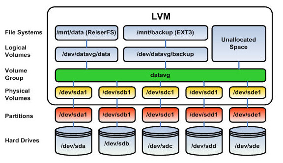

# Lab LVM

## 0. Kiến thức nền tảng trước khi thực hành

### 0.1 Tổng quan hệ thống lưu trữ Linux

**Swap & Storage Layout**
- **Swap**: vùng nhớ ảo trên ổ cứng, được hệ điều hành dùng làm bộ đệm thay thế khi RAM vật lý bị đầy.
- Nên phân tách các phân vùng `/` (root), `/home`, `/var` riêng biệt để tối ưu hệ thống và tránh tình trạng dữ liệu cá nhân hoặc log sinh ra quá nhiều làm đầy phân vùng gốc.

**Công cụ quản lý ổ đĩa (Disk Management Tools)**

| Lệnh | Công dụng |
|---|---|
| `lsblk` | Liệt kê thiết bị (List Block Devices) dạng sơ đồ cây, cho cái nhìn tổng quan về cấu trúc ổ đĩa/phân vùng hiện có. |
| `df -h` | Kiểm tra dung lượng còn trống/đã dùng trên các phân vùng **đã được mount** (`-h`: human-readable). |
| `fdisk` / `parted` | Trình phân vùng dòng lệnh. Với `fdisk`: `n` tạo, `d` xóa, `p` xem bảng, `w` lưu và thoát. VD: `sudo fdisk /dev/sdb`. |
| `gdisk` | Tương tự `fdisk` nhưng dùng cho bảng phân vùng GPT (như đã dùng trong lab này). |
| `blkid` | Tra UUID và loại filesystem của từng thiết bị/phân vùng. |

**Định dạng File System phổ biến**
- `ext4`: kiểu chuẩn mực, phổ biến mặc định trên nhiều distro.
- `XFS`: tốc độ cao, tối ưu khi làm việc với file dung lượng lớn.
- `Btrfs`: hệ thống tập tin hiện đại, mạnh về tính năng snapshot.

### 0.2 Các thao tác Mount (Gắn phân vùng)

Sau khi tạo phân vùng/LV và định dạng (VD: `mkfs.ext4 /dev/sdb1`), cần mount để đọc/ghi dữ liệu.

- **Mount tạm thời**: `sudo mount /dev/sdb1 /mnt/data` — mất hiệu lực sau khi khởi động lại.
- **Mount vĩnh viễn (Persistent Mount)**: khai báo trong file `/etc/fstab`. Nên dùng **UUID** (lấy bằng lệnh `blkid`) thay vì tên thiết bị (`/dev/sdb1`), vì tên thiết bị có thể thay đổi thứ tự giữa các lần boot.
  - Cấu trúc 1 dòng fstab: `UUID=1234-abcd-5678  /mnt/data  ext4  defaults  0  2`
  - **Lưu ý quan trọng**: sau khi sửa `/etc/fstab`, luôn chạy `sudo mount -a` để kiểm tra lỗi cấu hình trước khi reboot — tránh bị kẹt ở chế độ Emergency Mode / boot loop.
- **Unmount**: `sudo umount /mnt/data`. Nếu báo `target is busy`, kiểm tra xem có tiến trình/user nào đang đứng trong thư mục đó không (`lsof +D /mnt/data` hoặc `fuser -m /mnt/data`).

### 0.3 Chuẩn phân vùng: MBR vs GPT (kiến thức liên quan)

| Tiêu chí | MBR (Master Boot Record) | GPT (GUID Partition Table) |
|---|---|---|
| Dung lượng tối đa | 2 TB | ~9.4 ZB (gần như vô hạn thực tế) |
| Số phân vùng | Tối đa 4 primary | 128 (Windows), có thể nhiều hơn trên Linux |
| Cơ chế boot | BIOS | UEFI |
| Độ an toàn | Thấp (chỉ 1 bảng MBR duy nhất) | Cao (có bản backup, kiểm tra CRC) |
| Ứng dụng | Máy cũ, ổ đĩa < 2TB | Máy đời mới, ổ đĩa > 2TB (khuyến nghị) |

---

## 1. Khái niệm LVM

### LVM là gì?
- **LVM (Logical Volume Manager)** là một lớp quản lý lưu trữ nằm giữa ổ đĩa vật lý và filesystem, cho phép quản lý không gian đĩa linh hoạt hơn nhiều so với partition truyền thống.
- Thay vì làm việc trực tiếp với các partition có kích thước cố định, LVM gộp nhiều ổ đĩa/partition lại thành một "bể" dung lượng chung, rồi từ đó cắt ra các volume logic để dùng — có thể mở rộng hoặc thu nhỏ linh hoạt theo nhu cầu, ngay cả khi hệ thống đang chạy (runtime).

### Kiến trúc 3 lớp của LVM

  

**1. Physical Volume (PV)**
- Cấp độ thấp nhất. Là ổ đĩa thô hoặc partition (VD: `/dev/sdb`, `/dev/sdb1`) đã được "đánh dấu" (label) để LVM có thể quản lý và sử dụng.
- Tạo bằng lệnh `pvcreate`.
- Nhiều PV (có thể từ nhiều ổ đĩa vật lý khác nhau) có thể được gộp vào cùng một VG.

**2. Volume Group (VG)**
- Là "bể chứa" dung lượng, được tạo ra bằng cách gộp một hoặc nhiều PV lại với nhau (`vgcreate`).
- Dung lượng của VG bằng tổng dung lượng các PV thuộc về nó.
- Có thể mở rộng VG bằng cách thêm PV mới (`vgextend`), hoặc thu nhỏ bằng cách bớt PV ra (`vgreduce`).

**3. Logical Volume (LV)**
- Là "phân vùng ảo" được LVM cắt ra từ VG để sử dụng thực tế (`lvcreate`).
- LV được format filesystem (ext4, xfs...) rồi mount vào một thư mục, sử dụng giống hệt một partition bình thường. LV nằm ở đường dẫn dạng `/dev/Tên_VG/Tên_LV`.
- Có thể tăng/giảm dung lượng LV linh hoạt bằng `lvextend` / `lvreduce`, miễn là VG chứa nó còn đủ (hoặc sau khi bớt) dung lượng.
- Một VG có thể chứa nhiều LV khác nhau, dùng cho các mục đích khác nhau (ví dụ: `lv-home`, `lv-var`, `lv-log`...).

### Đơn vị cấp phát: PE (Physical Extent)
- LVM không cấp phát dung lượng theo từng byte lẻ mà theo các khối cố định gọi là **PE (Physical Extent)** — mặc định thường là 4MB/PE.
- Trong `vgdisplay`, thông số `Free PE / Size` cho biết còn bao nhiêu PE (và tương đương bao nhiêu dung lượng) chưa được cấp phát trong VG.
- Về bản chất, tăng/giảm dung lượng LV chính là tăng/giảm số lượng PE được gán cho LV đó.

### Vì sao cần dùng LVM?
- **Resize linh hoạt**: mở rộng hoặc thu nhỏ dung lượng ổ đĩa logic mà không cần format lại từ đầu (filesystem vẫn cần được resize tương ứng).
- **Gộp nhiều ổ đĩa vật lý thành 1 khối logic lớn**: ví dụ 2 ổ 20GB có thể gộp thành 1 VG 40GB, từ đó tạo được LV lớn hơn dung lượng của từng ổ riêng lẻ.
- **Hỗ trợ snapshot**: LVM cho phép chụp nhanh (snapshot) trạng thái của LV tại một thời điểm — hữu ích cho backup.
- **Dễ quản lý trên server/VM host**: khi dữ liệu (database, log...) tăng dần theo thời gian, chỉ cần gắn thêm ổ đĩa mới rồi extend VG/LV, thay vì phải backup — repartition — restore như với partition truyền thống.

### Cheat Sheet các lệnh LVM thường dùng

| Nhóm | Lệnh | Công dụng |
|---|---|---|
| Hiển thị (tóm tắt) | `pvs`, `vgs`, `lvs` | Xem nhanh danh sách PV/VG/LV |
| Hiển thị (chi tiết) | `pvdisplay`, `vgdisplay`, `lvdisplay` | Xem thông tin kỹ thuật chi tiết |
| Physical Volume | `pvcreate` | Tạo mới PV |
| | `pvremove` | Xóa bỏ PV |
| | `pvmove` | Di chuyển dữ liệu giữa các PV (di chuyển "nóng", không cần umount) |
| Volume Group | `vgcreate` | Tạo VG mới từ các PV |
| | `vgextend` | Bơm thêm PV vào VG |
| | `vgreduce` | Rút bớt PV ra khỏi VG |
| | `vgremove` | Xóa bỏ VG |
| Logical Volume | `lvcreate` | Tạo LV mới từ VG |
| | `lvextend` | Tăng dung lượng LV |
| | `lvreduce` | Giảm dung lượng LV |
| | `lvremove` | Xóa bỏ LV |

### Một vài lưu ý trước khi thực hành
- **Thứ tự tạo luôn là**: tạo Partition (hoặc dùng nguyên ổ đĩa) → `pvcreate` → `vgcreate` → `lvcreate` → format filesystem → mount.
- **Tăng dung lượng (extend)**: thường khá an toàn, có thể thực hiện ngay cả khi LV đang mount, nhưng vẫn cần resize filesystem (`resize2fs`...) sau khi extend LV thì dung lượng mới có hiệu lực thật.
- **Giảm dung lượng (reduce)**: rủi ro mất dữ liệu cao hơn nếu dữ liệu đang nằm ở phần bị cắt bớt → luôn phải umount, kiểm tra lỗi filesystem (`e2fsck -f`), thu nhỏ filesystem trước bằng `resize2fs`, rồi mới `lvreduce` Logical Volume.
- **Thứ tự xóa ngược lại với thứ tự tạo**: muốn xóa PV phải xóa VG chứa nó trước; muốn xóa VG phải xóa hết LV bên trong trước (LV → VG → PV). Nếu LV/VG đó có khai báo trong `/etc/fstab`, **bắt buộc** phải xóa dòng tương ứng trong fstab trước khi reboot, nếu không hệ thống sẽ bị kẹt ở Emergency Mode khi khởi động.

### Lưu ý riêng khi mở rộng ổ đĩa ảo trong máy ảo (VMware/VirtualBox...)

Nếu bạn "Expand" dung lượng ổ đĩa ngay từ phần mềm ảo hóa (VD: từ 20G lên 40G), bản thân cấu trúc partition/PV bên trong hệ điều hành **vẫn đang giới hạn ở dung lượng cũ** — cần thêm 3 bước sau để hệ thống nhận diện phần dung lượng mới:

```bash
sudo growpart /dev/sda 3     # Mở rộng partition số 3 của sda cho khớp với dung lượng đĩa mới
sudo pvresize /dev/sda3      # Cập nhật lại kích thước cho Physical Volume tương ứng
sudo lvextend -r -l +100%FREE /dev/vg-demo/lv-demo   # Bơm hết dung lượng trống vào LV & tự động resize filesystem (-r)
```

> Cờ `-r` (`--resizefs`) của `lvextend` giúp gộp 2 bước `lvextend` + `resize2fs` thành 1 lệnh duy nhất.

---

## 2. Chuẩn bị
- Add thêm 2 ổ cứng vào máy ảo

  

## 3. Tạo Logical Volume trên LVM

`B1`: Kiểm tra các Hard Drives có trên hệ thống

- Bạn có thể kiểm tra xem có những Hard Drives nào trên hệ thống bằng cách sử dụng câu lệnh `lsblk`

  

- Trong đó sdb, sdc là các Hard Drives mà mình mới thêm vào

`B2`: Tạo Partition

- Từ các Hard Drives trên hệ thống, tạo các partition. Ở đây, từ sdb ta tạo các partition bằng cách sử dụng lệnh `gdisk /dev/sdb`

  

- Trong đó:
  - `n` : bắt đầu tạo partition
  - `1` : tạo partition 1
  - `first sector(34-20971486, default = 2048)` : mặc định
  - `Last sector(2048-20971486, default = 20971486)` : 1G để partition tạo ra có dung lượng 1G
  - `Hex code = 8e00` : đổi thành LVM
  - `w`: lưu và thoát
- Tương tự ta tạo thêm các partition từ `sdb`

  


- Tạo các partition từ `sdc` bằng lệnh `gdisk /dev/sdc`

  

`B3`: Tạo Physical Volume

- Tạo các Physical Volume là `/dev/sdb1` và `/dev/sdc` bằng các lệnh sau:

  - `# pvcreate /dev/sdb1`
  - `# pvcreate /dev/sdc1`
- Có thể kiểm tra các Physical Volume bằng lệnh `pvs: Physical Volumes Show` hoặc `pvdisplay`

   


`B4`: Tạo Volume Group

- Nhóm các Physical Volume thành 1 Volume Group bằng câu lệnh:

  ```bash
  $ vgcreate vg-demo /dev/sdb1 /dev/sdc1
  ```

- Trong đó: `vg-demo` là tên của Volume Group

- Có thể dùng `vgs: Volume Group Show` hoặc `vgdisplay` để kiểm tra các Volume Group đã tạo

   

`B5`: Tạo Logical Volume

- Từ 1 Volume Group, ta có thể tạo các Logical Volume bằng lệnh:

  ```bash
  $ lvcreate -L 1G -n lv-demo vg-demo
  ```

- Trong đó:
  - `-L`: (--size) - chỉ ra dung lượng của Logical Volume
  - `-n`: (--name) - chỉ ra tên của Logical Volume
  - `lv-demo` là tên của Logical Volume
  - `vg-demo` là Volume Group mình vừa tạo
- **NOTE**: ta có thể tạo nhiều Logical Volume từ 1 Volume Group
- Ta có thể dùng `lvs:Logical Volume Show` hoặc `lvdisplay` để kiểm tra lại các Logical Volume đã tạo

   

`B6`: Định dạng Logical Volume

- Để format các Logical Volume thành các định dạng như ext2, ext3, ext4, ta có thể làm như sau:
  ```bash
  $ mkfs -t ext4 /dev/vg-demo/lv-demo
  ```

   


`B7`: Mount và sử dụng

- Ta tạo 1 thư mục để mount Logical Volume đã tạo vào thư mục đó:

  ```bash
  $ mkdir demo
  ```

  

- Tiến hành mount Logical Volume `lv-demo` vào thư mục `demo`:

  ```bash
  $ mount /dev/vg-demo/lv-demo demo
  ```

  

- Kiểm tra lại dung lượng của thư mục đã được mount: 

  ```bash
  $ df -h 

  # df: disk free, -h: human-readable
  ```

   


## 4. Thay đổi dung lượng Logical Volume trên LVM

- Trước khi thay đổi dung lượng, ta cần kiểm tra các thông tin hiện có:

  ```bash
  $ vgs
  $ lvs
  $ pvs
  ```

   

- Ta đã tạo được Logical Volume là `lv-demo`, giả sử Logical Volume này dung lượng đã đầy và chúng ta cần tăng kích thước của nó
- `lv-demo` thuộc `vg-demo`, để tăng kích thước, đầu tiên phải kiểm tra xem `vg-demo` còn dư dung lượng để kéo giãn Logical Volume không?
- **NOTE**: Logical Volume thuộc 1 Volume Group nhất định, Volume Group đã cấp phát hết thì Logical Volume cũng không thể tăng dung lượng được.

- Để kiểm tra: `$ vgdisplay`

   

- Volume Group ở đây vẫn còn dung lượng để cấp phát, ta có thể nhận thấy điều này qua 2 trường thông tin là `VG Status  resizeable` và `Free PE / Size  510 / 1.99 GiB` với dung lượng Free là: 510 * 4 = 2040Mb

- Để tăng kích thước Logical Volume ta dùng lệnh:

  ```bash
  $ lvextend -L +50M /dev/vg-demo/lv-demo
  ```

- Trong đó:
  - `-L`: (--size) - để tăng kích thước

   

- Kiểm tra lại bằng `lvs`:

   

- Sau khi tăng kích thước cho Logical Volume thì Logical Volume đã được tăng nhưng filesystem trên volume này vẫn chưa thay đổi, ta phải dùng lệnh sau để thay đổi:

  ```bash
  $ resize2fs /dev/vg-demo/lv-demo
  ```

   

- Để giảm kích thước của Logical Volume, trước hết ta phải umount Logical Volume mà mình muốn giảm

  ```bash
  $ umount /dev/vg-demo/lv-demo
  ```

- Tiến hành giảm kích thước của Logical Volume (chú ý: với ext4, phải thu nhỏ File System trước khi thu nhỏ Logical Volume để tránh mất dữ liệu).

<!--   ```bash
  $ lvreduce -L 20M /dev/vg-demo/lv-demo
  ```

- Sau đó tiến hành format lại Logical Volume

  ```bash
  mkfs -t ext4 /dev/vg-demo/lv-demo
  ``` -->

  ```bash
  # 1. Kiểm tra lỗi file system
  $ e2fsck -f /dev/vg-demo/lv-demo

  # 2. Thu nhỏ file system xuống kích thước mong muốn (VD: 20M)
  $ resize2fs /dev/vg-demo/lv-demo 20M

  # 3. Thu nhỏ Logical Volume
  $ lvreduce -L 20M /dev/vg-demo/lv-demo
  ```

- Cuối cùng là mount lại Logical Volume

  ```bash
  $ mount /dev/vg-demo/lv-demo demo
  ```

- Kiểm tra lại:

   
  
## 5. Thay đổi dung lượng Volume Group trên LVM
- Ở phần trước ta có thể tăng kích thước của LV nhưng với điều kiện VG đó còn dung lượng. 
- Phần này ta sẽ tìm hiểu làm thế nào có thể mở rộng thêm kích thước của VG cũng như thu hồi dung lượng của nó
- Việc thay đổi VG chính là việc nhóm thêm Physical Volume hay thu hồi Physical Volume ra khỏi VG
- Ta kiểm tra lại các partition và VG

  `$ vgs`

  `$ lsblk`

   

- Tiếp theo, thêm 1 partition vào VG:
  ```bash
  vgextend /dev/vg-demo /dev/sdb3
  ```

- **NOTE**: Vì muốn nhóm vào VG thì phải là PV nên hệ thống tự động tạo PV sdb3 ta không cần phải `pvcreate` nữa.

   

- Ta có thể cắt 1 PV ra khỏi VG như sau:

  ```bash
  $ vgreduce /dev/vg-demo /dev/sdb3
  ```
   
## 6. Xóa Logical Volume, Volume Group, Physical Volume
### Xóa Logical Volume
- Trước tiên ta phải umount Logical Volume
  
  ```bash
  $ umount /dev/vg-demo/lv-demo
  ```
  

- Sau đó tiến hành xóa Logical Volume bằng lệnh:

  ```bash
  $ lvremove /dev/vg-demo/lv-demo
  ```

- Kiểm tra lại:

   

### Xóa Volume Group
- Trước khi xóa Volume Group, ta phải xóa Logical Volume
- Xóa Volume Group bằng lênh:

  ```bash
  $ vgremove /dev/vg-demo
  ```

   

### Xóa Physical Volume
- Xóa PV bằng lệnh:
  ```bash
  $ pvremove /dev/sdb3
  ```

   

# Khi nào thì nên dùng `LVM`, khi nào nên dùng `Partition` và khi nào thì `mount trực tiếp ổ đĩa`

## 1. mount trực tiếp ổ đĩa
Ví dụ: `/dev/sdb` -> mount thẳng vào `/mnt/data`

- Dùng khi: 
  - Thí nghiệm, test lab, ổ USB, ổ test tạm thời.
  - Muốn mount nhanh, không quan tâm phân vùng
- Không nên dùng khi:
  - Muốn chia ổ thành nhiều phần(ví dụ: `/home`, `/var`)
  - Muốn resize linh hoạt

## 2. Partition
Ví dụ:

```bash
/dev/sda1  →  /
/dev/sda2  →  /home
```

- Dùng khi:
  - Ổ đĩa có dung lượng cố đinh, không thay đổi nhiều
  - Muốn tách biệt dữ liệu hệ thống và người dùng
- Đặc điểm:
  - Khó resize khi đầy(phải umount, resize thủ công)

## 3. LVM
Ví dụ:

```bash
/dev/sda1 → PV (Physical Volume)
PV → VG (Volume Group)
VG → LV (Logical Volume)
LV → mount /home
```

- Dùng khi: 
  - Cần linh hoạt thay đổi dung lượng ổ mà không phải format lại.
  - Dùng cho server, database, VM host, nơi dung lượng cần thay đổi linh hoạt.
  - Muốn gộp nhiều ổ thành một khối logic (VD: sda + sdb = 1 volume lớn).
  - Muốn mở rộng dễ dàng (thêm ổ mới → extend VG → extend LV).
  
## Ví dụ thực tế:
- Giả sử có 2 ổ cứng:
  - `/dev/sda` -> chứa hệ điều hành
  - `/dev/sdb` -> dùng lưu dữ liệu
- Ta có thể chọn:
  - Nếu dữ liệu cố định (VD: ảnh, video): tạo 1 partition `/dev/sdb1` và mount `/mnt/data`
  - Nếu dữ liệu có thể tăng (VD: log server, database): tạo LVM trên `/dev/sdb`, đặt tên VG `vg_data`, LV `lv_logs`, mount `/var/log`
  - Nếu chỉ muốn test nhanh: mount trực tiếp `/dev/sdb` vào `/mnt/test`