# Lab LVM
## 1. Chuẩn bị
- Add thêm 2 ổ cứng vào máy ảo

  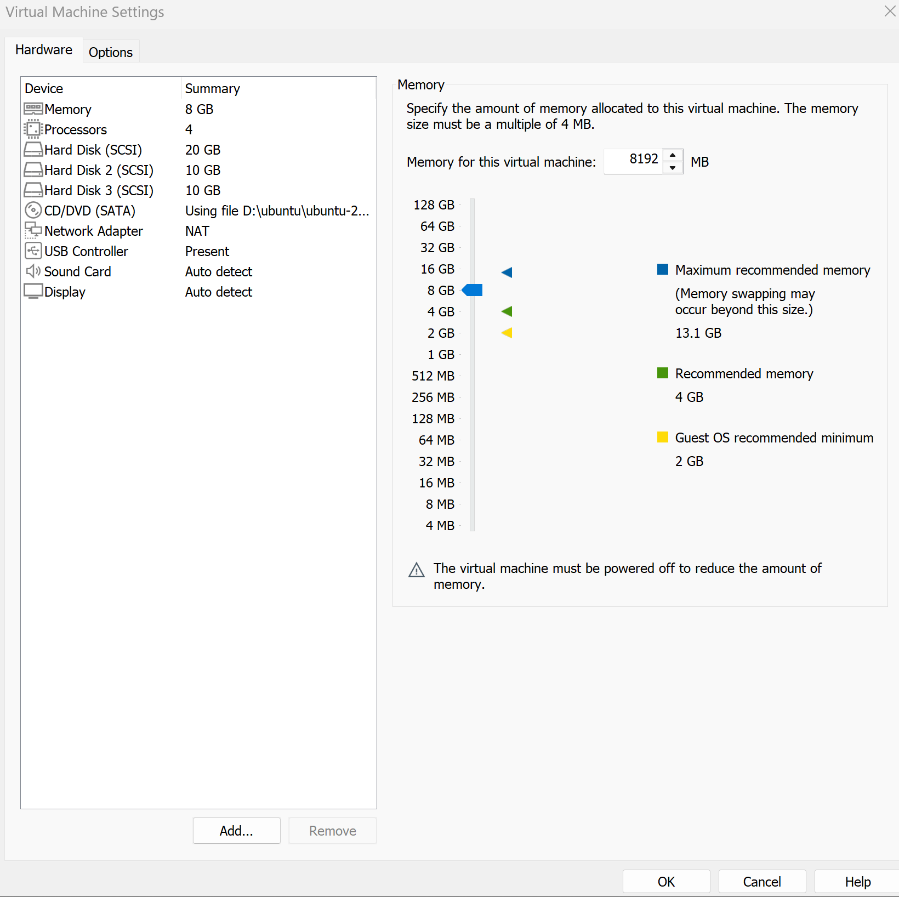

## 2. Tạo Logical Volume trên LVM

`B1`: Kiểm tra các Hard Drives có trên hệ thống

- Bạn có thể kiểm tra xem có những Hard Drives nào trên hệ thống bằng cách sử dụng câu lệnh `lsblk`

  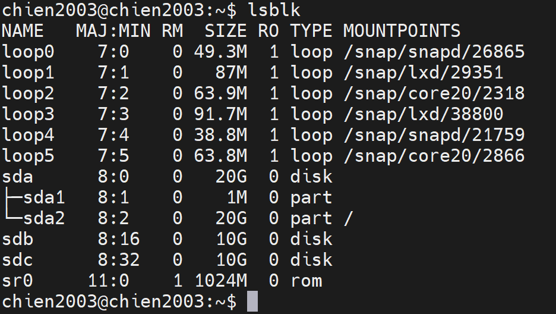

- Trong đó sdb, sdc là các Hard Drives mà mình mới thêm vào

`B2`: Tạo Partition

- Từ các Hard Drives trên hệ thống, tạo các partition. Ở đây, từ sdb ta tạo các partition bằng cách sử dụng lệnh `gdisk /dev/sdb`

  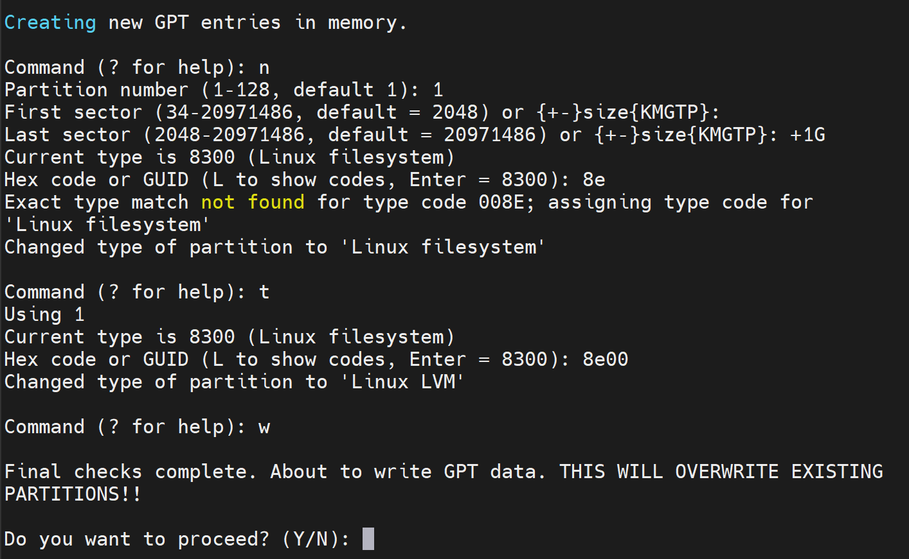

- Trong đó:
  - `n` : bắt đầu tạo partition
  - `1` : tạo partition 1
  - `first sector(34-20971486, default = 2048)` : mặc định
  - `Last sector(2048-20971486, default = 20971486)` : 1G để partition tạo ra có dung lượng 1G
  - `Hex code = 8e00` : đổi thành LVM
  - `w`: lưu và thoát
- Tương tự ta tạo thêm các partition từ `sdb`

  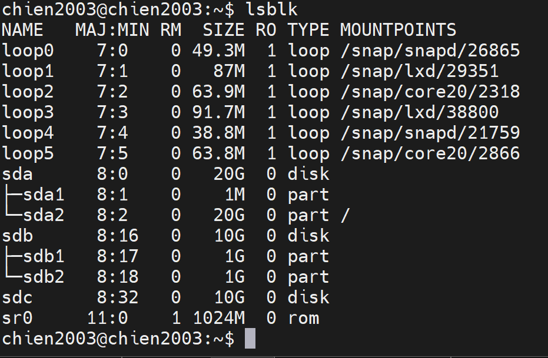


- Tạo các partition từ `sdc` bằng lệnh `gdisk /dev/sdc`

  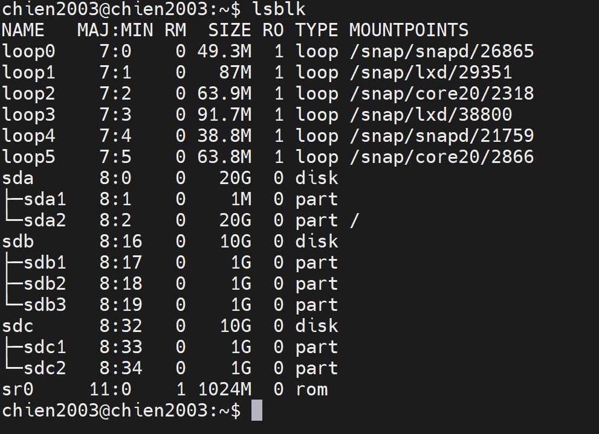

`B3`: Tạo Physical Volume

- Tạo các Physical Volume là `/dev/sdb1` và `/dev/sdc` bằng các lệnh sau:

  - `# pvcreate /dev/sdb1`
  - `# pvcreate /dev/sdc1`
- Có thể kiểm tra các Physical Volume bằng lệnh `pvs: Physical Volumes Show` hoặc `pvdisplay`

   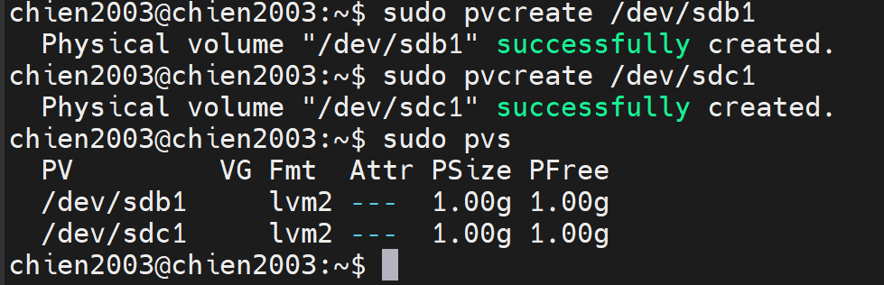


`B4`: Tạo Volume Group

- Nhóm các Physical Volume thành 1 Volume Group bằng câu lệnh:

  ```bash
  $ vgcreate vg-demo /dev/sdb1 /dev/sdc1
  ```

- Trong đó: `vg-demo` là tên của Volume Group

- Có thể dùng `vgs: Volume Group Show` hoặc `vgdisplay` để kiểm tra các Volume Group đã tạo

   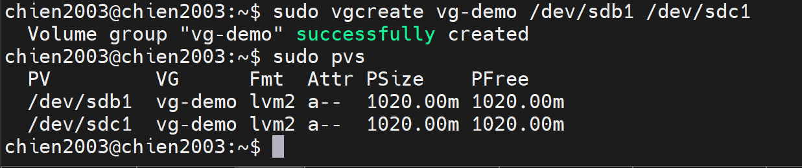

`B5`: Tạo Logical Volume

- Từ 1 Volume Group, ta có thể tạo các Logical Volume bằng lệnh:

  ```bash
  $ lvcreate -L 1G -n lv-demo vg-demo
  ```

- Trong đó:
  - `-L`: (--size) - chỉ ra dung lượng của Logical Volume
  - `-n`: (--name) - chỉ ra tên của Logical Volume
  - `lv-demo` là tên của Logical Volume
  - `vg-demo` là Volume Group mình vừa tạo
- **NOTE**: ta có thể tạo nhiều Logical Volume từ 1 Volume Group
- Ta có thể dùng `lvs:Logical Volume Show` hoặc `lvdisplay` để kiểm tra lại các Logical Volume đã tạo

   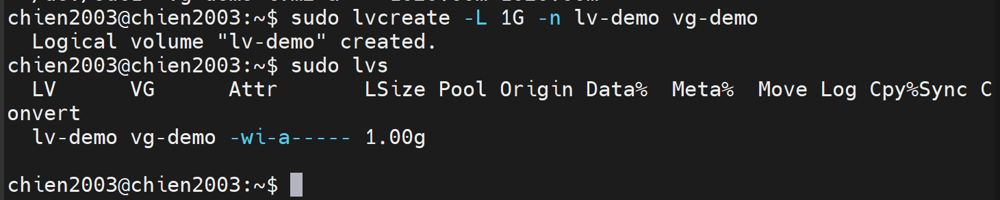

`B6`: Định dạng Logical Volume

- Để format các Logical Volume thành các định dạng như ext2, ext3, ext4, ta có thể làm như sau:
  ```bash
  $ mkfs -t ext4 /dev/vg-demo/lv-demo
  ```

   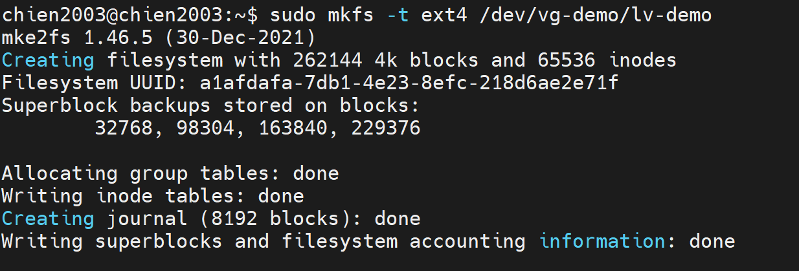


`B7`: Mount và sử dụng

- Ta tạo 1 thư mục để mount Logical Volume đã tạo vào thư mục đó:

  ```bash
  $ mkdir demo
  ```

  

- Tiến hành mount Logical Volume `lv-demo` vào thư mục `demo`:

  ```bash
  $ mount /dev/vg-demo/lv-demo demo
  ```

  

- Kiểm tra lại dung lượng của thư mục đã được mount: 

  ```bash
  $ df -h 

  # df: disk free, -h: human-readable
  ```

   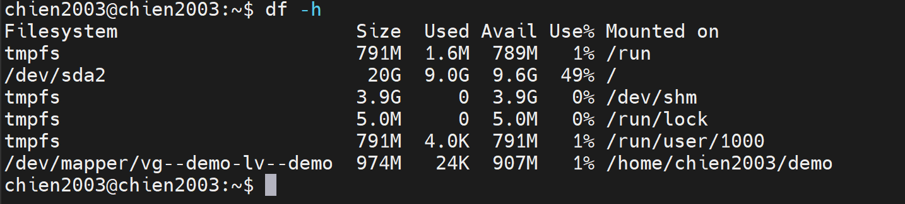


## 3. Thay đổi dung lượng Logical Volume trên LVM

- Trước khi thay đổi dung lượng, ta cần kiểm tra các thông tin hiện có:

  ```bash
  $ vgs
  $ lvs
  $ pvs
  ```

   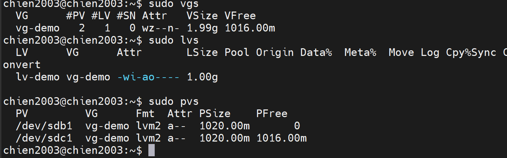

- Ta đã tạo được Logical Volume là `lv-demo`, giả sử Logical Volume này dung lượng đã đầy và chúng ta cần tăng kích thước của nó
- `lv-demo` thuộc `vg-demo`, để tăng kích thước, đầu tiên phải kiểm tra xem `vg-demo` còn dư dung lượng để kéo giãn Logical Volume không?
- **NOTE**: Logical Volume thuộc 1 Volume Group nhất định, Volume Group đã cấp phát hết thì Logical Volume cũng không thể tăng dung lượng được.

- Để kiểm tra: `$ vgdisplay`

   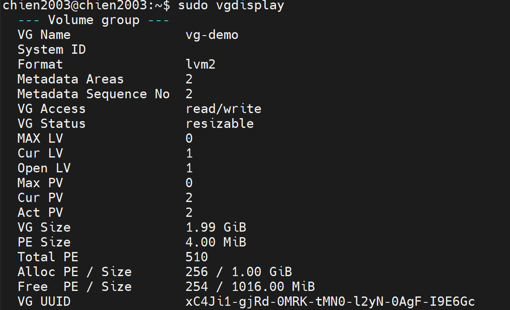

- Volume Group ở đây vẫn còn dung lượng để cấp phát, ta có thể nhận thấy điều này qua 2 trường thông tin là `VG Status  resizeable` và `Free PE / Size  510 / 1.99 GiB` với dung lượng Free là: 510 * 4 = 2040Mb

- Để tăng kích thước Logical Volume ta dùng lệnh:

  ```bash
  $ lvextend -L +50M /dev/vg-demo/lv-demo
  ```

- Trong đó:
  - `-L`: (--size) - để tăng kích thước

   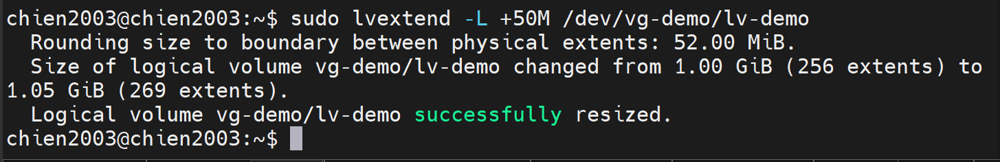

- Kiểm tra lại bằng `lvs`:

   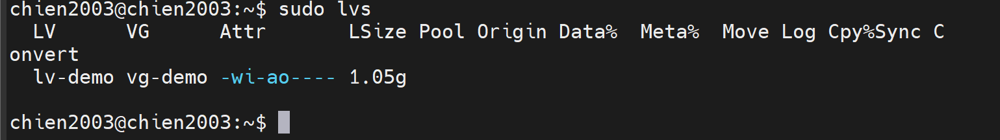

- Sau khi tăng kích thước cho Logical Volume thì Logical Volume đã được tăng nhưng filesystem trên volume này vẫn chưa thay đổi, ta phải dùng lệnh sau để thay đổi:

  ```bash
  $ resize2fs /dev/vg-demo/lv-demo
  ```

   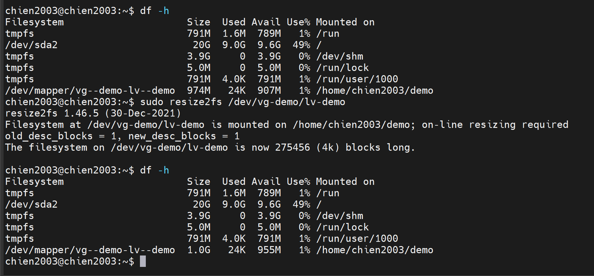

- Để giảm kích thước của Logical Volume, trước hết ta phải umount Logical Volume mà mình muốn giảm

  ```bash
  $ umount /dev/vg-demo/lv-demo
  ```

- Tiến hành giảm kích thước của Logical Volume (chú ý: với ext4, phải thu nhỏ File System trước khi thu nhỏ Logical Volume để tránh mất dữ liệu).

<!--   ```bash
  $ lvreduce -L 20M /dev/vg-demo/lv-demo
  ```

- Sau đó tiến hành format lại Logical Volume

  ```bash
  mkfs -t ext4 /dev/vg-demo/lv-demo
  ``` -->

  ```bash
  # 1. Kiểm tra lỗi file system
  $ e2fsck -f /dev/vg-demo/lv-demo

  # 2. Thu nhỏ file system xuống kích thước mong muốn (VD: 20M)
  $ resize2fs /dev/vg-demo/lv-demo 20M

  # 3. Thu nhỏ Logical Volume
  $ lvreduce -L 20M /dev/vg-demo/lv-demo
  ```

- Cuối cùng là mount lại Logical Volume

  ```bash
  $ mount /dev/vg-demo/lv-demo demo
  ```

- Kiểm tra lại:

   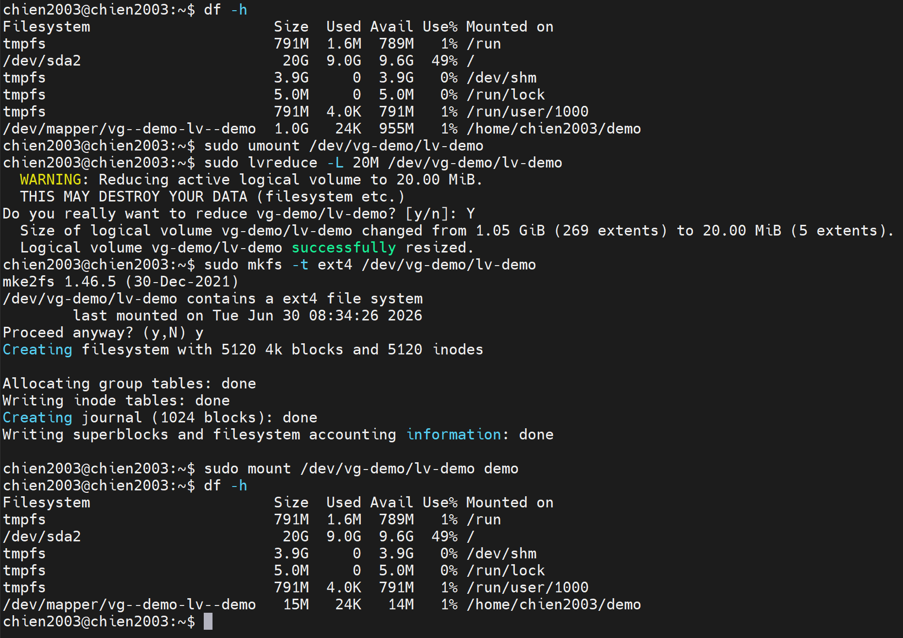
  
## 4. Thay đổi dung lượng Volume Group trên LVM
- Ở phần trước ta có thể tăng kích thước của LV nhưng với điều kiện VG đó còn dung lượng. 
- Phần này ta sẽ tìm hiểu làm thế nào có thể mở rộng thêm kích thước của VG cũng như thu hồi dung lượng của nó
- Việc thay đổi VG chính là việc nhóm thêm Physical Volume hay thu hồi Physical Volume ra khỏi VG
- Ta kiểm tra lại các partition và VG

  `$ vgs`

  `$ lsblk`

   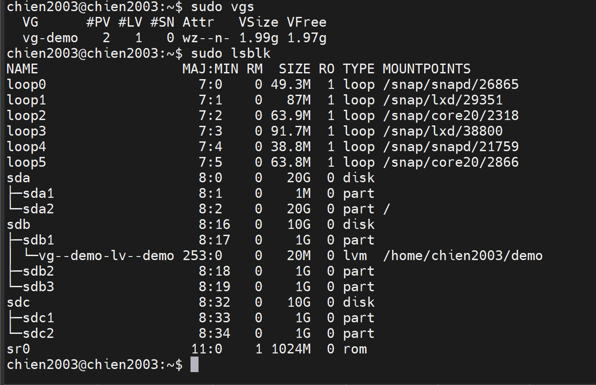

- Tiếp theo, thêm 1 partition vào VG:
  ```bash
  vgextend /dev/vg-demo /dev/sdb3
  ```

- **NOTE**: Vì muốn nhóm vào VG thì phải là PV nên hệ thống tự động tạo PV sdb3 ta không cần phải `pvcreate` nữa.

   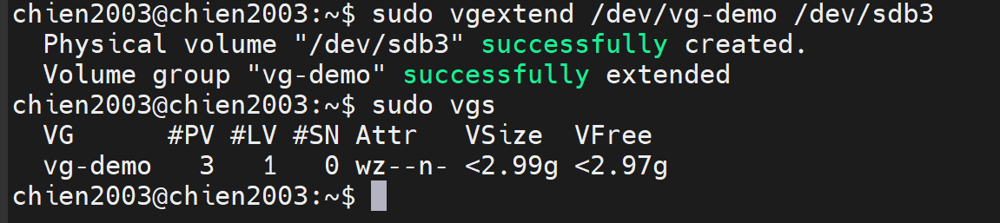

- Ta có thể cắt 1 PV ra khỏi VG như sau:

  ```bash
  $ vgreduce /dev/vg-demo /dev/sdb3
  ```
   
## 5. Xóa Logical Volume, Volume Group, Physical Volume
### Xóa Logical Volume
- Trước tiên ta phải umount Logical Volume
  
  ```bash
  $ umount /dev/vg-demo/lv-demo
  ```
  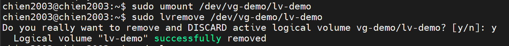

- Sau đó tiến hành xóa Logical Volume bằng lệnh:

  ```bash
  $ lvremove /dev/vg-demo/lv-demo
  ```

- Kiểm tra lại:

   

### Xóa Volume Group
- Trước khi xóa Volume Group, ta phải xóa Logical Volume
- Xóa Volume Group bằng lênh:

  ```bash
  $ vgremove /dev/vg-demo
  ```

   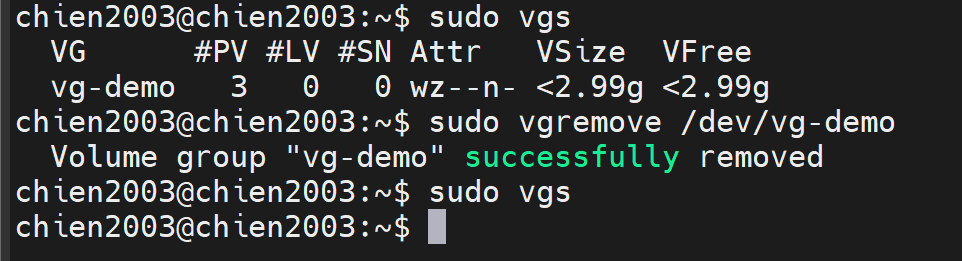

### Xóa Physical Volume
- Xóa PV bằng lệnh:
  ```bash
  $ pvremove /dev/sdb3
  ```

   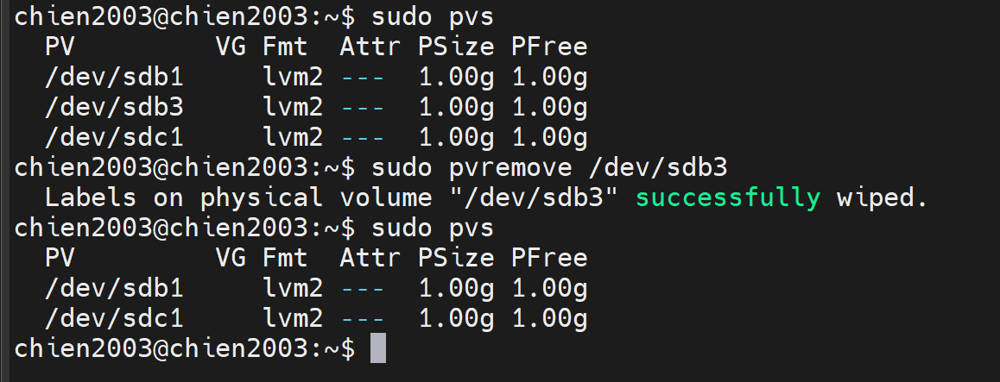

# Khi nào thì nên dùng `LVM`, khi nào nên dùng `Partition` và khi nào thì `mount trực tiếp ổ đĩa`

## 1. mount trực tiếp ổ đĩa
Ví dụ: `/dev/sdb` -> mount thẳng vào `/mnt/data`

- Dùng khi: 
  - Thí nghiệm, test lab, ổ USB, ổ test tạm thời.
  - Muốn mount nhanh, không quan tâm phân vùng
- Không nên dùng khi:
  - Muốn chia ổ thành nhiều phần(ví dụ: `/home`, `/var`)
  - Muốn resize linh hoạt

## 2. Partition
Ví dụ:

```bash
/dev/sda1  →  /
/dev/sda2  →  /home
```

- Dùng khi:
  - Ổ đĩa có dung lượng cố đinh, không thay đổi nhiều
  - Muốn tách biệt dữ liệu hệ thống và người dùng
- Đặc điểm:
  - Khó resize khi đầy(phải umount, resize thủ công)

## 3. LVM
Ví dụ:

```bash
/dev/sda1 → PV (Physical Volume)
PV → VG (Volume Group)
VG → LV (Logical Volume)
LV → mount /home
```

- Dùng khi: 
  - Cần linh hoạt thay đổi dung lượng ổ mà không phải format lại.
  - Dùng cho server, database, VM host, nơi dung lượng cần thay đổi linh hoạt.
  - Muốn gộp nhiều ổ thành một khối logic (VD: sda + sdb = 1 volume lớn).
  - Muốn mở rộng dễ dàng (thêm ổ mới → extend VG → extend LV).
  
## Ví dụ thực tế:
- Giả sử có 2 ổ cứng:
  - `/dev/sda` -> chứa hệ điều hành
  - `/dev/sdb` -> dùng lưu dữ liệu
- Ta có thể chọn:
  - Nếu dữ liệu cố định (VD: ảnh, video): tạo 1 partition `/dev/sdb1` và mount `/mnt/data`
  - Nếu dữ liệu có thể tăng (VD: log server, database): tạo LVM trên `/dev/sdb`, đặt tên VG `vg_data`, LV `lv_logs`, mount `/var/log`
  - Nếu chỉ muốn test nhanh: mount trực tiếp `/dev/sdb` vào `/mnt/test`