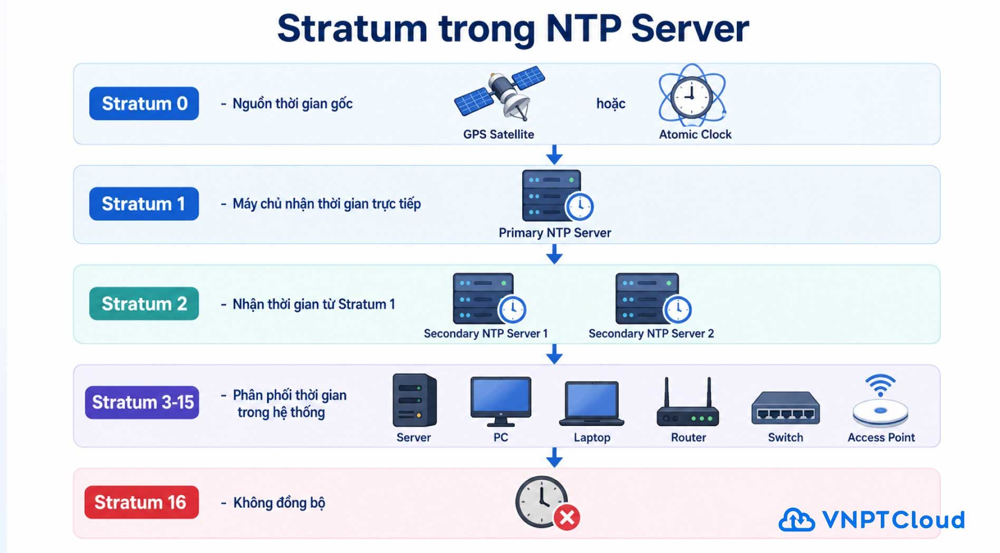

# 0. Lý thuyết về NTP (đọc trước khi thực hành)

## NTP là gì?
- **NTP (Network Time Protocol)** là giao thức mạng dùng để đồng bộ thời gian giữa các máy tính qua mạng, đảm bảo đồng hồ hệ thống (system clock) của máy luôn khớp với thời gian chuẩn.
- NTP hoạt động ở tầng ứng dụng, sử dụng giao thức **UDP cổng 123**.
- Trên Linux hiện đại, việc đồng bộ thời gian thường được xử lý bởi `systemd-timesyncd` (client NTP đơn giản, tích hợp sẵn) hoặc các dịch vụ đầy đủ hơn như `ntpd`/`chrony` (hỗ trợ làm cả server lẫn client, đồng bộ chính xác hơn).

## Vì sao cần đồng bộ thời gian?
- **Bảo mật**: nhiều cơ chế xác thực (Kerberos, TLS/SSL, chữ ký số, token OTP...) yêu cầu thời gian giữa các máy phải khớp nhau, sai lệch quá nhiều sẽ khiến xác thực thất bại.
- **Log & Audit**: khi hệ thống gồm nhiều server, thời gian đồng bộ giúp việc đối chiếu log giữa các máy chính xác, dễ truy vết sự cố theo đúng trình tự thời gian.
- **Ứng dụng phân tán**: các hệ thống cluster, database, message queue... thường dựa vào timestamp để xử lý thứ tự sự kiện; lệch giờ có thể gây lỗi logic nghiêm trọng.
- **Lập lịch (cron, backup, replication)**: các tác vụ định kỳ cần chạy đúng giờ theo kế hoạch.

## Kiến trúc phân tầng: Stratum
NTP tổ chức các nguồn thời gian theo cấp bậc gọi là **Stratum**, càng gần nguồn thời gian chuẩn thì stratum càng thấp (càng đáng tin cậy):



- **Stratum 0**: không tham gia mạng trực tiếp, là chính thiết bị phần cứng đo thời gian chuẩn (đồng hồ nguyên tử, thu tín hiệu vệ tinh GPS...).
- **Stratum 1**: các máy chủ kết nối trực tiếp với thiết bị Stratum 0.
- **Stratum 2, 3...**: các máy chủ/máy khách lấy giờ từ tầng phía trên, mỗi lần đi qua một tầng thì độ trễ và sai số tích lũy tăng thêm một chút.
- Máy Linux thông thường khi đồng bộ qua `pool.ntp.org` thường ở khoảng Stratum 2–4.

## Cơ chế hoạt động cơ bản
1. Client gửi gói tin yêu cầu đến NTP server, kèm timestamp lúc gửi đi.
2. Server nhận, ghi lại timestamp lúc nhận và lúc trả lời, gửi phản hồi kèm 4 mốc thời gian (T1–T4).
3. Client tính toán 2 giá trị quan trọng:
   - **Offset**: độ lệch giữa đồng hồ client và server.
   - **Round-trip delay**: tổng thời gian gói tin đi và về (dùng để ước lượng độ trễ mạng).
4. Dựa trên các giá trị này (thu thập qua nhiều lần polling với nhiều server khác nhau), client sẽ **hiệu chỉnh dần** đồng hồ hệ thống — không giật thời gian đột ngột (trừ khi lệch quá lớn), để tránh gây lỗi cho các tiến trình đang chạy phụ thuộc vào thời gian tăng dần liên tục.

### Các khái niệm hay gặp khi kiểm tra NTP
- **Offset**: chênh lệch giờ hiện tại giữa máy local và server tham chiếu (đơn vị ms).
- **Jitter**: độ dao động của offset qua nhiều lần đo — jitter càng thấp thì kết nối/đồng bộ càng ổn định.
- **Delay**: thời gian round-trip giữa client và server.
- **Reachability**: giá trị bát phân (octal) thể hiện 8 lần polling gần nhất có thành công liên lạc với server hay không.
- **Poll interval**: khoảng thời gian giữa các lần client hỏi server để đồng bộ lại (NTP tự động điều chỉnh khoảng poll tăng dần khi kết nối ổn định để giảm tải mạng).
- Khi chạy `ntpq -p`, dấu `*` trước tên server cho biết đây là server đang được chọn làm nguồn đồng bộ chính (system peer); dấu `+` là các server dự phòng đủ điều kiện; dấu `-`/`x` là các server bị loại do sai số hoặc không đáng tin cậy.

## NTP Pool Project (`pool.ntp.org`)
- Là một dự án cộng đồng, gồm hàng ngàn server NTP tình nguyện trên khắp thế giới, được nhóm theo tên miền để phân phối tải hợp lý theo khu vực địa lý: `asia.pool.ntp.org`, `europe.pool.ntp.org`, `north-america.pool.ntp.org`, hoặc theo quốc gia như `vn.pool.ntp.org`.
- Cơ chế DNS round-robin của pool.ntp.org sẽ trả về ngẫu nhiên vài server phù hợp mỗi lần phân giải tên miền, giúp cân bằng tải giữa các server tình nguyện.
- Nhiều distro (như Ubuntu) mặc định trỏ tới các subdomain riêng do nhà phát triển vận hành trong hệ thống pool (VD: `*.ubuntu.pool.ntp.org`) — các server này tham gia pool chung nhưng được gắn nhãn riêng cho hệ điều hành, không nhất thiết tối ưu theo vị trí địa lý của máy client.

## `timedatectl` vs dịch vụ NTP đầy đủ (`ntpd`/`chrony`)
- **`timedatectl`**: công cụ của `systemd`, quản lý cấu hình thời gian hệ thống (timezone, bật/tắt NTP client) và điều khiển `systemd-timesyncd` — một client NTP đơn giản, chỉ đồng bộ giờ cho chính máy đó (không có khả năng làm NTP server cho máy khác, độ chính xác vừa phải).
- **`ntpd` / `chrony`**: dịch vụ NTP đầy đủ hơn, có thể vừa làm client (đồng bộ giờ cho máy) vừa làm server (cấp giờ cho các máy khác trong mạng nội bộ), thuật toán đồng bộ phức tạp và chính xác hơn `timesyncd`, phù hợp khi cần làm NTP server nội bộ hoặc yêu cầu độ chính xác cao (VD: cho hệ thống tài chính, logging tập trung).
- Khi cài `ntp` (gói chứa `ntpd`), nó thường sẽ **thay thế vai trò đồng bộ giờ tự động** của `systemd-timesyncd` để tránh xung đột — đó là lý do lab có bước bật/tắt `timedatectl set-ntp` trước khi chuyển sang dùng `ntpd`.

---

# 1. Kiểm tra trạng thái đồng bộ thời gian
```
timedatectl status
```

# 2. Bật đồng bộ thời gian tự động
```
sudo timedatectl set-ntp true
```
## Kiểm tra lại:
```
timedatectl status
```

# 3. Tắt đồng bộ thời gian
```
sudo timedatectl set-ntp false
```

# 4. Cài đặt NTP
## Nếu máy chưa có dịch vụ đồng bộ:
```
sudo apt update
sudo apt install ntp -y
```


## Khởi động dịch vụ:
```
sudo systemctl enable ntp
sudo systemctl start ntp
```

## Kiểm tra:
```
systemctl status ntp
```

# 5. Cấu hình NTP Server
## Mở file cấu hình:
```
sudo nano /etc/ntp.conf
```
## Tìm các dòng:
```
pool 0.ubuntu.pool.ntp.org iburst
pool 1.ubuntu.pool.ntp.org iburst
pool 2.ubuntu.pool.ntp.org iburst
pool 3.ubuntu.pool.ntp.org iburst
```
## Có thể thay bằng:
```
server 0.asia.pool.ntp.org iburst
server 1.asia.pool.ntp.org iburst
server 2.asia.pool.ntp.org iburst
server 3.asia.pool.ntp.org iburst
```


### Tại sao nên thay thế?

- **Vị trí địa lý gần hơn → độ trễ (latency) thấp hơn**: `pool.ntp.org` là dự án NTP Pool toàn cầu, chia theo vùng miền như `asia.pool.ntp.org`, `europe.pool.ntp.org`, `north-america.pool.ntp.org`... Server ở khu vực `asia` sẽ nằm gần vị trí của máy chủ hơn so với các server mặc định của `*.ubuntu.pool.ntp.org` (thường được phân giải ngẫu nhiên, không đảm bảo chọn đúng server gần nhất).
- **Đồng bộ chính xác hơn**: NTP tính toán độ lệch thời gian dựa trên round-trip time giữa client và server. Khoảng cách địa lý càng xa, độ trễ mạng càng lớn và càng dao động (jitter), khiến sai số đồng bộ tăng lên. Chọn server khu vực gần giúp giảm độ trễ và tăng độ chính xác của việc đồng bộ giờ.
- **Giảm tải cho hạ tầng, tăng độ ổn định**: dùng đúng pool khu vực (`asia`) giúp phân tán tải hợp lý hơn theo vùng miền của dự án NTP Pool, tránh việc request phải đi vòng qua các server ở châu lục khác, hạn chế rớt kết nối hoặc timeout khi mạng quốc tế không ổn định.
- **Không phụ thuộc vào server đặc thù của Ubuntu**: `*.ubuntu.pool.ntp.org` là các subdomain riêng do Canonical vận hành trong hệ thống pool, nhắm tới việc đồng bộ tải cho máy chạy Ubuntu nói chung trên toàn thế giới chứ không tối ưu theo vị trí địa lý của từng máy chủ. Dùng `asia.pool.ntp.org` (hoặc pool quốc gia cụ thể hơn như `vn.pool.ntp.org` nếu có) cho phép chọn đúng nhóm server theo khu vực đang triển khai hệ thống.

# 6. Khởi động lại dịch vụ
## Mở file cấu hình:
```
sudo systemctl restart ntp
```
# 7. Kiểm tra trạng thái đồng bộ
```
ntpq -p
```

## Dấu * cho biết máy chủ đang được sử dụng để đồng bộ.