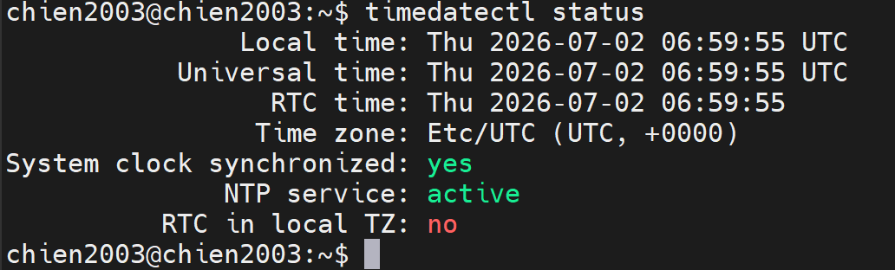
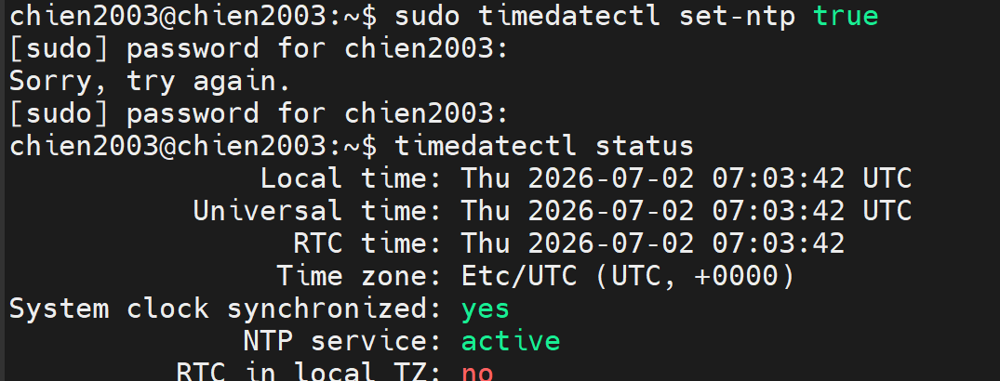
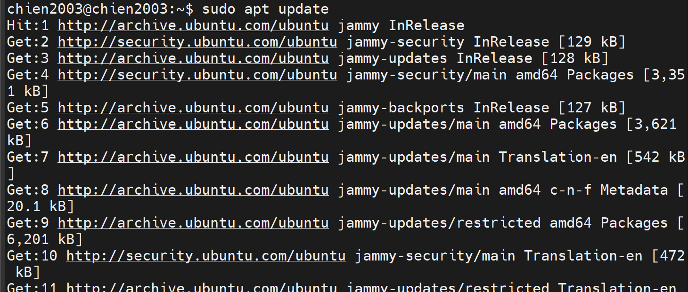
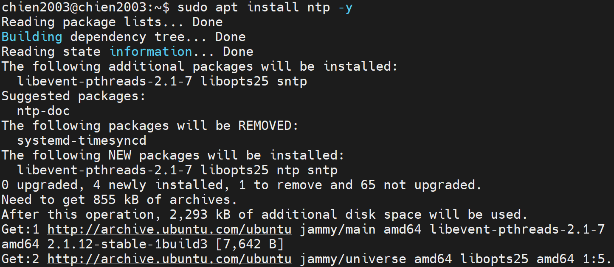
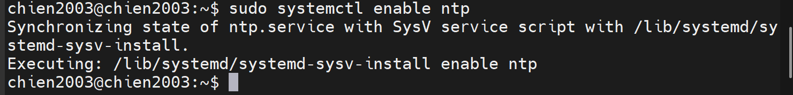
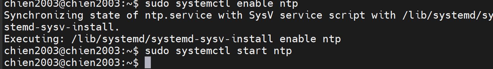
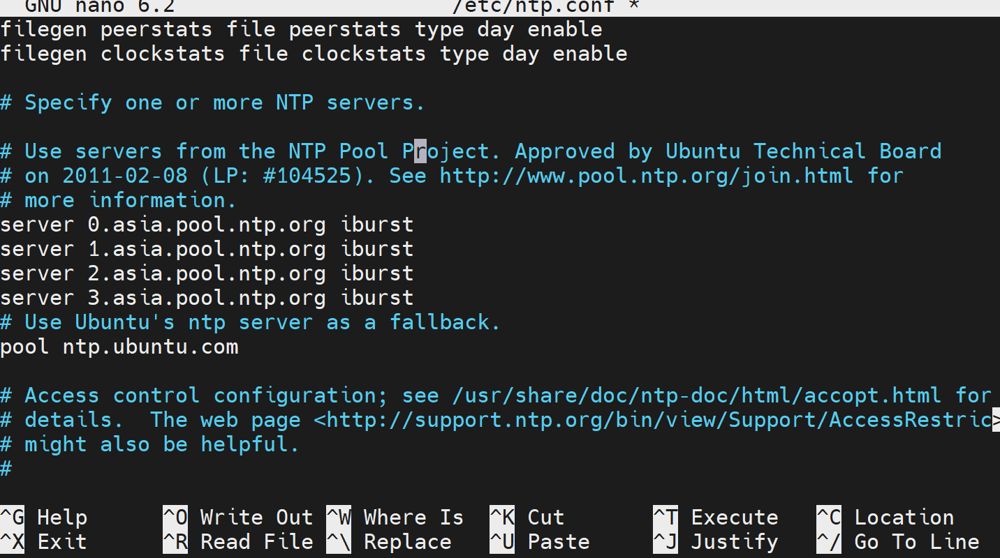
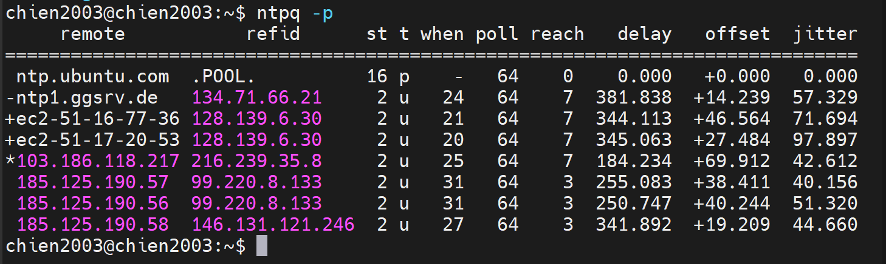

# 1. Kiểm tra trạng thái đồng bộ thời gian
```
timedatectl status
```

# 2. Bật đồng bộ thời gian tự động
```
sudo timedatectl set-ntp true
```
## Kiểm tra lại:
```
timedatectl status
```

# 3. Tắt đồng bộ thời gian
```
sudo timedatectl set-ntp false
```

# 4. Cài đặt NTP
## Nếu máy chưa có dịch vụ đồng bộ:
```
sudo apt update
sudo apt install ntp -y
```



## Khởi động dịch vụ:
```
sudo systemctl enable ntp
sudo systemctl start ntp
```

## Kiểm tra:
```
systemctl status ntp
```

# 5. Cấu hình NTP Server
## Mở file cấu hình:
```
sudo nano /etc/ntp.conf
```
## Tìm các dòng:
```
pool 0.ubuntu.pool.ntp.org iburst
pool 1.ubuntu.pool.ntp.org iburst
pool 2.ubuntu.pool.ntp.org iburst
pool 3.ubuntu.pool.ntp.org iburst
```
## Có thể thay bằng:
```
server 0.asia.pool.ntp.org iburst
server 1.asia.pool.ntp.org iburst
server 2.asia.pool.ntp.org iburst
server 3.asia.pool.ntp.org iburst
```

# 6. Khởi động lại dịch vụ
## Mở file cấu hình:
```
sudo systemctl restart ntp
```
# 7. Kiểm tra trạng thái đồng bộ
```
ntpq -p
```

## Dấu * cho biết máy chủ đang được sử dụng để đồng bộ.
