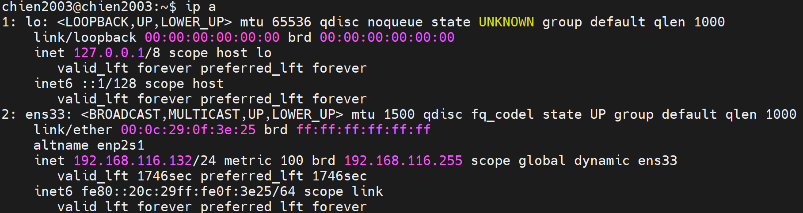
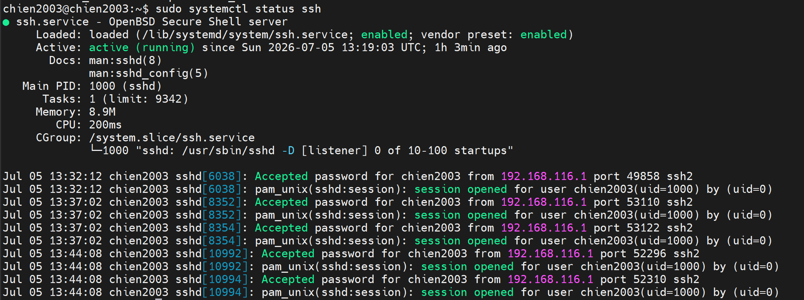
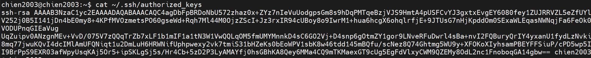
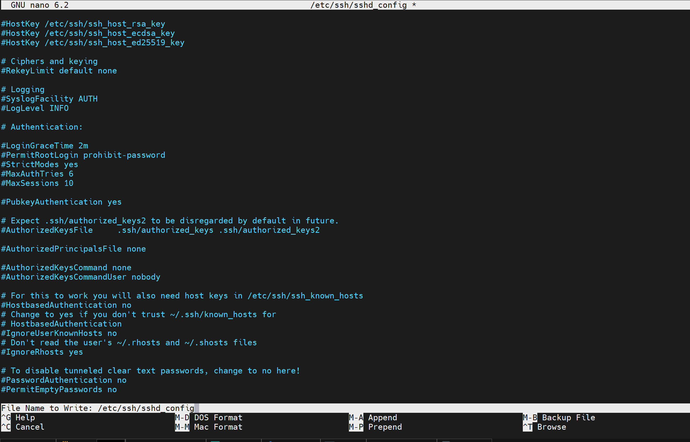
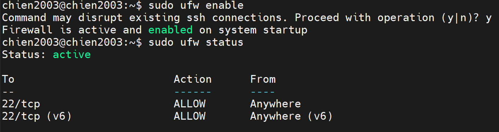
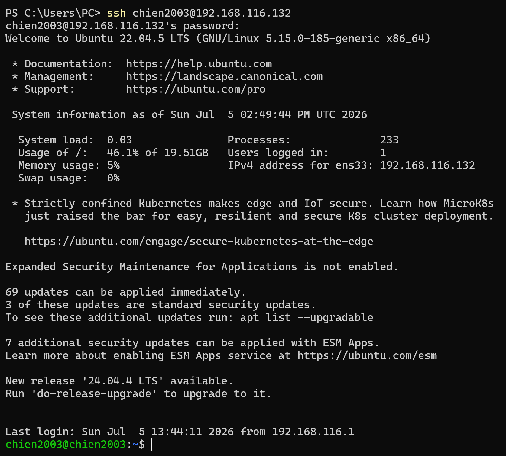

# SSH TỪ MÁY WINDOWS SANG MÁY ẢO UBUNTU SERVER 24.04
## MÔ TẢ
- Mô hình máy chính Windows thực hiện SSH đến máy ảo Ubuntu Server 24.04 sử dụng SSH Key

## CÁC BƯỚC THỰC HIỆN
## 1. Generate SSH key sử dụng thuật toán RSA
- Ở trên màn hình Terminal của Windows, ta gõ câu lệnh `ssh-keygen -t rsa -b 4096`
- Sau đó ở sẽ xuất hiện private key và public key

## 2. Kiểm tra địa chỉ IP của máy ảo Ubuntu
- Gõ câu lệnh `ip a` trên máy ảo Ubuntu để kiểm tra địa chỉ IP
  

## 3. Kiểm tra dịch vụ SSH có đang hoạt động trong Ubuntu
- Sử dụng câu lệnh `sudo systemctl status ssh` để kiểm tra xem ssh service có đang hoạt động hay không
  

- Ta có thể thấy service đang running nên không cần phải cài đặt nữa
<!-- - Nếu chưa có, ta có thể dùng lệnh `sudo apt install ssh` để cài đặt SSH trên Ubuntu -->
- Nếu chưa có, ta có thể dùng lệnh `sudo apt install openssh-server` để cài đặt SSH trên Ubuntu

<!-- ## 3. Tạo thư mục chứa Public Key tại thư mục cá nhân trong Ubuntu -->
## 4. Tạo thư mục chứa Public Key tại thư mục cá nhân trong Ubuntu
- Sử dụng câu lệnh `mkdir -p ~/.ssh` để tạo thư mục ssh
- Sử dụng câu lệnh `sudo nano ~/.ssh/authorized_keys` rồi thêm public key ssh trong file id_rsa.pub
- Cấu hình quyền cho thư mục ssh và file authorized_keys
`chmod 700 ~/.ssh`
`chmod 600 ~/.ssh/authorized_keys`

<!-- ## 4. Cấu hình lại dịch vụ SSH trên Ubuntu -->
## 5. Cấu hình lại dịch vụ SSH trên Ubuntu
`sudo nano /etc/ssh/sshd_config`

- Ở đây, tìm và chỉnh sửa các dòng sau:
+ PubkeyAuthentication yes (Bật tính năng đăng nhập bằng Key).
+ PasswordAuthentication no (Tắt tính năng đăng nhập bằng mật khẩu thường, chỉ làm bước này khi chắc chắn bước 2 đã thành công để tránh bị khóa bên ngoài).

<!-- ## 5. Restart lại dịch vụ SSH -->
## 6. Restart lại dịch vụ SSH
`sudo systemctl restart ssh`
- Câu lệnh trên sẽ khởi động lại dịch vụ ssh và áp dụng những thay đổi trong cấu hình trong file config

<!-- ## 6. Cấu hình Fire wall -->
## 7. Cấu hình Fire wall
- Đầu tiên ta sẽ gõ câu lệnh `sudo ufw status` để kiểm tra cấu hình của Firewall có mở Port 22 không
  

- Như hình trên ta có thể thể thấy Port 22 của SSH đã được mở, ta không cần phải cấu hình gì thêm
- Trong trường hợp Port 22 không mở, ta sẽ sử dụng câu lệnh `sudo ufw allow ssh` để mở khóa cổng SSH trên hệ thống Ubuntu

<!-- ## 6. Thực hiện SSH từ Windows đến Ubuntu -->
## 8. Thực hiện SSH từ Windows đến Ubuntu
- Vào terminal gõ `ssh username@dia_chi_ip` để thực hiện kết nối
  

<!-- - Ở đây màn hình sẽ hiển thị yêu cầu mật khẩu passphrase (mật khẩu để mở khóa public key trên máy, mật khẩu này sẽ được ta cấu hình khi generate key ssh lúc đầu) -->
- Ở đây màn hình sẽ hiển thị yêu cầu mật khẩu passphrase (mật khẩu để mở khóa private key trên máy, mật khẩu này sẽ được ta cấu hình khi generate key ssh lúc đầu)
- Sau khi nhập xong mật khẩu passphrase, ta đã có thể SSH từ máy Windows sang máy ảo Ubuntu rồi.