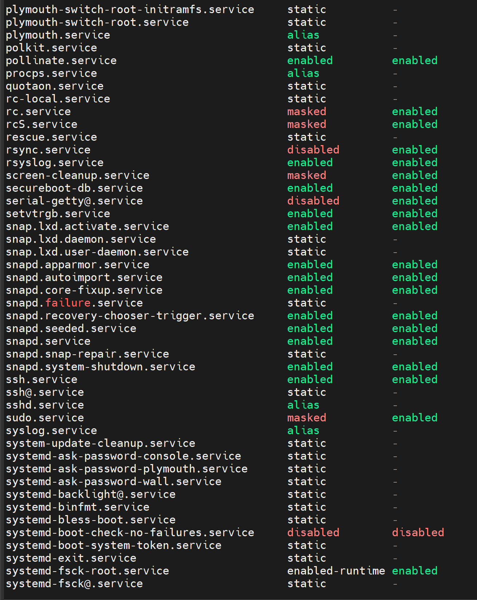
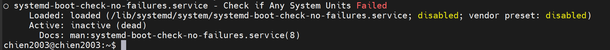
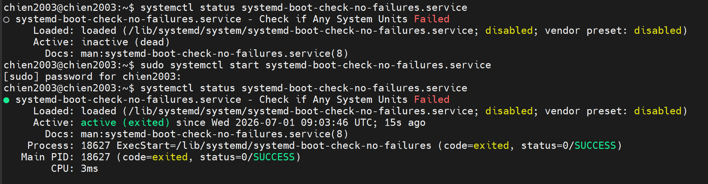
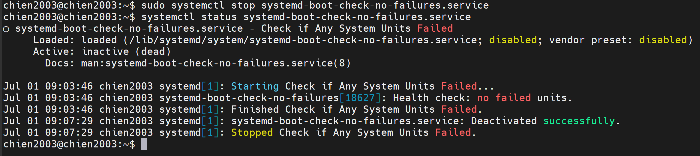
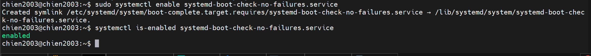
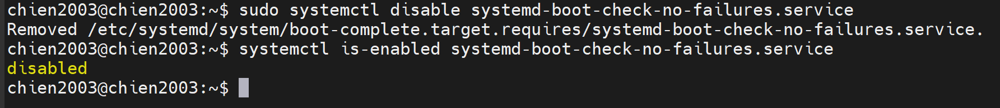
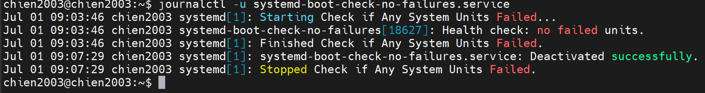

# Liệt kê tất cả service
Kiểm tra tất cả service có trên hệ thống với câu lệnh:
```
systemctl list-unit-files --type service -all
```
  

# 1. Kiểm tra trạng thái
```
systemctl status systemd-boot-check-no-failures.service
```


# 2. Start service
```
sudo systemctl start systemd-boot-check-no-failures.service
```
## Kiểm tra lại:
```
systemctl status systemd-boot-check-no-failures.service
```


# 3. Stop service
```
sudo systemctl stop systemd-boot-check-no-failures.service
```
## Kiểm tra lại:
```
systemctl status systemd-boot-check-no-failures.service
```


# 4. Enable service
```
sudo systemctl enable systemd-boot-check-no-failures.service
```
## Kiểm tra lại:
```
systemctl is-enabled systemd-boot-check-no-failures.service
```


# 5. Disable service
```
sudo systemctl disable systemd-boot-check-no-failures.service
```
## Kiểm tra lại:
```
systemctl is-enabled systemd-boot-check-no-failures.service
```


<!-- # 7. Xem log service -->
# 6. Xem log service



