# Thực hành chmod trên Linux 
### Bước 1. Đăng nhập root

```bash
sudo -i
```
---

### Bước 2. Kiểm tra các User

```bash
cat /etc/passwd | grep -E "chien2003|nxc|appuser"
```

Kết quả

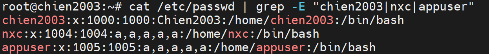
---

### Bước 3. Tạo Group

```bash
groupadd developers
```
---

### Bước 4. Thêm User vào Group

```bash
usermod -aG developers chien2003
usermod -aG developers nxc
```

Kiểm tra

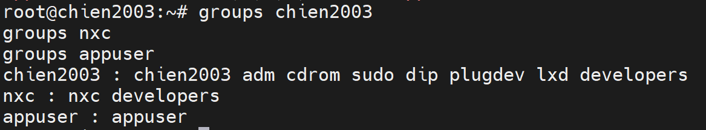
---

### Bước 5. Tạo thư mục thực hành

```bash
mkdir -p /labchmod
```

Đổi Owner và Group

```bash
chown chien2003:developers /labchmod
```

Phân quyền

```bash
chmod 775 /labchmod
```

Kiểm tra

```bash
ls -ld /labchmod
```

Ví dụ

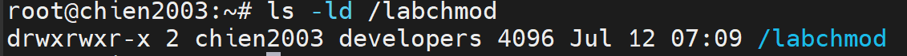
---

### Bước 6. Chuyển sang User

```bash
su - chien2003
```

Di chuyển

```bash
cd /labchmod
```
---

# Ví dụ 1. Thêm quyền Execute cho Owner

### Tạo file

```bash
touch script.sh
chmod 644 script.sh
echo 'echo "script.sh da chay thanh cong"' > script.sh
```

### Trước

```bash
ls -l script.sh
```

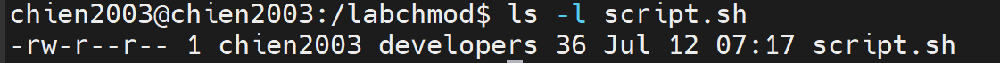

Owner: `rw-` · Group: `r--` · Others: `r--`

**Test quyền (owner `chien2003`)**

```bash
./script.sh
```

Kết quả:

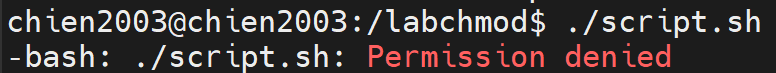

---

### Thực hiện

```bash
chmod u+x script.sh
```

---

### Sau

```bash
ls -l script.sh
```

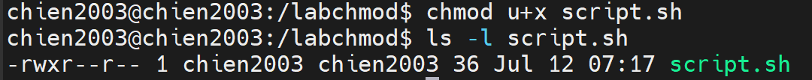

**Test lại**

```bash
./script.sh
```

Kết quả:

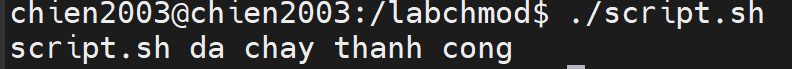

Giải thích

- Owner được thêm quyền Execute → chạy được file.
- Group và Others giữ nguyên.

---

# Ví dụ 2. Xóa quyền Write của Owner

### Tạo file

```bash
touch report.txt
chmod 644 report.txt
```

### Trước

```bash
ls -l report.txt
```
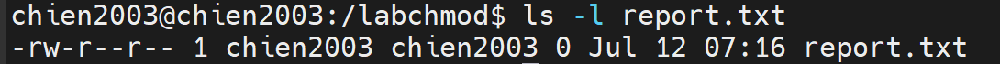

**Test quyền (owner)**

```bash
echo "noi dung test" >> report.txt
```

---

### Thực hiện

```bash
chmod u-w report.txt
```

---

### Sau

```bash
ls -l report.txt
```
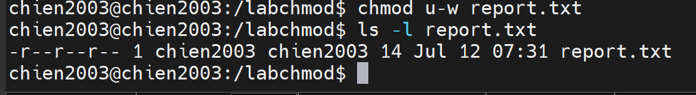

**Test lại**

```bash
echo "noi dung test" >> report.txt
```

Kết quả:

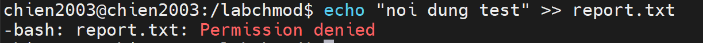

Giải thích

Owner chỉ còn quyền đọc, không ghi được nữa.

---

# Ví dụ 3. Owner chỉ được Read

### Tạo file

```bash
touch secret.txt
chmod 644 secret.txt
```

### Trước

```bash
ls -l secret.txt
```
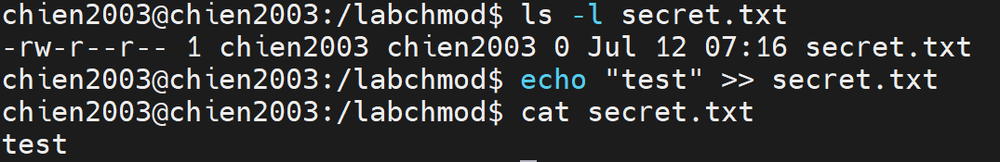

---

### Thực hiện

```bash
chmod u=r secret.txt
```

---

### Sau

```bash
ls -l secret.txt
```
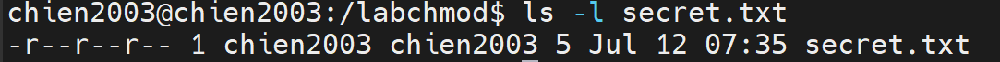

**Test lại**

```bash
cat secret.txt        # vẫn đọc được
echo "test2" >> secret.txt
```

Kết quả:

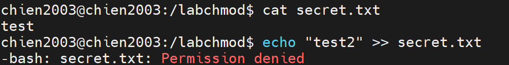

Giải thích

Owner chỉ được đọc, không còn ghi được.

---

# Ví dụ 4. Thêm quyền Write cho Group

### Tạo file

```bash
touch file1.txt
chmod 644 file1.txt
```

### Trước

```bash
ls -l file1.txt
```

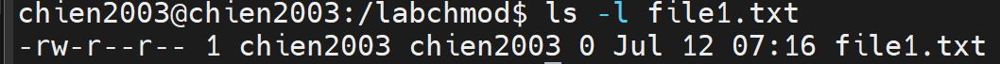

**Test quyền — chuyển sang `nxc` (thành viên group developers)**

```bash
su - nxc
cd /labchmod
echo "test group" >> file1.txt
```

Kết quả:

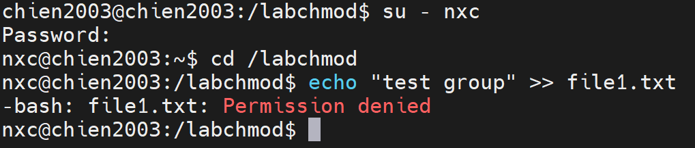

---

### Thực hiện (với owner `chien2003`)

```bash
chmod g+w file1.txt
```

---

### Sau

```bash
ls -l file1.txt
```

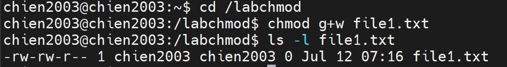

**Test lại (vẫn với `nxc`)**

```bash
echo "test group" >> file1.txt
cat file1.txt
```

Kết quả: 

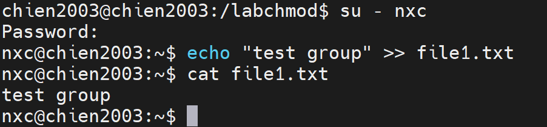

Giải thích

Group được phép sửa file.

---

# Ví dụ 5. Thêm quyền Execute cho Group

### Tạo file

```bash
touch file2.txt
chmod 644 file2.txt
```

### Trước

```bash
ls -l file2.txt
```

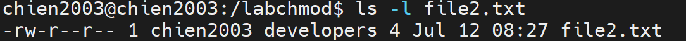

**Test quyền (`nxc`)**

```bash
./file2.txt
```

Kết quả:

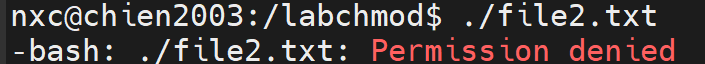

---

### Thực hiện (owner)

```bash
chmod g+x file2.txt
```

---

### Sau

```bash
ls -l file2.txt
```

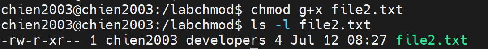

**Test lại (`nxc`)**

```bash
./file2.txt
```

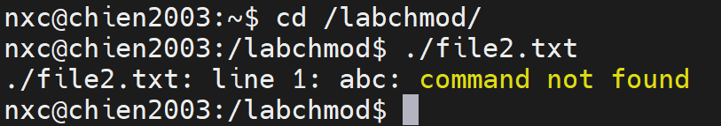

Giải thích

Group được phép thực thi file.

---

# Ví dụ 6. Xóa quyền Read của Group

### Tạo file

```bash
touch file3.txt
chmod 644 file3.txt
```

### Trước

```bash
ls -l file3.txt
```

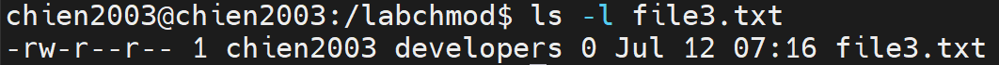

Ý nghĩa: Owner `rw-` · Group `r--` · Others `r--`

**Test quyền (`nxc`)**

```bash
cat file3.txt
```

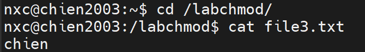

---

### Thực hiện (owner)

```bash
chmod g-r file3.txt
```

---

### Sau

```bash
ls -l file3.txt
```

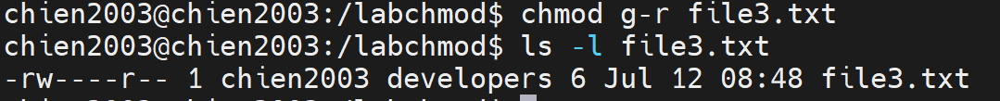

**Test lại (`nxc`)**

```bash
cat file3.txt
```

Kết quả:

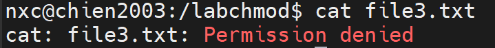

Giải thích

- Group bị xóa quyền đọc.
- Owner và Others không thay đổi.

---

# Ví dụ 7. Thêm quyền Read cho Others

### Tạo file

```bash
touch file4.txt
chmod 644 file4.txt
```

### Trước

```bash
ls -l file4.txt
```

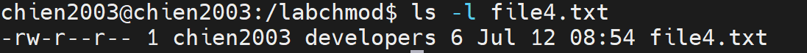

**Test quyền — chuyển sang `appuser` (không thuộc group developers → đại diện others)**

```bash
su - appuser
cd /labchmod
cat file4.txt
```

Kết quả: 

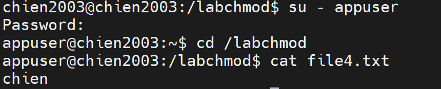

---

### Thực hiện (owner)

```bash
chmod o+r file4.txt
```

---

### Sau

```bash
ls -l file4.txt
```

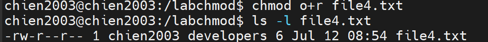

**Test lại (`appuser`)**

```bash
cat file4.txt
```

Kết quả: 

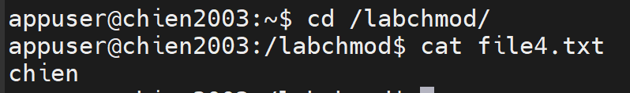

Giải thích

- Others đã có quyền đọc (`r`) từ trước nên hành vi không đổi.

---

# Ví dụ 8. Thêm quyền Execute cho Others

### Tạo file

```bash
touch file5.txt
chmod 644 file5.txt
```

### Trước

```bash
ls -l file5.txt
```

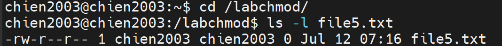

**Test quyền (`appuser`)**

```bash
./file5.txt
```

Kết quả:

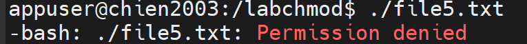

---

### Thực hiện (owner)

```bash
chmod o+x file5.txt
```

---

### Sau

```bash
ls -l file5.txt
```

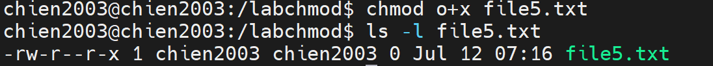

**Test lại (`appuser`)**

```bash
./file5.txt
```

Kết quả: 

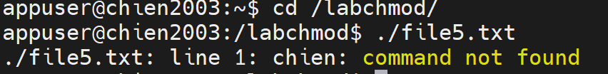

Giải thích

- Others được thêm quyền thực thi (`x`).
- Owner và Group giữ nguyên.

---

# Ví dụ 9. Xóa quyền Write của Others

### Tạo file

```bash
touch demo.txt
chmod 644 demo.txt
```

### Trước

```bash
ls -l demo.txt
```

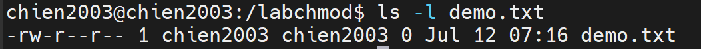

**Test quyền (`appuser`)**

```bash
echo "test" >> demo.txt
```

Kết quả:

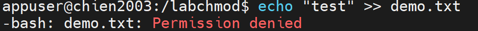

(others vốn chưa từng có quyền ghi)

---

### Thực hiện (owner)

```bash
chmod o-w demo.txt
```

---

### Sau

```bash
ls -l demo.txt
```

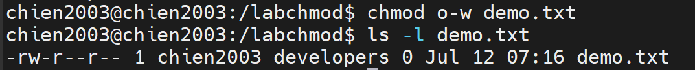

**Test lại (`appuser`)**

```bash
echo "test" >> demo.txt
```

Kết quả: 

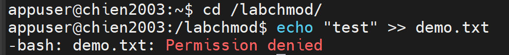

Giải thích

- Others vốn không có quyền ghi (`w`) nên quyền không thay đổi.

---

# Ví dụ 10. Thêm quyền Execute cho tất cả

### Tạo file

```bash
touch project.txt
chmod 644 project.txt
```

### Trước

```bash
ls -l project.txt
```

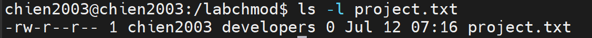

**Test quyền (cả 3 user)**

```bash
# chien2003 (owner)
./project.txt   # Permission denied

# nxc (group)
./project.txt   # Permission denied

# appuser (others)
./project.txt   # Permission denied
```

---
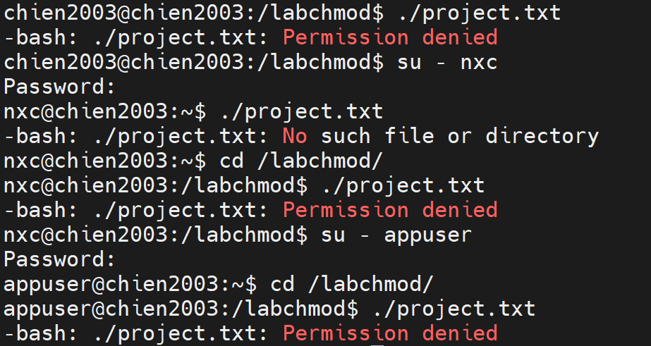

### Thực hiện (owner)

```bash
chmod a+x project.txt
```

---

### Sau

```bash
ls -l project.txt
```

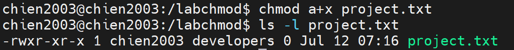

**Test lại (cả 3 user)**

```bash
./project.txt
```

Kết quả: 

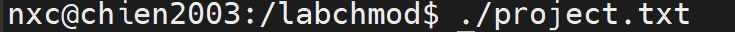

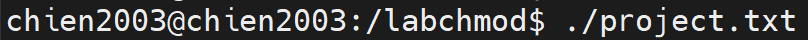

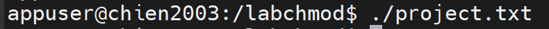

Giải thích

- Owner, Group, Others đều được thêm quyền Execute.

Kết quả: Owner `rwx` · Group `r-x` · Others `r-x`

---

# Ví dụ 11. Xóa quyền Write của tất cả

> Dùng lại `project.txt` từ Ví dụ 10 (không tạo file mới).

### Trước

```bash
ls -l project.txt
```

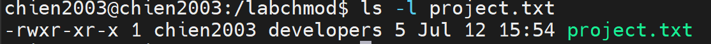

Ý nghĩa: Owner `rwx` · Group `r-x` · Others `r-x`

**Test quyền (owner)**

```bash
echo "test" >> project.txt
```
---

### Thực hiện

```bash
chmod a-w project.txt
```

---
### Sau

```bash
ls -l project.txt
```

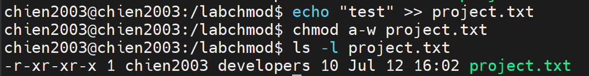

**Test lại (owner)**

```bash
echo "test" >> project.txt
```

Kết quả:

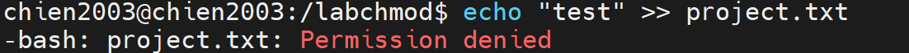

Giải thích

- Owner bị xóa quyền ghi (thay đổi thực sự).
- Group, Others vốn không có quyền ghi nên không đổi (test bằng `nxc`/`appuser` vẫn `Permission denied` như trước).

Kết quả: Owner `r-x` · Group `r-x` · Others `r-x`

---

# Ví dụ 12. Owner toàn quyền, Group đọc & thực thi, Others không có quyền

> Dùng lại `script.sh` từ Ví dụ 1 (không tạo file mới).

### Trước

```bash
ls -l script.sh
```

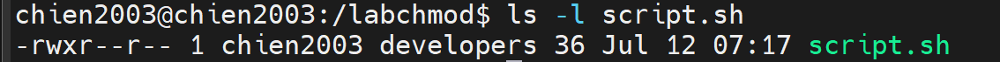

Ý nghĩa: Owner `rwx` · Group `r--` · Others `r--`

**Test quyền trước**

```bash
# nxc: ./script.sh -> Permission denied (group chưa có x)
# appuser: cat script.sh -> đọc được (others đang có r)
```
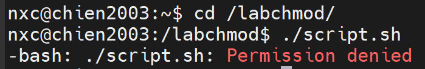

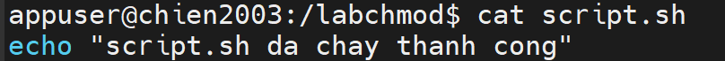
---

### Thực hiện (owner)

```bash
chmod u+rwx,g+rx,o-rwx script.sh
```

---

### Sau

```bash
ls -l script.sh
```

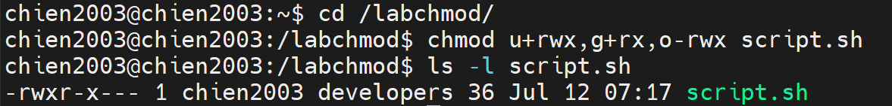

**Test lại**

```bash
# chien2003 (owner): ./script.sh -> chạy thành công
# nxc (group): ./script.sh -> chạy thành công
# appuser (others): cat script.sh -> Permission denied
```


Giải thích

- Owner có toàn quyền.
- Group được đọc và thực thi.
- Others bị xóa toàn bộ quyền, kể cả đọc.

---

# Ví dụ 13. Owner đọc ghi, Group chỉ đọc, Others không có quyền

> Dùng lại `report.txt` từ Ví dụ 2 (không tạo file mới).

### Trước

```bash
ls -l report.txt
```


Ý nghĩa: Owner `r--` · Group `r--` · Others `r--`

**Test quyền trước (owner)**

```bash
echo "x" >> report.txt
```

Kết quả: 


 (owner chưa có `w`).

---

### Thực hiện

```bash
chmod u=rw,g=r,o= report.txt
```

---

### Sau

```bash
ls -l report.txt
```


**Test lại**

```bash
# chien2003 (owner): echo "x" >> report.txt -> thành công
# nxc (group): cat report.txt -> đọc được; echo "x" >> report.txt -> Permission denied
# appuser (others): cat report.txt -> Permission denied
```


Giải thích

- Owner được đọc và ghi.
- Group chỉ được đọc.
- Others không còn quyền gì.

---

# Ví dụ 14. Numeric Mode 777

> Dùng lại `demo.txt` từ Ví dụ 9 (không tạo file mới).

### Trước

```bash
ls -l demo.txt
```


Ý nghĩa: Owner `rw-` · Group `r--` · Others `r--`

**Test quyền trước (`appuser`)**

```bash
echo "x" >> demo.txt    # Permission denied
./demo.txt               # Permission denied
```


---

### Thực hiện (owner)

```bash
chmod 777 demo.txt
```
---

### Sau

```bash
ls -l demo.txt
```


**Test lại (`appuser`)**

```bash
echo "x" >> demo.txt    # thành công
./demo.txt               # thành công
```


Giải thích

Tất cả người dùng đều đọc, ghi và thực thi được — kể cả `appuser` là others.

---

# Ví dụ 15. Numeric Mode 755

> Dùng lại `script.sh` từ Ví dụ 12 (không tạo file mới).

### Trước

```bash
ls -l script.sh
```


Ý nghĩa: Owner `rwx` · Group `r-x` · Others `---`

**Test quyền trước (`appuser`)**

```bash
cat script.sh   # Permission denied
```

---

### Thực hiện (owner)

```bash
chmod 755 script.sh
```

---

### Sau

```bash
ls -l script.sh
```


**Test lại (`appuser`)**

```bash
cat script.sh    # đọc được
./script.sh       # chạy được
echo "x" >> script.sh   # Permission denied (others không có w)
```


Giải thích

- Owner toàn quyền, Group và Others đọc + thực thi được, nhưng không ai ngoài owner ghi được.

---

# Ví dụ 16. Numeric Mode 700

> Dùng lại `secret.txt` từ Ví dụ 3 (không tạo file mới).

### Trước

```bash
ls -l secret.txt
```


Ý nghĩa: Owner `r--` · Group `r--` · Others `r--`

**Test quyền trước**

```bash
# nxc: cat secret.txt -> đọc được
# appuser: cat secret.txt -> đọc được
```

---

### Thực hiện (owner)

```bash
chmod 700 secret.txt
```

---

### Sau

```bash
ls -l secret.txt
```


**Test lại**

```bash
# chien2003 (owner): cat secret.txt -> OK; echo "x">>secret.txt -> OK; ./secret.txt -> OK
# nxc (group): cat secret.txt -> Permission denied
# appuser (others): cat secret.txt -> Permission denied
```


Giải thích

- Chỉ owner có toàn quyền; group và others bị chặn hoàn toàn, kể cả đọc.

---

# Ví dụ 17. Numeric Mode 644

> Dùng lại `report.txt` từ Ví dụ 13 (không tạo file mới).

### Trước

```bash
ls -l report.txt
```


Ý nghĩa: Owner `rw-` · Group `r--` · Others `---`

**Test quyền trước (`appuser`)**

```bash
cat report.txt   # Permission denied
```


---

### Thực hiện (owner)

```bash
chmod 644 report.txt
```

---

### Sau

```bash
ls -l report.txt
```


**Test lại (`appuser`)**

```bash
cat report.txt   # đọc được
echo "x" >> report.txt   # Permission denied
```


Giải thích

Đây là quyền phổ biến nhất đối với file văn bản: ai cũng đọc được, chỉ owner ghi được.

---

# Ví dụ 18. Numeric Mode 600

> Dùng lại `secret.txt` từ Ví dụ 16 (không tạo file mới).

### Trước

```bash
ls -l secret.txt
```


Ý nghĩa: Owner `rwx` · Group `---` · Others `---`

**Test quyền trước (owner)**

```bash
./secret.txt   # chạy được (owner có x)
```


---

### Thực hiện

```bash
chmod 600 secret.txt
```

---

### Sau

```bash
ls -l secret.txt
```


**Test lại (owner)**

```bash
./secret.txt
```

Kết quả:


Giải thích

Owner chỉ còn đọc/ghi, quyền thực thi bị xóa. Group/Others vẫn không có quyền gì (test `nxc`/`appuser` → `Permission denied` khi đọc).

---

# Ví dụ 19. Numeric Mode 555

> Dùng lại `project.txt` từ Ví dụ 11 (không tạo file mới).

### Trước

```bash
ls -l project.txt
```


Ý nghĩa: Owner `r-x` · Group `r-x` · Others `r-x`

**Test quyền trước (owner)**

```bash
echo "x" >> project.txt   # Permission denied (đã không có w từ trước)
```


---

### Thực hiện

```bash
chmod 555 project.txt
```

---

### Sau

```bash
ls -l project.txt
```


**Test lại**

```bash
# chien2003, nxc, appuser: cat project.txt -> OK; ./project.txt -> OK; echo "x">>project.txt -> Permission denied
```


Giải thích

File đã có quyền 555 từ trước nên hành vi không đổi: ai cũng đọc/thực thi được, không ai ghi được.

---

# Ví dụ 20. Numeric Mode 000

> Dùng lại `demo.txt` từ Ví dụ 14 (không tạo file mới).

### Trước

```bash
ls -l demo.txt
```


Ý nghĩa: Owner `rwx` · Group `rwx` · Others `rwx`

**Test quyền trước (owner)**

```bash
cat demo.txt   # đọc được
```

---

### Thực hiện

```bash
chmod 000 demo.txt
```

---

### Sau

```bash
ls -l demo.txt
```


**Test lại**

```bash
# chien2003 (owner): cat demo.txt -> Permission denied
# nxc (group): cat demo.txt -> Permission denied
# appuser (others): cat demo.txt -> Permission denied
```


**Test riêng với root**

```bash
exit   # thoát về root nếu đang ở user khác
cat /labchmod/demo.txt
```

Kết quả: 


Giải thích

- Không ai (owner, group, others) đọc/ghi/thực thi được, kể cả chính owner.
- Riêng **root** vẫn có thể truy cập và thay đổi quyền của file nếu cần, vì root bỏ qua kiểm tra quyền file thông thường.

---
