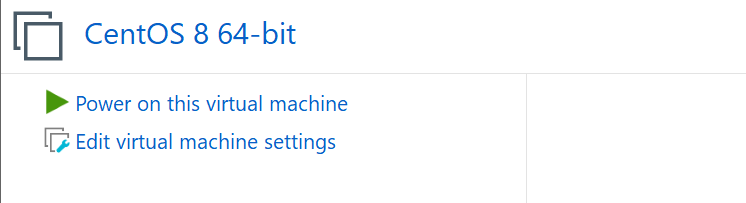
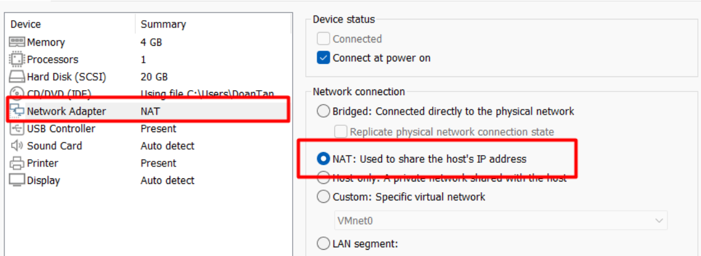
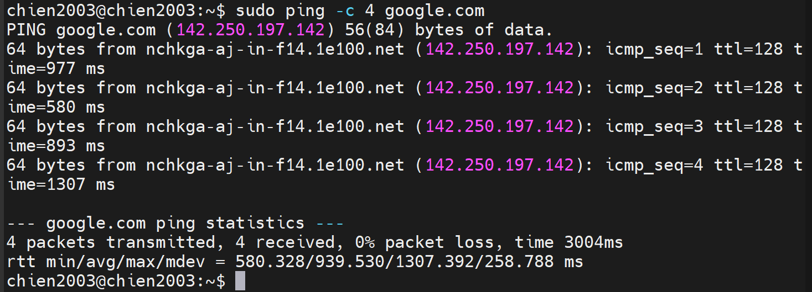
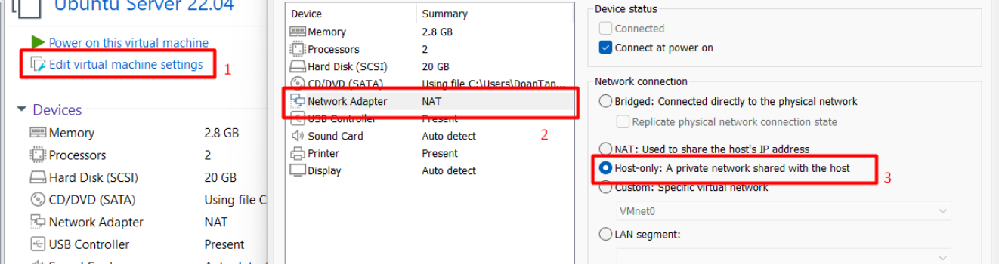
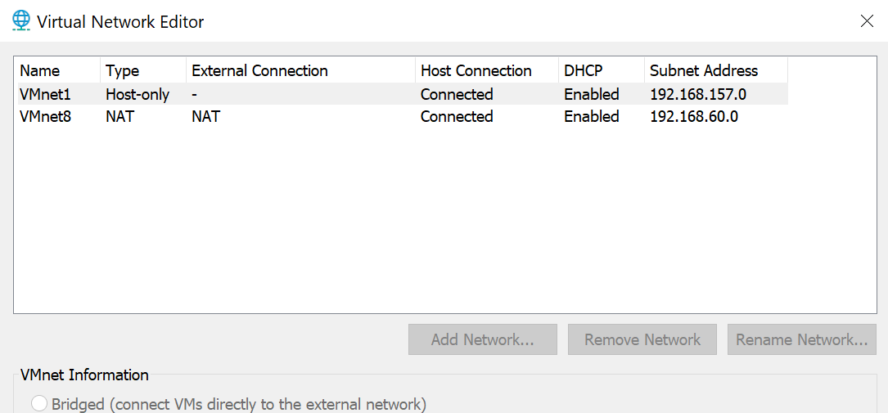
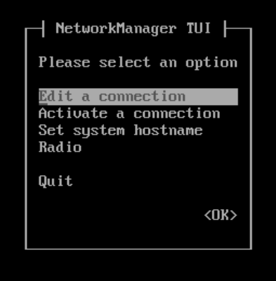
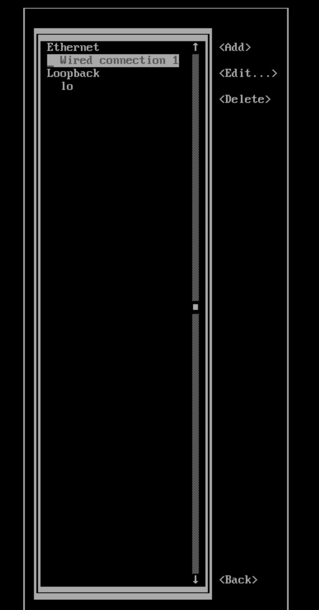
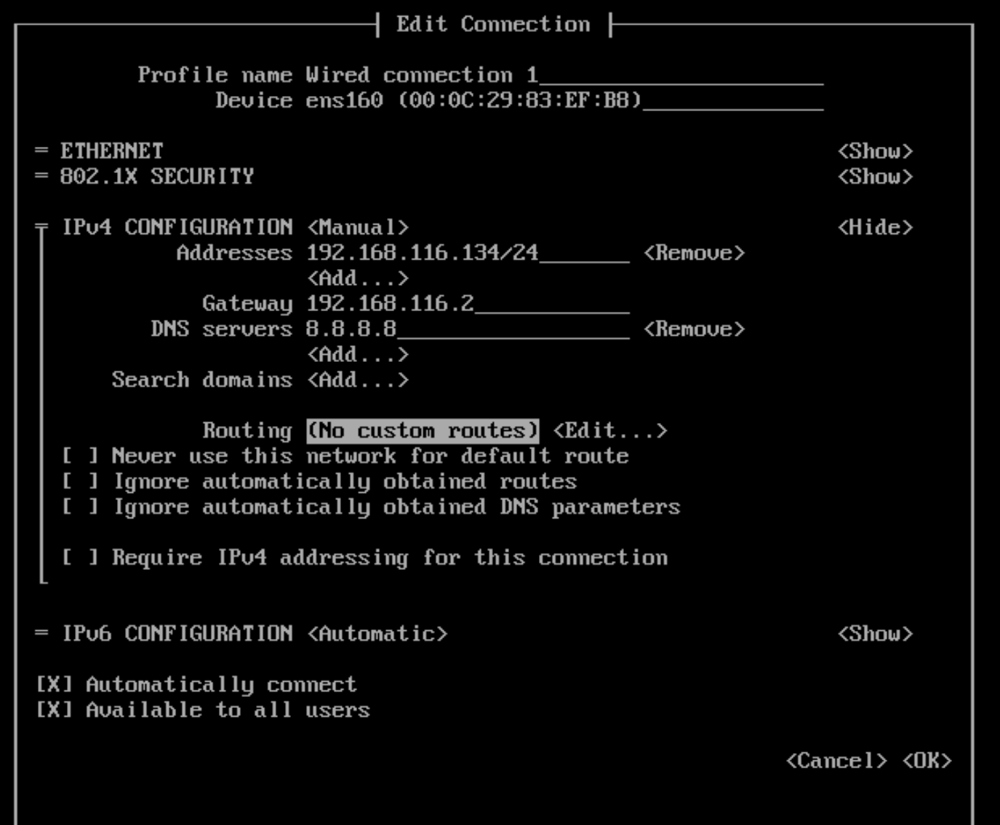
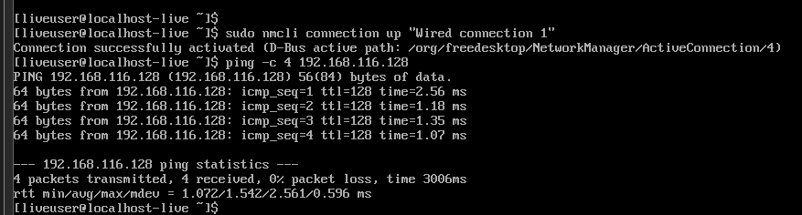

# LAB

## I. Sử dụng chế độ mạng NAT để truy cập Internet

### `Bước 1:` Cấu hình NAT trên VMware Workstation

1. Tắt máy ảo CentOS 9 nếu đang chạy.
2. Chọn máy ảo CentOS 9 trong VMware Workstation.
3. Nhấp vào Edit virtual machine settings.

4. Chọn Network Adapter → Chọn NAT (Share the host’s IP address).

5. Nhấn OK để lưu lại cấu hình.

### `Bước 2:` Kiểm tra và kết nối internet

1. Ping kiểm tra kết nối internet (gửi đi 4 gói tin):

```bash
sudo ping -c 4 google.com
```

Nếu nhận được phản hồi, máy ảo đã kết nối internet thành công.



## II. Sử dụng chế độ card Host-only để 2 máy ảo kết nối với nhau

### `Bước 1:` Cấu hình card mạng Host-Only trên VMware

1. Chọn CentOS 9 → Edit virtual machine settings → Chọn Network Adapter → Tích chọn Host-Only → OK để lưu cấu hình.
2. Lặp lại các bước trên Ubuntu Server.



Kiểm tra cấu hình card mạng Host-Only:

- Vào Edit → Virtual Network Editor.
- Đảm bảo có một VMnet1 đã được thiết lập cho Host-Only.



Nếu chưa có:

- Chọn Add Network → VMnet1 → Host-Only.
- Đặt dải IP (ví dụ: 192.168.186.0/24).

### `Bước 2:` Cấu hình IP tĩnh cho máy ảo

Để hai máy ảo có thể kết nối được với nhau, cả hai phải được thiết lập địa chỉ IP thuộc cùng một dải mạng. Trong tài liệu này, ta sử dụng dải mạng `192.168.116.X`.

* **Máy CentOS 9:** `192.168.116.134`
* **Máy Ubuntu Server:** `192.168.116.132`

**Trên máy ảo CentOS 9:**

- Sử dụng công cụ `nmtui` để cấu hình IP tĩnh cho card mạng (thường là `ens160`):

  ```bash
  sudo nmtui
  ```
    

    

  - Chọn **Edit a connection** &rarr; Chọn **Wired connection 1**.
  - Tại phần **IPv4 CONFIGURATION**, chọn `<Manual>` và điền các thông tin:
    - **Addresses**: `192.168.116.134/24`
    - **Gateway**: `192.168.116.2`
    - **DNS servers**: `8.8.8.8`
  - Chọn `<OK>` để lưu, sau đó thoát khỏi `nmtui`.

    

- Khởi động lại card mạng để áp dụng cấu hình:

  ```bash
  sudo nmcli connection up "Wired connection 1"
  ```

- Kiểm tra lại địa chỉ IP sau khi cấu hình:

  ```bash
  ip a
  ```

- Kiểm tra kết nối giữa 2 máy ảo:
  - Từ CentOS 9 ping tới Ubuntu Server (`192.168.116.132`):

    ```bash
    ping -c 4 192.168.116.132
    ```


     
    *Kết quả:* Thông báo `0% packet loss` cho thấy kết nối đã thành công.

  - Từ Ubuntu Server ping tới CentOS 9 (`192.168.116.134`):

    ```bash
    ping -c 4 192.168.116.134
    ```

    *Kết quả:* Kết nối thành công.

## III. Sử dụng 1 card Bridged để từ máy ảo ping ra máy laptop cá nhân

**Lưu ý quan trọng:** Khi muốn cài chế độ Bridged trên máy ảo ta cần tắt máy ảo đó trước rồi thực hiện chọn chế độ như Host-Only,NAT nhưng thêm 1 bước vào phần Advance → Bridged to để chọn card mạng vật lý (Wi-Fi hoặc Ethernet) → Chọn đúng card mạng mà máy laptop của bạn đang kết nối internet.

### `Bước 1:` Kiểm tra cấu hình mạng

- Trên laptop cá nhân, kiểm tra địa chỉ IP trong mạng LAN:
- Trên Windows, mở CMD và nhập lệnh:

  ```cmd
  ipconfig
  ```

  Nếu laptop kết nối có dây, sử dụng địa chỉ trong `Ethernet adapter Ethernet`. Nếu kết nối không dây, sử dụng địa chỉ trong `Wireless LAN adapter Wi-Fi`.

### `Bước 2:` Cấu hình IP cho máy ảo

**Cách 1: Sử dụng DHCP (IP động):**

- Do CentOS 9 đã bỏ phần Network-Scripts (không có sẵn) nên ta sẽ dùng `nmcli` để quản lý.
- Đặt chế độ DHCP bằng lệnh `nmcli`:

  ```bash
  sudo nmcli connection modify ens160 ipv4.method auto
  sudo nmcli connection up ens160
  ```

- Kiểm tra lại IP xem đã có chưa:

  ```bash
  ip a show dev ens160
  ```

**Cách 2: Cài đặt IP tĩnh (Nếu không muốn dùng DHCP):**

**Lưu ý quan trọng:** Chọn địa chỉ IP chưa sử dụng và cùng dải với laptop để tránh bị xung đột IP trong mạng LAN.

**CentOS 9:**

Mở cấu hình mạng:

```bash
sudo vi /etc/sysconfig/network-scripts/ifcfg-ens160
```

Cập nhật nội dung:

```ini
TYPE="Ethernet"
BOOTPROTO="none"
ONBOOT="yes"
IPADDR=192.168.1.50
NETMASK=255.255.255.0
GATEWAY=192.168.1.1
DNS1=8.8.8.8
```

*Trong đó:*
- `IPADDR` là địa chỉ cùng dải mạng và khác host với IP của laptop.
- `GATEWAY` trùng với Default Gateway của laptop để truy cập mạng.

Lưu file và khởi động lại mạng:

```bash
sudo systemctl restart network
```

### `Bước 3:` Kiểm tra kết nối

- Từ laptop ping tới máy ảo (trên Windows CMD):

  ```cmd
  ping 192.168.3.58
  ```

  Kết quả ping thành công:

  ```text
  successfully ping to vm
  ```

- Từ máy ảo ping tới laptop: thực hiện tương tự.